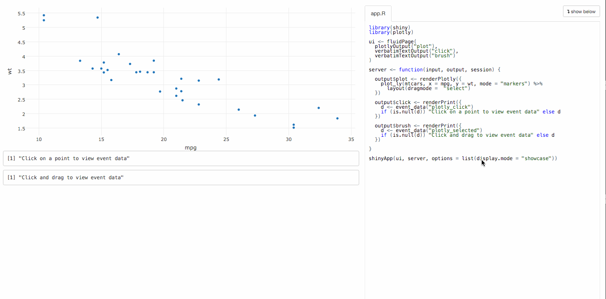

```{r setup, echo = FALSE}
knitr::opts_chunk$set(
  message = FALSE,
  fig.width = 10,
  fig.height = 4,
  comment = "#>",
  collapse = TRUE
)
```

# Why interactive web graphics?

---

* Why _interactive_ graphics?
    * "Any high-dimensional dataviz has to be summarized in some way, but interactivity allows us to get details" - (Dr. Karl Broman; JSM 2015)
    * Discover structure that may otherwise go missing ([Wickham, Cook, Hofmann; 2015](http://onlinelibrary.wiley.com/doi/10.1002/sam.11271/abstract)).
    * Present ideas/findings to others in a compelling way.

> - Why interactive _web_ graphics?
    * simple to share, portable (web browser)
    * encourages composability
    * guide your audience by providing links to interesting selections/states

## Translate ggplot2 to the web w/ plotly

```{r}
library(plotly)
p <- qplot(data = mtcars, x = wt, y = mpg, geom = c("point", "smooth"))
ggplotly(p)
```

---

<div align="center">
  <a href="https://gallery.shinyapps.io/ggtree"> 
    
  </a>
</div>


## Translating R graphics to the web

* Pros:
    * Easy to use -- extrapolates on existing knowledge/code
* Cons:
    * Translation may depend on internals of other packages
    * Hard to extend, customize, and/or add (interactive) features
    
> - Although pragmatic, it's often better to have a custom interface.

## plotly's R interface

```{r}
library(plotly)
plot_ly(economics, x = date, y = unemploy / pop)
```

## Visual mappings as data attributes

```r
p <- plot_ly(economics, x = date, y = unemploy / pop)
str(p) 
```

```r
#> Classes ‘plotly’ and 'data.frame':	478 obs. of  6 variables:
#>  $ date    : Date, format: "1967-06-30" "1967-07-31" ...
#>  $ pce     : num  508 511 517 513 518 ...
#>  $ pop     : int  198712 198911 199113 199311 199498 199657 199808 199920 200056 200208 ...
#>  $ psavert : num  9.8 9.8 9 9.8 9.7 9.4 9 9.5 8.9 9.6 ...
#>  $ uempmed : num  4.5 4.7 4.6 4.9 4.7 4.8 5.1 4.5 4.1 4.6 ...
#>  $ unemploy: int  2944 2945 2958 3143 3066 3018 2878 3001 2877 2709 ...
#>  - attr(*, "plotly_hash")= chr "f638d391dcf53809b8426325a842a091#8"
```

## Data sent to plotly.js

```r
str(plotly_build(p))
```

```r
#> List of 2
#>  $ data  :List of 1
#>   ..$ :List of 5
#>   .. ..$ type   : chr "scatter"
#>   .. ..$ x      : Date[1:478], format: "1967-06-30" ...
#>   .. ..$ y      : num [1:478] 0.0148 0.0148 0.0149 0.0158 0.0154 ...
#>  $ layout:List of 2
#>   ..$ xaxis:List of 1
#>   .. ..$ title: chr "date"
#>   ..$ yaxis:List of 1
#>   .. ..$ title: chr "unemploy/pop"
```

## Why represent plots as data?

* Thinking about graphics as a mapping from data to visual space is powerful (e.g. __ggplot2__'s grammar of graphics).
* Allows us to implement a "data-plot-pipeline": a sequence of data manipulations and mappings.


## Data-plot-pipeline: An Example

`%>%` is known as a "pipeline operator"

```{r, fig.height = 3.5}
# f(x, y) becomes x %>% f(y)
economics %>%
  transform(rate = unemploy / pop) %>%
  plot_ly(x = date, y = rate)
```

---

## Layering model fits

```{r, fig.height = 3.5}
economics %>%
  transform(rate = unemploy / pop) %>%
  plot_ly(x = date, y = rate, name = "raw") %>%
  ### <b>
  loess(rate ~ as.numeric(date), data = .) %>%
  broom::augment(economics) %>%
  add_trace(x = date, y = .fitted, name = "smooth")
  ### </b>
```

---

## Adding annotations

```{r, fig.height = 3.5}
economics %>%
  transform(rate = unemploy / pop) %>%
  plot_ly(x = date, y = rate, name = "raw") %>%
  ### <b>
  subset(rate == max(rate)) %>%
  layout(annotations = list(x = date, y = rate, text = "Peak", showarrow = T),
         title = "The U.S. Unemployment Rate")
  ### </b>
```

# What about linked views?
    
## An Example: touring w/ linked brush

<div align="center">
  
</div>

<https://github.com/cpsievert/tourbrush>

## Linked views pipeline

* Coordinated, linked views is an important quality of any interactive statistical graphics system (e.g., cranvas, ggobi, iplots, mondrian, MANET, etc).
* In order to have linked views, we need a "data pipeline" (Buja et.al, 1988); ([Wickham et. al., 2010](http://link.springer.com/article/10.1007%2Fs00180-008-0116-x)).

## Linked views pipeline

<div align="center">
  
</div>

## Where should the pipeline live?

<div align="center">
  
</div>

## Design considerations

|Pipeline |       Pros |                           Cons|
|--------:|-----------:|------------------------------:|
|   Server|   Flexible |   Not (necessarily) fast      |
|   Client|       Fast |   Not (necessarily) flexible  |

<p></p>
> - Navigate to <http://104.131.111.111:3838/3Dnormal/> (the touring example), press play, and watch your browser weep `r remoji::emoji("crying_cat_face")`
> - IMO, flexibility often outweighs speed

## What a widgetful world

* The R package __htmlwidgets__ makes your HTML widget "just work" from the R console, rmarkdown, and shiny.
* R packages that use __htmlwidgets__, such as __plotly__, "just work" like any other shiny output:

<div align="center">
  
</div>

## What about capturing direct manipulation?

* __htmlwidgets__ does a lot for widget authors, but there is no standard for accessing widget interactions server-side.
* Thankfully, __shiny__ provides a way to [send data from client to server](https://ryouready.wordpress.com/2013/11/20/sending-data-from-client-to-server-and-back-using-shiny/), but it's on widget authors to provide an interface.

## Accessing plotly events in shiny

<div align="center">
  
</div>

## Linked correlation matrix

<div align="center">
  
</div>

---

<div align="center">
  
</div>

---

<div align="center">
  
</div>

# Thank you!

* <https://twitter.com/cpsievert>
* <https://github.com/cpsievert>
* cpsievert1 @ gmail dot com 
