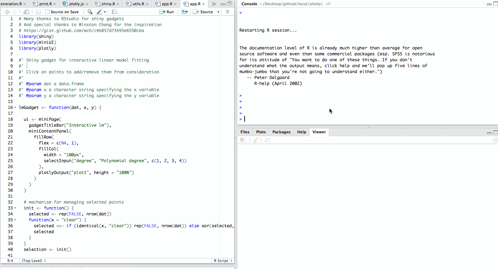

## About me

* Maintainer of plotly's R package for >12 months. Author/maintainer of many other R packages: LDAvis, animint, pitchRx, rdom, etc.
* PhD candidate in the Department of Statistics at Iowa State University.
* Spent last 6 months in Melbourne, Australia working with Dr. Dianne Cook, Dr. Heike Hofmann, and Dr. Rob Hyndman.
* BA in Math & Econ, but don't ask me any Econ questions `r remoji::emoji("wink")`

## Workshop materials

Please install the following packages:

```{r, eval = FALSE}
install.packages("quantmod")
install.packages("RColorBrewer")
install.packages("devtools")
# if you encounter errors, let me know!
devtools::install_github("ropensci/plotly#628")
```

Code for today's workshop is [here](https://gist.github.com/cpsievert/dc7f1f2c94cca7cdaa5b74132f870acb). Please download it and follow along.

At times, I'll give you an exercise and stop talking to encourage hands-on learning.

Please ask questions!!!

## Why _interactive_ graphics?

* "Any high-dimensional dataviz has to be summarized in some way, but interactivity allows us to get details" - (Dr. Karl Broman; JSM 2015)
* Aids exploration -- discover structure that may otherwise go unnoticed (see [Wickham, Cook, Hofmann; 2015](http://onlinelibrary.wiley.com/doi/10.1002/sam.11271/abstract))
* Aids communication & enhances presentability

* Why interactive _web_ graphics?
    * simple to share, portable (web browser)
    * encourages composability (e.g., plotly.js + leaflet.js)
    * encourages reproducibility (scriptable)

---

<div align="center">
  
</div>

---

<div align="center">
  
</div>

---

<div align="center">
  
</div>


```{r setup, echo = FALSE}
knitr::opts_chunk$set(
  message = FALSE,
  fig.width = 10,
  fig.height = 4,
  comment = "#>",
  collapse = TRUE,
  warning = FALSE
)
```

## Before we start, some R basics

* Combine values into a vector with `c()`

```{r}
c(0, 1)
```

* Assign values to a name with `<-` (or `=`)

```{r}
x <- c(0, 1)
```

* Avoid `for` loops and use built-in _vectorized_ functions

```{r}
sum(x + 10)
```

* Although arcane at times, `R` has rich support for documentation, see `?sum`

---

Extract _named_ elements with `$`, `[[`, and/or `[`

```{r}
x <- list(a = 1:5, b = "red")
x$a
x[["a"]]
x["a"]
```

Data frames are essentially a list:

```{r}
range(mtcars$mpg)
```

* See Hadley Wickham's online chapters on [data structures](http://adv-r.had.co.nz/Data-structures.html) and [subsetting](http://adv-r.had.co.nz/Subsetting.html)

## ggplotly

plotly can convert most ggplot2 plots <http://ropensci.github.io/plotly/ggplot2>

```{r}
library(plotly)
p <- qplot(data = mpg, displ, hwy, geom = c("point", "smooth")) + facet_wrap(~drv)
ggplotly(p)
```

## That's great, but...

* ggplot2's interface wasn't designed for interactive graphics.
* ggplot2 requires data frame(s) and can be inefficient (especially for time series).
* plotly.js creates visualizations that ggplot2 simply can't.
* A recent update to `plot_ly()` combines the flexibility of plotly.js with the elegance of a _layered_ grammar of graphics.

---

* To begin, suppose we have a numeric matrix:

```{r}
str(volcano)
```

* __Side note__: formulas can capture the environment in which objects are referenced.

```{r}
str(~volcano)
f <- function() { str(~volcano) }
f()
```

* For this reason, Hadley [now recommends using formulas (over expressions) for non-standard evaluation](http://rpubs.com/hadley/157957)

## No data frame necessary!

```{r, message = TRUE, fig.width=5, fig.height=4.5}
plot_ly(z = ~volcano)
```

## Functional interface

Most functions take a plotly object as input and return a modified plotly object.

```{r, eval = FALSE}
# equivalent to before, but more explicit
add_heatmap(plot_ly(z = ~volcano))
```

Use the `%>%` operator to enhance readability, for example:

```{r, eval = FALSE}
plot_ly(z = ~volcano) %>% add_surface() %>% plotly_POST()
```

is easier to read compared to:

```{r, eval = FALSE}
plotly_POST(add_surface(plot_ly(z = ~volcano)))
```

---

<div align="center">
  
</div>

## Housing sales in Texas

```{r}
library(plotly)
txhousing
```

## Univariate plots

```{r, message = TRUE}
plot_ly(txhousing, x = ~sales)
```

# Your Turn 1

* __Easy:__ Make histograms of other numeric variables.
* __Medium__: Make a histogram of `log(sales)` and `sqrt(sales)`
* __Hard__: Make a density plot of log sales (Hint: use `density()` and `add_area()`).

See [here](https://gist.github.com/cpsievert/9a8258ae6471c6dec9d8fd26e4524c9e) for solutions.

## Mean sales by city

```{r}
library(dplyr)
d <- txhousing %>% 
  group_by(city) %>%
  summarise(m = mean(sales, na.rm = TRUE))
d
```

## split-apply-combine

<div align="center">
  
</div>

## split-apply-combine-visualize

```{r}
txhousing %>% 
  group_by(city) %>%
  summarise(m = mean(sales, na.rm = TRUE)) %>%
### <b>
  arrange(m) %>%
  plot_ly(x = ~m, y = ~city) %>%
  layout(title ="Average monthly sales, by city", margin = list(l = 120))
### </b>
```

## Monthly sales by city

```{r}
p <- txhousing %>%
  group_by(city) %>%
  plot_ly(x = ~date, y = ~sales, text = ~city) %>%
  layout(hovermode = "closest")
p
```

## Log of monthly sales

```{r}
add_lines(p, y = ~log(sales))
```

## Highlight city on hover

```{r, echo = FALSE}
p %>%
  add_lines(y = ~log(sales), color = ~city, 
            line = list(color = "black"), hoverinfo = "text") %>% 
  layout(hovermode = "closest", showlegend = FALSE) %>%
  htmlwidgets::onRender('
    function(el, x) { 
      var graphDiv = document.getElementById(el.id);
      // reduce the opacity of every trace except for the hover one
      el.on("plotly_hover", function(e) { 
        var traces = [];
        for (var i = 0; i < x.data.length; i++) {
          if (i !== e.points[0].curveNumber) traces.push(i);
        }
        Plotly.restyle(graphDiv, "opacity", 0.2, traces);
      })
     el.on("plotly_unhover", function(e) { 
       var traces = [];
       for (var i = 0; i < x.data.length; i++) traces.push(i);
       Plotly.restyle(graphDiv, "opacity", 1, traces);
     })
    } 
  ')
```

## Median house price

```{r, echo = FALSE}
p %>%
  add_lines(y = ~median, color = ~city, text = ~city, 
            line = list(color = "black"), hoverinfo = "text") %>%
  layout(hovermode = "closest", showlegend = FALSE) %>%
  htmlwidgets::onRender('
    function(el, x) { 
      var graphDiv = document.getElementById(el.id);
      // reduce the opacity of every trace except for the hover one
      el.on("plotly_hover", function(e) { 
        var traces = [];
        for (var i = 0; i < x.data.length; i++) {
          if (i !== e.points[0].curveNumber) traces.push(i);
        }
        Plotly.restyle(graphDiv, "opacity", 0.2, traces);
      })
     el.on("plotly_unhover", function(e) { 
       var traces = [];
       for (var i = 0; i < x.data.length; i++) traces.push(i);
       Plotly.restyle(graphDiv, "opacity", 1, traces);
     })
    } 
  ')
```

## Top 5 cities wrt mean sales

```{r}
top5 <- txhousing %>% 
  group_by(city) %>%
  summarise(m = mean(sales, na.rm = TRUE)) %>%
  arrange(desc(m)) %>%
  top_n(5)
top5
```

## Sales in top 5 cities

```{r}
top5plot <- txhousing %>%
  semi_join(top5) %>%
  plot_ly(x = ~date, y = ~sales, color = ~city)
add_lines(top5plot)
```

## ColorBrewer palettes

```{r}
RColorBrewer::display.brewer.all(type = "qual")
```

## Provide the palette name

```{r}
add_lines(top5plot, colors = "Dark2")
```

## Your Turn 2

Similar to `color`/`colors`, there are also `linetype`/`linetypes` and `symbol`/`symbols` variable mappings. Use them to plot sales (or some other variable) for the top 5 cities.

See [here](https://gist.github.com/cpsievert/e4922ec494141474fc86c3f2b312303f) for solutions.

## Split-apply-plot?

```{r}
txhousing %>%
  semi_join(top5) %>%
  group_by(city) %>%
  do(p = plot_ly(., x = ~log(sales), name = .$city))
```

---


```{r}
txhousing %>%
  semi_join(top5) %>%
  group_by(city) %>%
  do(p = plot_ly(., x = ~log(sales), name = ~city)) %>%
### <b>
  .[["p"]] %>% 
  subplot(nrows = 5, shareX = TRUE)
### </b>
```

## Economics data

```{r}
economics 
```

## Wide to long data

```{r}
library(tidyr)
gather(economics, variable, value, -date)
```

## gather -> split-apply-combine

```{r}
economics %>%
  gather(variable, value, -date) %>%
  group_by(variable) %>%
  summarise(m = min(value))
```

---

```{r}
economics %>%
  gather(variable, value, -date) %>%
  group_by(variable) %>%
  do(p = plot_ly(., x = ~date, y = ~value, name = ~variable)) %>%
  .[["p"]] %>%
  subplot(nrows = NROW(.), shareX = TRUE, titleX = FALSE)
```

## Unemployment rate vs duration

```{r}
economics %>%
  plot_ly(x = ~uempmed, y = ~unemploy/pop) %>%
  add_markers(color = ~as.numeric(date), text = ~date, hoverinfo = "text")
```

## Your Turn

Get creative and find something interesting in the `economics` data!

## Stock prices

```{r}
library(quantmod)
msft <- getSymbols("MSFT", auto.assign = F)
dat <- as.data.frame(msft)
dat$date <- index(msft)
head(dat)
```

## CandleStick chart

```{r, eval = FALSE}
names(dat) <- sub("^MSFT\\.", "", names(dat))

plot_ly(dat, x = ~date, xend = ~date, color = ~Close > Open, 
        colors = c("red", "forestgreen"), hoverinfo = "none") %>%
  add_segments(y = ~Low, yend = ~High, line = list(width = 1)) %>%
  add_segments(y = ~Open, yend = ~Close, line = list(width = 3)) %>%
  layout(showlegend = FALSE, yaxis = list(title = "Price")) %>%
  toWebGL()
```

See [here](https://plot.ly/~cpsievert/14269.embed) for the plot.

# Accessing plotly events in shiny

* __NOTE__: this enabled the magic at the beginning of the talk...

---

<div align="center">
  
</div>

## Your Turn 3

Take [this code](https://gist.github.com/cpsievert/817cbffaf99222ddf50e90247fd0f818) and modify it so that, brushing points generates another plot.

See [here](https://gist.github.com/cpsievert/70b124897e4286d667f9e601a2f59402) for a solution.

## Linked correlation matrix

<div align="center">
  
</div>

---

<div align="center">
  
</div>

## Your Turn 4

Make a shiny app that makes use of `event_data()`.


# Thank you!

* GitHub: <https://github.com/cpsievert>
* Twitter: <https://twitter.com/cpsievert>
* Email: cpsievert1 @ gmail dot com 
