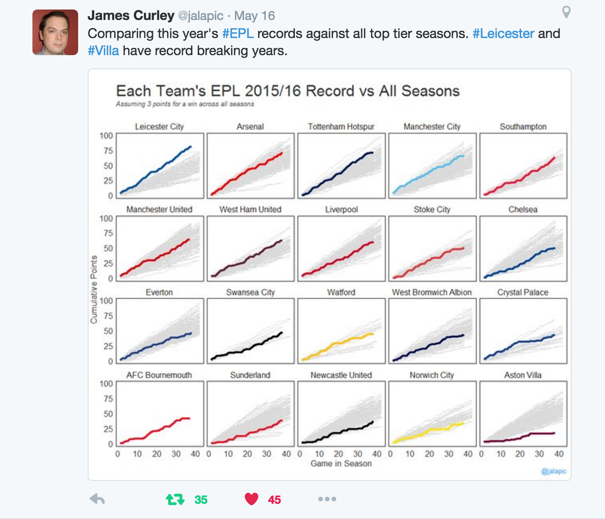

```{r setup, echo = FALSE}
knitr::opts_chunk$set(
  message = FALSE,
  fig.width = 10,
  fig.height = 4,
  comment = "#>",
  collapse = TRUE,
  warning = FALSE
)
```


## Why _interactive_ graphics?

| Technique           | Related Question(s)             | Examples
-----------------     | ----------------------        | ------------
| Identification      | What is this point/mark?      | Hover for additional info
| Filter              | How does one group compare to another? <br /> What happened during this time period? | `shiny::selectInput()` <br /> `shiny::sliderInput()` <br /> Click on legend entries
| Zoom & pan          | Is there local structure?     | Click & drag to alter x/y limits
| Linked highlighting | How does the marginal/joint compare to a conditional? | Linked brushing on a scatterplot matrix

<div class="build">

* Why should _presentation_ graphics be interactive?
    * Helps demonstrate your point
* Why should _exploratory_ graphics be interactive?
    * Generate insight _faster_ (thus, iteration time is crucial!). 

</div>


## Why _web_ graphics? Portability!

<div align="center">
  
</div>

## Why _web_ graphics? Composability!

<div align="center">
  
</div>


# _Web_ graphics usually aren't _practical_ for _exploring_ data


## Identification, zoom & pan w/ ggplotly

```{r}
library(plotly)
p <- ggplot(diamonds, aes(price, carat, color = cut)) + 
  geom_point(alpha = 0.05)
p %>% ggplotly() %>% toWebGL()
```
    
## Extending James' plot

<div align="center">
  
</div>

## Linked highlighting via ggplotly

<iframe src="epl.html" width=400 height=10 frameBorder="0" seamless="seamless"></iframe>

## That's great, but...

* ggplot2's interface wasn't designed for interactive graphics.
* ggplot2 requires data frame(s) and can be inefficient (especially for time series).
* `plot_ly()` provides a low-level R interface to [plotly.js](https://github.com/plotly/plotly.js) (now open source!).
* Smarter defaults, informative warnings/errors, and higher-level functionality are on their way to `plot_ly()`.

## Smart defaults

```{r, message = TRUE, fig.width=5, fig.height=4.5, fig.align='center'}
plot_ly(z = ~volcano)
```

## Informative warnings/errors

```{r, error = TRUE, message = TRUE}
plot_ly(puppies = rnorm(100)) %>% add_boxplot()
plot_ly(x = rnorm(100)) %>% add_boxplot(name = "puppies")
```

## plot_ly loves dplyr verbs

```{r, eval = FALSE}
txhousing %>%
  group_by(city) %>%
  plot_ly(x = ~date, y = ~median) %>%
  add_lines()
```

```{r, echo = FALSE}
txhousing %>%
  plot_ly(x = ~date, y = ~median, color = ~city, line = list(color = "rgb(31, 119, 180)"), hoverinfo = "name") %>%
  layout(showlegend = FALSE, hovermode = "closest") %>%
  htmlwidgets::onRender('
      function(el, x) { 
        var graphDiv = document.getElementById(el.id);
        // reduce the opacity of every trace except for the hover one
        el.on("plotly_hover", function(e) { 
          var traces = [];
          for (var i = 0; i < x.data.length; i++) {
            if (i !== e.points[0].curveNumber) traces.push(i);
          }
          Plotly.restyle(graphDiv, "opacity", 0.2, traces);
        })
       el.on("plotly_unhover", function(e) { 
         var traces = [];
         for (var i = 0; i < x.data.length; i++) traces.push(i);
         Plotly.restyle(graphDiv, "opacity", 1, traces);
       })
      } 
    ')
```

## data-plot-pipeline

```{r}
txhousing %>%
  group_by(city) %>%
  plot_ly(x = ~date, y = ~median) %>%
  add_lines(name = "Texan Cities") %>%
### <b>
  filter(city == "Houston") %>%
  add_lines(name = "Houston")
### </b>
```

## data-model-plot-pipeline

```{r, fig.height=3}
library(broom)
mtcars %>%
    lm(mpg ~ wt, data = .) %>%
    augment() %>%
    mutate(l  = .fitted - 1.96 * .se.fit, u = .fitted + 1.96 * .se.fit) %>%
    plot_ly(x = ~wt, y = ~mpg) %>%
    add_markers(fill = "black") %>%
    add_lines(y = ~.fitted, stroke = "steelblue") %>%
    add_ribbons(ymin = ~l, ymax = ~u, fill = "gray", alpha = 0.3) 
```

## split-apply-subplot

```{r}
s <- split(mpg, mpg$drv)
plots <- lapply(s, function(d) plot_ly(d, x = ~cty, name = ~drv))
subplot(plots, nrows = length(plots), shareX = TRUE)
```

# Thank you!

* GitHub: <https://github.com/cpsievert>
* Twitter: <https://twitter.com/cpsievert>
* Email: cpsievert1 @ gmail dot com 
