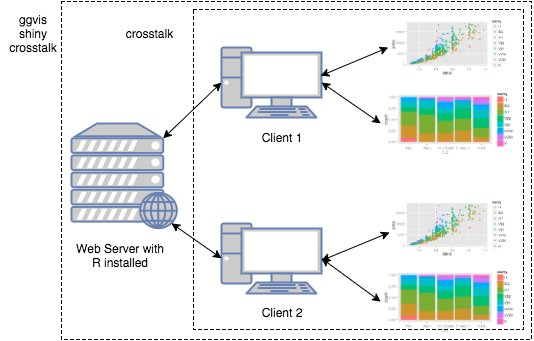

```{r setup, echo = FALSE}
knitr::opts_chunk$set(
  message = FALSE,
  fig.width = 10,
  fig.height = 4,
  comment = "#>",
  collapse = TRUE,
  warning = FALSE
)
```


## Why _interactive_ graphics?

* Why should _presentation_ graphics be interactive?
    * Helps demonstrate your point
* Why should _exploratory_ graphics be interactive?
    * Generate insight _faster_ (thus, iteration time is crucial!). 

<div class="build">

| Technique           | Related Question(s)             | Examples
-----------------     | ----------------------        | ------------
| Identification      | What is this point/mark?      | Hover for additional info
| Filter              | How does one group compare to another? <br /> What happened during this time period? | `shiny::selectInput()` <br /> `shiny::sliderInput()` <br /> Click on legend entries
| Zoom & pan          | Is there local structure?     | Click & drag to alter x/y limits
| Linked highlighting | How does the marginal/joint compare to a conditional? | Linked brushing on a scatterplot matrix
</div>


## Why _web_ graphics? Composable! Easy to Share!

<div align="center">
  
</div>

# __Problem__: _Web_ graphics usually aren't _practical_ for _exploring_ data

Good for presentation (viz type is _known_), bad for exploration (viz type is _unknown_)

## Identification, zoom & pan w/ ggplotly

```{r}
library(plotly)
p <- qplot(data = diamonds, x = carat, y = price, color = cut, alpha = I(.05))
toWebGL(ggplotly(p))
```

## Disclaimer

The following examples are _very_ new, may change, and require dev versions of several packages:

```{r eval = FALSE}
library(devtools)
install_github("rstudio/crosstalk")
install_github("ropensci/plotly@joe/feature/crosstalk")
install_github("rstudio/leaflet@joe/feature/crosstalk-filter")
```

## Highlighting series

```{r}
library(crosstalk)
d <- SharedData$new(txhousing, ~city)
p <- qplot(data = d, x = date, y = median, group = city, geom = "line")
o <- ct_opts(on = "plotly_hover", off = "plotly_doubleclick", color = "red")
ggplotly(p, tooltip = "city", crosstalkOpts = o)
```

## Extending James' ggplot

<div align="center">
  
</div>

## Linked highlighting via ggplotly

<iframe src="../20160630/epl.html" width=400 height=10 frameBorder="0" seamless="seamless"></iframe>

## Linked brushing in plotly via crosstalk

```{r, eval = FALSE}
library(crosstalk)
d <- SharedData$new(mtcars)
subplot(
  qplot(data = d, x = mpg, y = wt),
  qplot(data = d, x = mpg, y = vs)
)
```

```{r, echo = FALSE}
library(crosstalk)
d <- SharedData$new(mtcars)
subplot(
  qplot(data = d, x = mpg, y = wt),
  qplot(data = d, x = mpg, y = disp),
  titleX = T, titleY = T, margin = 0.03
)
```

## Linked brushing with plotly & leaflet

```{r, eval = FALSE}
library(leaflet)
sd <- SharedData$new(quakes)
p <- plot_ly(sd, x = ~depth, y = ~mag) %>% add_markers(alpha = 0.5)
map <- leaflet(sd) %>% addTiles() %>% addCircles()
htmltools::tagList(list(p, map))
```

```{r, echo=FALSE}
library(leaflet)
sd <- SharedData$new(quakes)

p <- plot_ly(sd, x = ~depth, y = ~mag, width = 450) %>% 
  add_markers(color = I("steelblue"), alpha = 0.5) %>%
  layout(showlegend = FALSE)

map <- leaflet(sd, width = 450) %>% 
  addTiles() %>% 
  addCircles()

library(htmltools)
p <- div(style = "display:inline-block", as.tags(p))
map <- div(style = "display:inline-block", as.tags(map))
tagList(list(p, map))
```

---

```r
library(GGally)
iris$id <- seq_len(nrow(iris))
d <- SharedData$new(iris, ~id)
p <- ggpairs(d, aes(colour = Species), columns = 1:4)
ggplotly(p, c("x", "y", "colour"))
```

<div align = "center">
  <a href = "gglink.html">
    
  </a>
</div>

## Limitations

<div align = "center">
  
</div>

## Identity mapping between plot & data

<div align = "center">
  <a href = "gglink.html">
    
  </a>
</div>

## Limitations continued

```{r}
p <- qplot(data = mtcars, x = mpg)
ggplotly(p, originalData = FALSE) %>% plotly_data()
```

## Where should the computation live?

<div align = "center">
  
</div>

## Thank you to sooo many people

* The plotly.js team
* The RStudio team
* Heike Hofmann
* Di Cook
* Toby Dylan Hocking
* Barret Schloerke
* and many more...

# Thank you!

* Slides: <http://bit.ly/JSM_16>
* GitHub: <https://github.com/cpsievert>
* Twitter: <https://twitter.com/cpsievert>
* Email: cpsievert1 @ gmail dot com 
