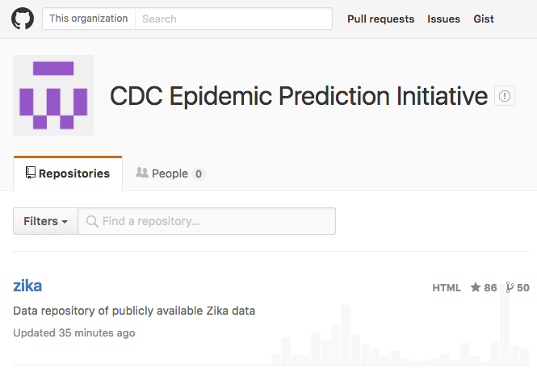
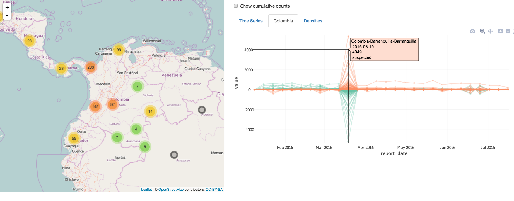

```{r setup, echo = FALSE}
knitr::opts_chunk$set(
  message = FALSE,
  fig.width = 10,
  fig.height = 4,
  comment = "#>",
  collapse = TRUE,
  warning = FALSE
)
```


## About me

* PhD in statistics from Iowa State University (ABD).
* I solely maintain and develop plotly's R package.
* Expert in the intersection of R, web technologies, and data visualization.
* Novice disease outbreak analyst.

## What is R?

* __Free__ and __open__-source statistical programming language.
* A __huge__ community:
    * Numerous organization support R development ([R Consortium](https://www.r-consortium.org/), [RStudio](https://www.rstudio.com/home/), [rOpenSci](https://ropensci.org/), etc)
* Over 7500 user contributed packages (e.g., plotly) currently on CRAN

## An Example: Measles in 15 German Districts

```{r}
library(surveillance)
data(measles.weser)
plot(measles.weser)
```

```{r, echo = FALSE}
library(tidyr)
measles <- data.frame(measles.weser$observed)
measles$date <- seq(as.Date("2001-01-01"), by = "week", length.out = NROW(measles))
measles <- gather(measles, district, count, -date)
measles$district <- sub("^X", "", measles$district)
```

## Again, but with plotly

```{r, eval = FALSE}
library(plotly)
plot_ly(measles, x = ~date, y = ~count, color = ~district, mode = "lines")
```

```{r, echo=FALSE}
library(plotly)
measles$txt <- with(measles, paste0("Date: ", date, "<br />", "Count: ", count))
measles %>%
  plot_ly(x = ~date, y = ~count, color = ~district, text = ~txt) %>%
  add_lines(hoverinfo = "text+name") %>%
  config(displayModeBar = FALSE)
```

## Highlight on hover

```{r, echo = FALSE}
library(crosstalk)
measles %>%
  SharedData$new(~district) %>%
  plot_ly(x = ~date, y = ~count, color = ~district, text = ~txt) %>%
  add_lines(hoverinfo = "text+name") %>%
  crosstalk("plotly_hover")
```

# What if there are _many_ areas of interest?

## Visualization mantras

Statistical graphics perspective:

> Visualizations can surprise you, but don't scale well.
> Modeling scales well, but can't surprise you.
>
> --- Hadley Wickham

Information visualization perspective:

> Overview first, then zoom and filter, then details on demand.
> 
> --- Ben Shneiderman

## zika data

Dania M. Rodriguez et al. (2016). zika: August 1, 2016. Zenodo. [10.5281/zenodo.59231](http://dx.doi.org/10.5281/zenodo.59231)

<div align="center">
  
</div>

## The zikar package

```{r}
# install_github("cpsievert/zikar")
library(zikar)
zika
```

## Zika Exploration App

<div align="center">
  <a href = "https://github.com/cpsievert/zikar"> 
    
  </a>
</div>

# Thank you!

* Slides: <http://bit.ly/IQT16>
* GitHub: <https://github.com/cpsievert>
* Twitter: <https://twitter.com/cpsievert>
* Email: cpsievert1 @ gmail dot com 
