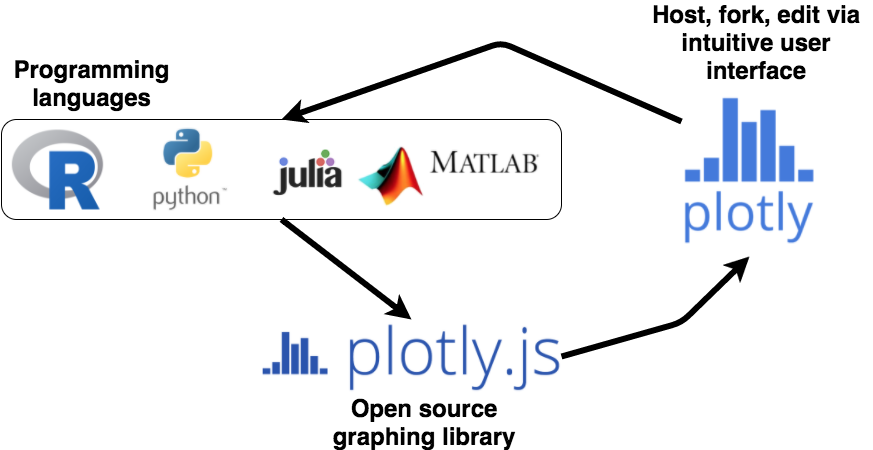
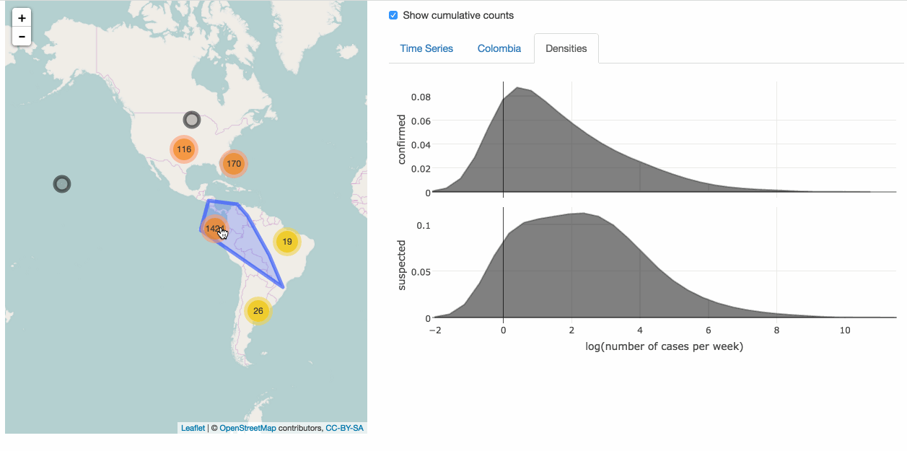

```{r setup, echo = FALSE}
knitr::opts_chunk$set(
  message = FALSE,
  fig.width = 10,
  fig.height = 4,
  comment = "#>",
  collapse = TRUE,
  warning = FALSE
)
```

---

* __About me__
    * I solely maintain and develop plotly's R package (part time).
    * PhD in statistics from Iowa State University (ABD).
    * Expert in the intersection of R, web technologies, and data visualization.
    * Novice disease outbreak analyst.
* __What is R?__
    * __Free__ and __open__-source statistical programming language.
    * A __huge__ community:
        * Over __9000 user contributed packages currently__ on CRAN (best source for latest statistical methodology)
        * The package __surveillance__ implements outbreak detection methods from 13 different publications!

        
## What is plotly?

<div align="center">
  
</div>


---

<div align="center">
  <a href = "../videos/collaborate.mp4">
    
  </a>
</div>

## An example

```{r, eval = FALSE}
library(plotly)
plot_ly(measles, x = ~date, y = ~count, color = ~district, mode = "lines")
```

```{r, echo = FALSE, fig.height=5}
library(surveillance)
library(plotly)
data("measles.weser")
measles <- data.frame(measles.weser$observed)
measles$date <- seq(as.Date("2001-01-01"), by = "week", length.out = NROW(measles))
measles <- tidyr::gather(measles, district, count, -date)
measles$district <- sub("^X", "", measles$district)
measles$txt <- with(measles, paste0("Date: ", date, "<br />", "Count: ", count))
measles %>%
  crosstalk::SharedData$new(~district) %>%
  plot_ly(x = ~date, y = ~count, color = ~district, text = ~txt) %>%
  add_lines(hoverinfo = "text+name") %>%
  layout(dragmode = "zoom", hovermode = "compare", xaxis = list(title = "")) %>%
  crosstalk("plotly_hover")
```

# What if there are _many_ areas of interest?

## Visualization mantras

Statistical graphics perspective:

> Visualizations can surprise you, but don't scale well.
> Modeling scales well, but can't surprise you.
>
> --- Hadley Wickham

Information visualization perspective:

> Overview first, then zoom and filter, then details on demand.
> 
> --- Ben Shneiderman


## Zika Exploration App

<div align="center">
  <a href = "http://104.131.111.111:3838/zikar"> 
    
  </a>
</div>

## Summary

* __Create__ exploratory & expository graphics _quickly_.
* __Collaborate__ on plotly's web platform.
* __Reproduce__ with confidence.

# Thank you!

* Slides: <http://bit.ly/IQT16>
* GitHub: <https://github.com/cpsievert>
* Twitter: <https://twitter.com/cpsievert>
* Email: cpsievert1 @ gmail dot com 
