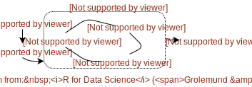
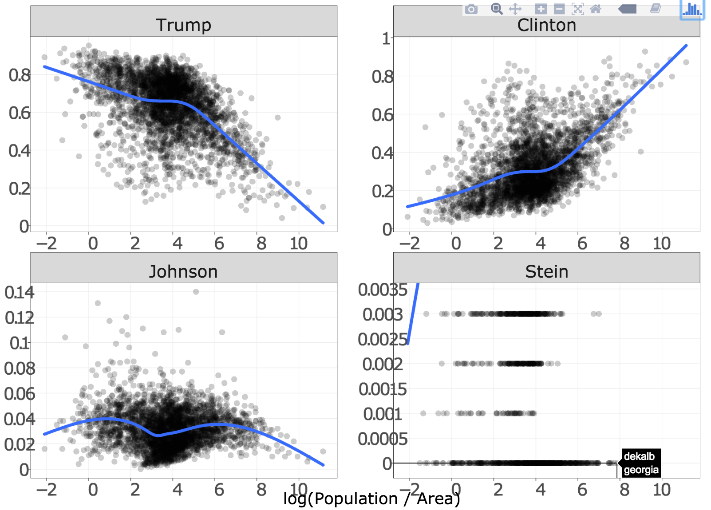
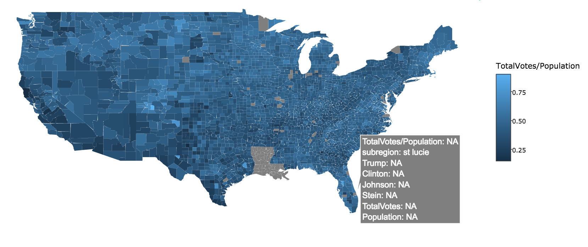
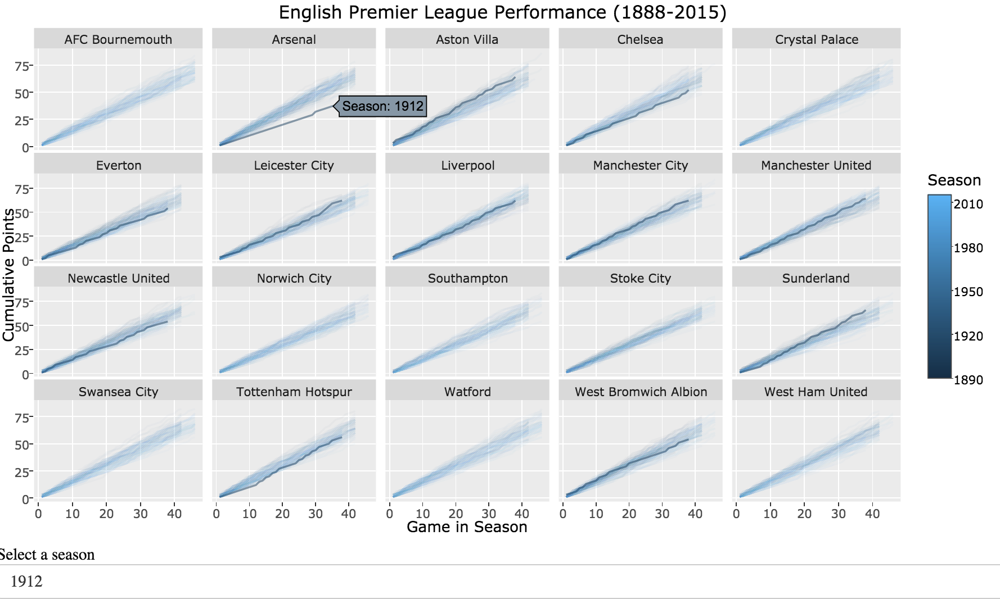
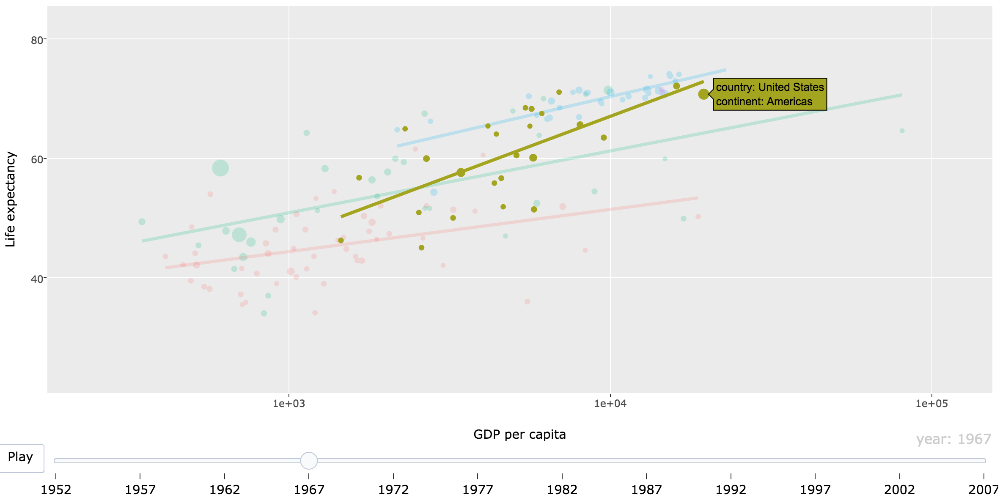
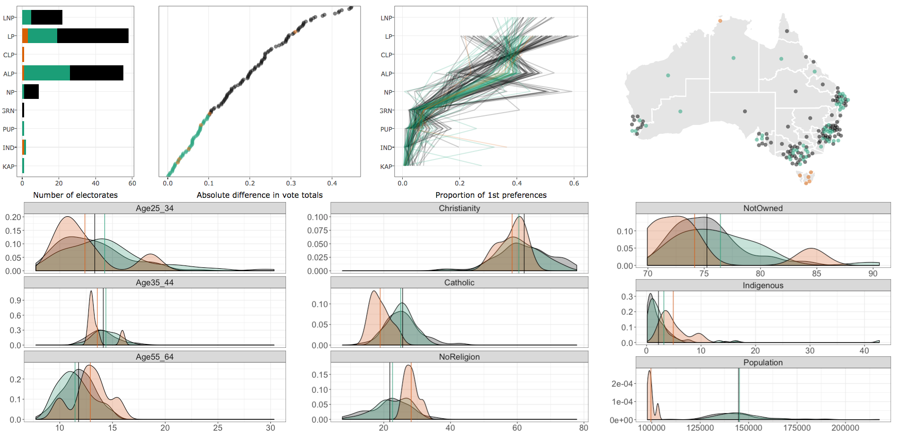
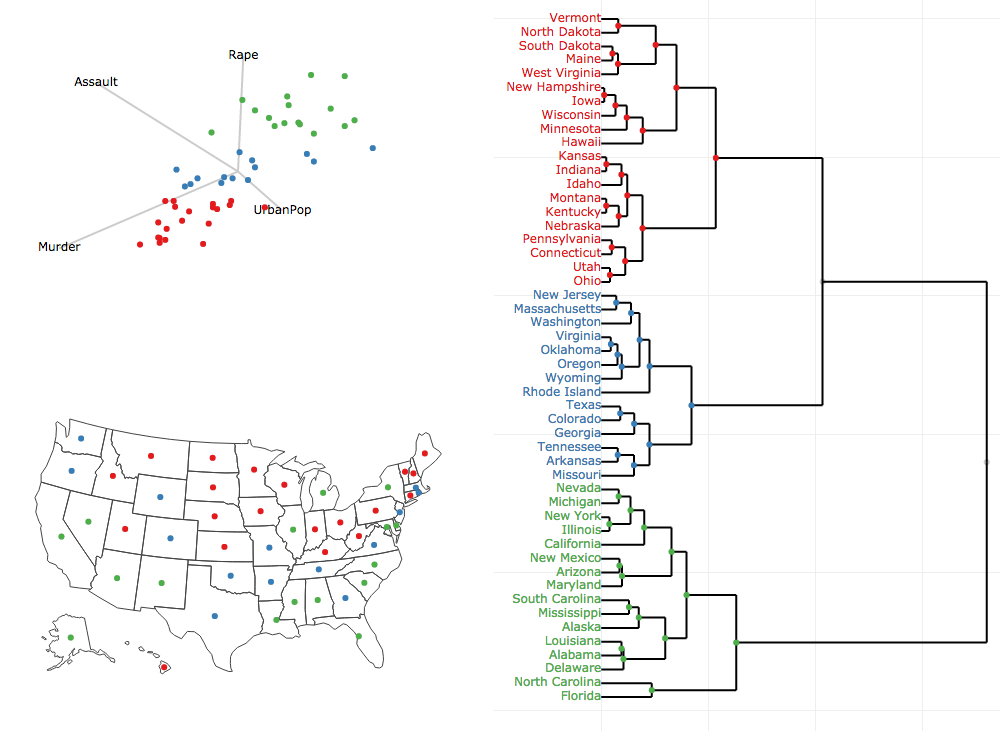

```{r setup, echo = FALSE}
knitr::opts_chunk$set(
  message = FALSE,
  echo = FALSE,
  fig.width = 10,
  fig.height = 4,
  comment = "#>",
  collapse = TRUE
)
```

## Why interactive graphics?

* Why interactive graphics for <b>presentation</b>?
    * Enhances knowledge transfer (see [New York Times](http://www.nytimes.com/interactive/2015/us/year-in-interactive-storytelling.html))
* Why interactive graphics for <b>exploration</b>?
    * Identify structure that otherwise goes missing ([Tukey 1972](http://stat-graphics.org/movies/prim9.html))
    * Better understand/diagnose models ([Wickham, Cook, & Hofmann 2015](http://onlinelibrary.wiley.com/doi/10.1002/sam.11271/abstract)).
    * <b>Generate insights faster (iteration time is crucial!)</b>
    
<div align="center">
  
</div>
    
## Why interactive graphics _on the web_?    

* Portable (i.e., cross-platform)
* Simple to share
* Encourages composability (i.e., reports, dashboards, etc)
* Enables integration of multiple systems (1 + 1 > 2)

<!-- TODO: maybe a graphic of two systems talking to each other? -->

## The problem with web graphics for data analytics

* Great for conveying information (viz is _known_), but impractical for exploration (viz is _unknown_).

<div align="center">
  
</div>

* <b>The reality:</b> analysts have to learn/juggle many technologies.
* <b>My goal:</b> An R interface that makes 80% of techniques <b>seamless</b>, <b>quick</b>, and <b>easy</b> (w/o knowledge of web technology).
* <b>My contribution:</b> Designed and implemented a linked brushing framework.

## Implemented as an R package

<div align="center">
  
</div>

# A demo of the workflow

[See here](https://github.com/cpsievert/talks/tree/gh-pages/20161212a) for the demo script.

## 2016 Election Outcomes by County ([Politico](http://rpubs.com/dgrtwo/county-results))

```
     County |   State | TotalVotes| Clinton| Johnson| Stein| Trump| Population|    Area
    --------| --------| ----------|--------|--------|------|------|-----------|--------
1   autauga | alabama |      24661|   0.240|   0.022| 0.004| 0.734|      54571|  594.44
2   baldwin | alabama |      94090|   0.196|   0.026| 0.005| 0.774|     182265| 1589.78
3   barbour | alabama |      10390|   0.467|   0.009| 0.002| 0.523|      27457|  884.88
4      bibb | alabama |       8748|   0.214|   0.014| 0.002| 0.770|      22915|  622.58
5    blount | alabama |      25384|   0.085|   0.013| 0.004| 0.899|      57322|  644.78
6   bullock | alabama |       4701|   0.751|   0.005| 0.002| 0.242|      10914|  622.81
7    butler | alabama |       8685|   0.428|   0.007| 0.001| 0.563|      20947|  776.83
8   calhoun | alabama |      47376|   0.279|   0.024| 0.006| 0.692|     118572|  605.87
9  chambers | alabama |      13778|   0.418|   0.012| 0.003| 0.566|      34215|  596.53
10 cherokee | alabama |      10503|   0.145|   0.014| 0.002| 0.839|      25989|  553.70
# ... with 3,101 more rows
```

* Is there a relationship between population density and voting preference? 

---

<a href="votes.html">
 <div align="center">
   
 </div>
</a>

## Choropleth map of voter turnout

<a href="map.html">
 <div align="center">
   
 </div>
</a>

## Linking proportions with geography

<a href="https://vimeo.com/192528320">
  
</a>
    
## Brushing to combat overplotting

```{r, eval = FALSE}
library(plotly)
library(crosstalk)

d <- SharedData$new(txhousing, ~city)
p <- ggplot(d, aes(date, median, group = city)) + geom_line()
w <- ggplotly(p, tooltip = "city", dynamicTicks = TRUE, height = 550, width = 1000) %>%
  layout(
    margin = list(l = 50), 
    yaxis = list(title = "Median house price")
    ) %>%
  highlight("plotly_click", "plotly_doubleclick")
htmlwidgets::saveWidget(w, "highlight.html")
```

<iframe src = "highlight.html" style="border: 0; position:absolute; top:100; left:0; right:0; bottom:0; width:100%; height:85%"></iframe>

## Querying missing values

<iframe src = "missing.html" style="border: 0; position:absolute; top:100; left:0; right:0; bottom:0; width:100%; height:85%"></iframe>

## Querying seasons directly/indirectly

<a href="epl">
 <div align="center">
   
 </div>
</a>

## Brushing plus animation

```{r, eval = FALSE, echo = FALSE}
# whoops, this is currently broken?
# devtools::install_github("ropensci/plotly@9370c7476f5355ad810ce5e557a08ae33c470746")
library(gapminder)
g <- crosstalk::SharedData$new(gapminder, ~continent)
gg <- ggplot(g, aes(gdpPercap, lifeExp, color = continent, frame = year)) +
  geom_point(aes(size = pop, ids = country)) +
  geom_smooth(se = FALSE, method = "lm") +
  scale_x_log10()
ggplotly(gg, tooltip = c("continent", "country", "population")) %>% 
    hide_legend() %>%
    layout(xaxis = list(title = "GDP per capita"), yaxis = list(title = "Life expectancy")) %>%
  highlight("plotly_click") %>% animation_opts(easing = "linear")
```

<a href="gapminder.html">
 <div align="center">
   
 </div>
</a>

    
## Making comparisons

<iframe src = "eechidna" style="border: 0; position:absolute; top:100; left:100; right:0; bottom:0; width:80%; height:70%"></iframe>

## Making comparisons

<div align="center">
  
</div>

## Making comparisons

<div align="center">
  
</div>

## Linked Tree Brushing

<a href="USArrests">
 <div align="center">
   
 </div>
</a>

## The bigger picture

* All examples could classify as focusing, arranging, and/or linking views.
* [Cook, Buja, & Swayne 1996](https://www.jstor.org/stable/1390754): {focusing, arranging, linking} => {find Gestalt, pose queries, make comparisons}

<div align="center">
  
</div>


## Similar work

* General purpose:
    * <b>rCharts</b> (Vaidyanathan et al. 2014), <b>ggvis</b> (Chang and Wickham 2016), <b>rBokeh</b> (Hafen et al. 2016), <b>plotly</b> (Sievert el al. 2016)
* Domain specific:
    * <b>leaflet</b> (Cheng et al. 2016), <b>dygraphs</b> (Allaire et al. 2016), <b>networkD3</b> (Gandrud et. al. 2016), <b>DiagrammeR</b> (Iannone et al. 2016), <b>d3scatter</b> (Cheng 2016)
    
* Most approaches neglect/ignore linking views and animation.
    * <b>ggvis</b> - limited linking/animation (requires a <b>shiny</b> (Chang 2016) server).
    * <b>animint</b> (Hocking et al. 2016) limited linking/animation by extending <b>ggplot2</b>'s grammar of graphics implementation (Wickham et al. 2017).

---

* <b>plotly</b> (Sievert el al. 2016) borrows from and improves upon <b>animint</b>.
    * Makes <b>ggplot2</b> graphics interactive.
    * Hooks into custom <b>ggplot2</b> geoms.
        * E.g., <b>ggmosaic</b> (Jeppson et al. 2016), <b>geomnet</b> (Tyner et al. 2016), and <b>ggalt</b> (Rudis et al. 2016).
    * Special support for ggmatrix objects (from <b>GGally</b> (Schloerke et al. 2016)).
    * Better support for focusing (zoom/pan) and arranging views. 
    * A "non-ggplot2" interface supports plots not supported by <b>ggplot2</b> (e.g., 3D charts).
    * Supports more complex brushing interactions 
        * Make selections via mouse hover, click, click & drag.
        * Dynamically modify brush color (making comparisons).

## Future work

* Keep adding documentation and examples in the [plotly for R](https://cpsievert.github.io/plotly_book) book.
* Further advance <b>plotly</b>'s support for linking views (without <b>shiny</b>).
* Support for more popular <b>ggplot2</b> extension packages such as <b>ggrepel</b> and <b>ggraph</b>.
    * Integrating <b>plotly</b>'s support for linking tree-structures with <b>ggraph</b> would be particularly interesting.
* Enable _interactive_ arranging of views.

# Thank you

* Slides -- <http://bit.ly/phd-seminar>

* Contact
    * Email -- <cpsievert1@gmail.com>
    * Twitter -- <http://twitter.com/cpsievert>
    * GitHub -- <http://github.com/cpsievert>
