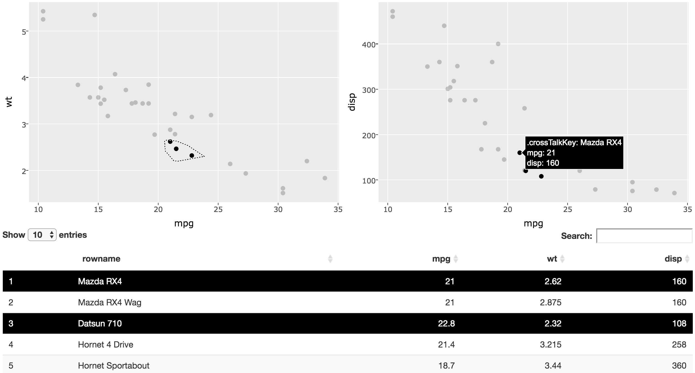
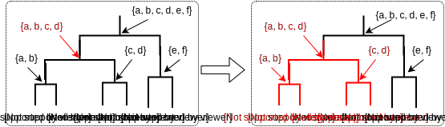
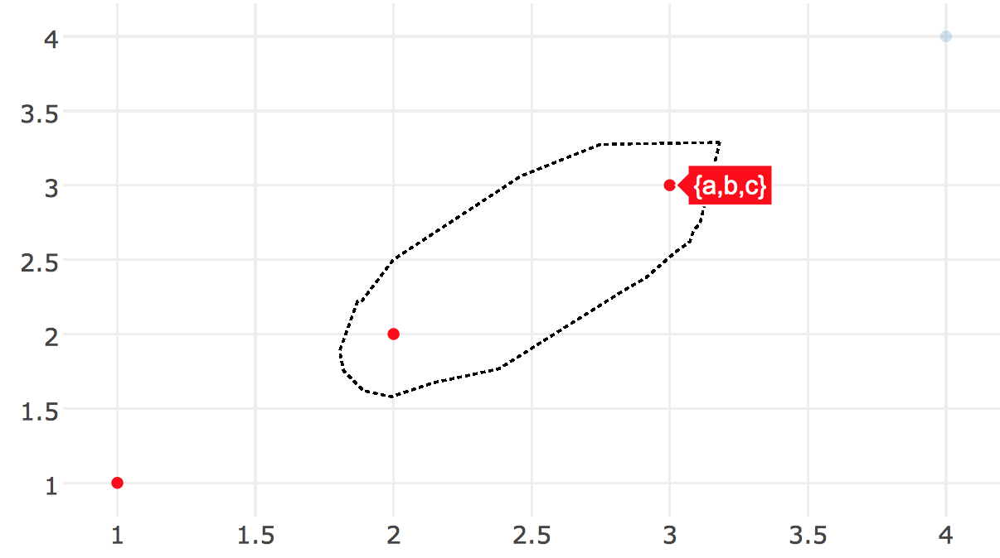
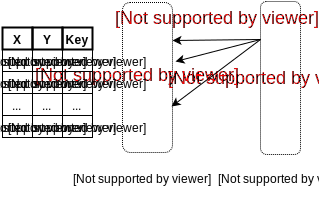
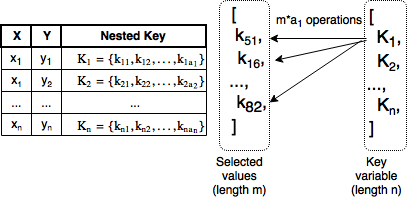

```{r setup, echo = FALSE}
knitr::opts_chunk$set(
  message = FALSE,
  fig.width = 10,
  fig.height = 4,
  comment = "#>",
  collapse = TRUE
)
```

## Bio

* Teaching Assistant, <b>Iowa State University</b> (2011-2015)
* M.S. in Statistics, <b>Iowa State University</b> (2013)
* Internships with AT&T (2013) and Google (2014)
* Software Developer, <b>plotly</b> (2015 - Present)
* Research Assistant, <b>Monash University</b> (Sept 2015 - June 2016)

---

<div align="center">
  
</div>

## Future plans

#### Freelance software developer & data scientist
<p></p>
* My clients already include: plotly, NOAA, Phronesis
* In addition to developing <b>plotly</b>, I plan on delivering "data products" (e.g. interactive web apps, dynamic reports/documents, etc.)
* Businesses already building products around <b>plotly</b>: [Omni Analytics](https://omnianalytics.io/), [TCBD Analytics](http://tcbanalytics.com/)

## Dissertation chapters

* Problem Statement
* Overview
* Taming PITCHf/x Data with XML2R and pitchRx
* LDAvis: A method for visualizing and interpreting topics 
* Extending ggplot2’s grammar of graphics implementation for linked and dynamic graphics on the web
* Interactive data visualization on the web using R
* plotly for R
    * Multiple linked views
        * Linking views with shiny
        * <b>Linking views without shiny</b>
* Impact and Future Work

## Why link views without shiny?

> "Multiple linked views are the optimal framework for posing queries about data" ([Cook, Buja, & Swayne 2007](https://www.jstor.org/stable/1390754))

<div align="center">
  
</div>

* Web applications are generally more complicated, less responsive, and difficult to share.

## Linking as a database query

* First described in detail by [Buja, McDonald, Michalak, and Stuetzle 1991](https://www.stat.washington.edu/wxs/Visualization-papers/focusing-and-linking.pdf).
* Compared to other linking frameworks by [Cook, Buja, & Swayne 2007](https://www.jstor.org/stable/1390754).
* Snap-together visualizations (on Windows) [North and Shneiderman 1999](http://www.cs.umd.edu/hcil/snap/snap-avi00.pdf).
* <b>crosstalk</b> (Cheng et al. 2016) proposes similar standards for linking web graphics from R.

<div align="center">
  
</div>

## 1-to-1 linking

<div align="center">
  
</div>

## 1-to-n linking

<iframe src = "missing.html" style="border: 0; position:absolute; top:100; left:0; right:0; bottom:0; width:100%; height:85%"></iframe>

---

<div align="center">
  
</div>

---

```{r, eval = FALSE}
library(plotly)
library(dplyr)
library(crosstalk)

sd <- SharedData$new(txhousing, ~city)

base <- plot_ly(sd, color = I("black")) %>%
  group_by(city)

p1 <- base %>%
  summarise(has = sum(is.na(median))) %>%
  filter(has > 0) %>%
  arrange(has) %>%
  add_bars(x = ~has, y = ~factor(city, levels = city), hoverinfo = "none")

p2 <- base %>%
  add_lines(x = ~date, y = ~median, alpha = 0.3)

subplot(p1, p2, widths = c(0.3, 0.7)) %>% 
  highlight(on = "plotly_click", off = "plotly_unhover", color = "red")
```

## m-to-n linking

<iframe src = "eechidna" style="border: 0; position:absolute; top:100; left:100; right:0; bottom:0; width:80%; height:70%"></iframe>

## Displaying aggregated selections

```{r, echo = FALSE, fig.height=5.4}
library(crosstalk)
library(plotly)
d <- SharedData$new(mpg)
dots <- plot_ly(d, color = ~class, x = ~displ, y = ~cyl)
boxs <- plot_ly(d, color = ~class, x = ~class, y = ~cty) %>% add_boxplot() %>% layout(xaxis = list(title = ""))
bars <- plot_ly(d, x = ~class, color = ~class) %>% layout(xaxis = list(title = ""))

subplot(dots, boxs, titleX = TRUE, titleY = TRUE) %>%
  subplot(bars, nrows = 2, titleX = TRUE, titleY = TRUE) %>%
  hide_legend() %>%
  layout(barmode = "overlay", dragmode = "select")
```

---

```{r, eval = FALSE}
d <- SharedData$new(mpg)
dots <- plot_ly(d, color = ~class, x = ~displ, y = ~cyl)
boxs <- plot_ly(d, color = ~class, x = ~class, y = ~cty) %>% add_boxplot()
bars <- plot_ly(d, x = ~class, color = ~class)

subplot(dots, boxs) %>%
  subplot(bars, nrows = 2) %>%
  layout(barmode = "overlay", dragmode = "select")
```

<p></p>

* plotly.js "natively" supports a few statistical graphics (e.g., bar charts, histograms, and boxplots)
    
* Dynamically updating other statistical graphics (e.g., densities, fitted lines, violins, etc) currently requires [linking views <b>with shiny</b>](https://cpsievert.github.io/plotly_book/linking-views-with-shiny.html)

## Tree linking via subset matching

* Tree-like structures associate multiple values with a single graphical element

<div align="center">
  
</div>

* In this case, we need to match _sets_ rather than _elements_.

## Attaching sets via list-columns

```{r}
d <- data.frame(x = 1:4, y = 1:4)
d$key <- lapply(1:4, function(x) letters[seq_len(x)])
d
```

```{r, eval = FALSE}
plot_ly(d, x = ~x, y = ~y, key = ~key) %>% highlight(color = "red")
```

```{r, echo = FALSE, fig.height=2, fig.width=4}
d$txt <- lapply(d$key, function(x) { paste0("{", paste(x, collapse = ","), "}") })

library(crosstalk)
library(plotly)
SharedData$new(d, ~key) %>%
  plot_ly(x = ~x, y = ~y, text = ~txt, hoverinfo = "text") %>% 
  highlight(color = "red")
```

## Devil in the details

<div align="center">
  
</div>

* Do we "inform the world" as $\{\{a, b\}, \{a, b, c\}\}$? Or $\{a, b, c\}$?
* For now, we _always_ emit the union, but emitting a set of sets could be useful for linking networks (for example).

## Keeping it simple encourages system integration

<iframe src = "parcoords" style="border: 0; position:absolute; top:20; left:0; right:0; bottom:0; width:100%; height:80%"></iframe>

```{r, eval = FALSE, echo = FALSE}
library(plotly)
library(parcoords)
library(crosstalk)
library(htmltools)

hc <- hclust(dist(USArrests), "ave")
dend1 <- as.dendrogram(hc)
p2 <- plot_dendro(dend1, height = 600, width = 550) %>%
  highlight(off = NULL)

p1 <- USArrests[labels(dend1),] %>% SharedData$new(group = "A") %>% 
  parcoords(brushMode = "1D-axes", reorderable = TRUE,
            color = "black", width = 550)

html <- tags$div(
  style = "display: flex; flex-wrap: wrap",
  tags$div(p1, style = "width: 50%;"),
  tags$div(p2, style = "width: 50%;")
)

res <- html_print(html)
file.copy(
  dir(dirname(res), full.names = T), 
  "parcoords", overwrite = T, recursive = T
)
```

## Keeping it simple encourages system integration

```{r, eval = FALSE}
library(plotly)
library(parcoords)
library(crosstalk)

hc <- hclust(dist(USArrests), "ave")
dend1 <- as.dendrogram(hc)

htmltools::tagList(
  plot_dendro(dend1),
  USArrests %>% SharedData$new() %>% parcoords()
)
```

## Basic matching algorithm

<div align="center">
  
</div>

* Worst-case scenario $\mathcal{O}(mn)$
* If key has, say $u < n$ unique values, can improve to $\mathcal{O}(mu)$.

## Subset matching algorithm

<div align="center">
  
</div>

* Worst-case scenario $\mathcal{O}(m \Sigma_{i=1}^n a_i)$
* Again, if key has, say $u < n$ unique values, can improve to $\mathcal{O}(m \Sigma_{i=1}^{\textbf{u}} a_i)$.

## Improving performance via "simple keys"

```{r}
m <- SharedData$new(mpg)
p <- ggplot(m, aes(displ, hwy, colour = class)) +
  geom_point() +
  geom_smooth(se = FALSE, method = "lm")
ggplotly(p) %>% highlight("plotly_hover")
```

## The geom_smooth() data

```{r}
d <- ggplotly(p, originalData = F, layerData = 2) %>% 
  plotly_data()
d
```

## The geom_smooth() key

* Many of the key values are redundant

```{r}
length(d$key)
length(unique(d$key))
```

* And one unique key per color

```{r}
length(unique(setNames(d$key, d$colour)))
```

## Data sent to plotly.js

```{r, eval=FALSE}
p %>% ggplotly() %>% plotly_json()
```

```{r, echo=FALSE}
p %>% ggplotly() %>% plotly_json(T)
```

## What do "simple keys" buy us?

* Reduces querying time of [this example](http://i.imgur.com/DdPdSBB.gif) from minutes to seconds.

<a href="../20161212a/election.mp4">
  
</a>

## Future work

* Keep adding documentation and examples in the [plotly for R](https://cpsievert.github.io/plotly_book) book.
* Further advance <b>plotly</b>'s support for linking views without <b>shiny</b>
    * Add more support for displaying statistical summaries of selections.
    * Integrate <b>plotly</b>'s linking features with more projects (see <b>leaflet</b> (Cheng et al. 2016) and <b>parcoords</b> (Russell et al. 2016))
    * Lower hanging fruit is listed [here](https://cpsievert.github.io/plotly_book/linking-views-without-shiny.html#limitations))
* Support for more popular <b>ggplot2</b> extension packages such as <b>ggrepel</b> and <b>ggraph</b>.
    * Integrating <b>plotly</b>'s support for linking tree/network structures with <b>ggraph</b>/<b>geomnet</b> would be particularly interesting.

# Thank you, questions?
