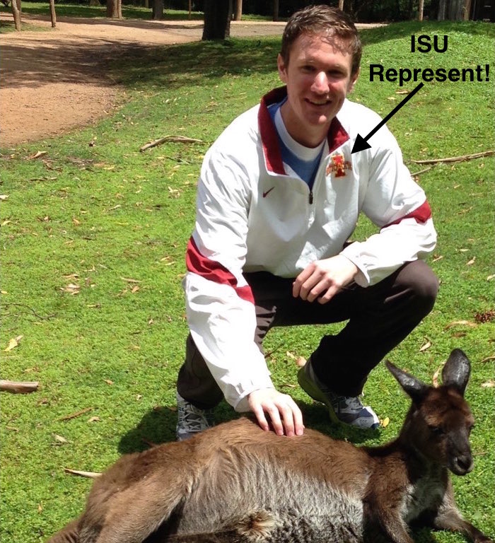

```{r setup, echo = FALSE}
knitr::opts_chunk$set(
  message = FALSE,
  fig.width = 10,
  fig.height = 4,
  comment = "#>",
  collapse = TRUE
)
```

<!-- Note to self:
Make sure this builds off the proposal -- http://cpsievert.github.io/slides/web-graphics/proposal/
-->

## Bio

* Teaching Assistant, <b>Iowa State University</b> (2011-2015)
* M.S. in Statistics, <b>Iowa State University</b> (2013)
* Internships with AT&T (2013) and Google (2014)
* Software Developer, <b>plotly</b> (2015 - Present)
* Research Assistant, <b>Monash University</b> (Sept 2015 - June 2016)

---

<div align="center">
  
</div>

## Future plans

#### Freelance software developer & data scientist
<p></p>
* My clients already include: plotly, NOAA, Phronesis
* In addition to developing <b>plotly</b>, I plan on delivering "data products" (e.g. interactive web apps, dynamic reports/documents, etc.)
* Businesses already building products around <b>plotly</b>: [Omni Analytics](https://omnianalytics.io/), [TCBD Analytics](http://tcbanalytics.com/)


## Dissertation chapters

* Problem Statement
* Overview
* Taming PITCHf/x Data with XML2R and pitchRx
* LDAvis: A method for visualizing and interpreting topics 
* Extending ggplot2’s grammar of graphics implementation for linked and dynamic graphics on the web
* __Interactive data visualization on the web using R__
* __plotly for R__
* Impact and Future Work


* Slides -- <http://bit.ly/phd-defense>

# Thank you
