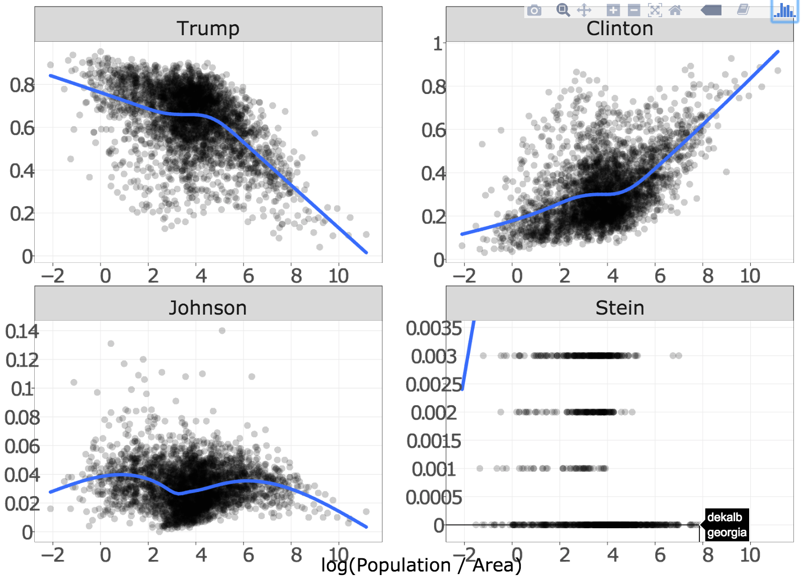
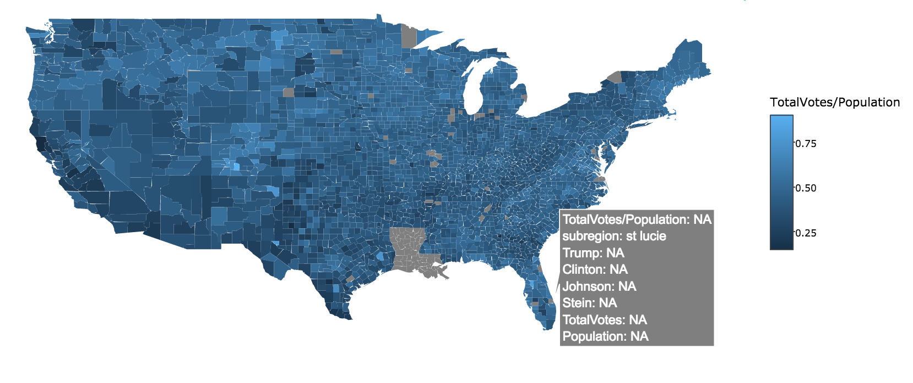
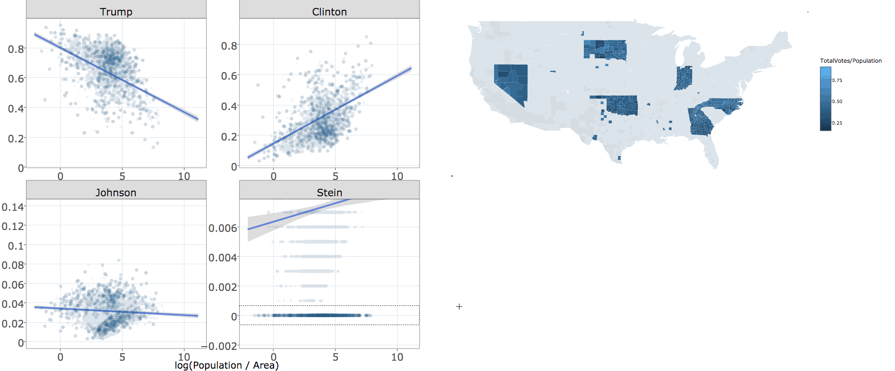
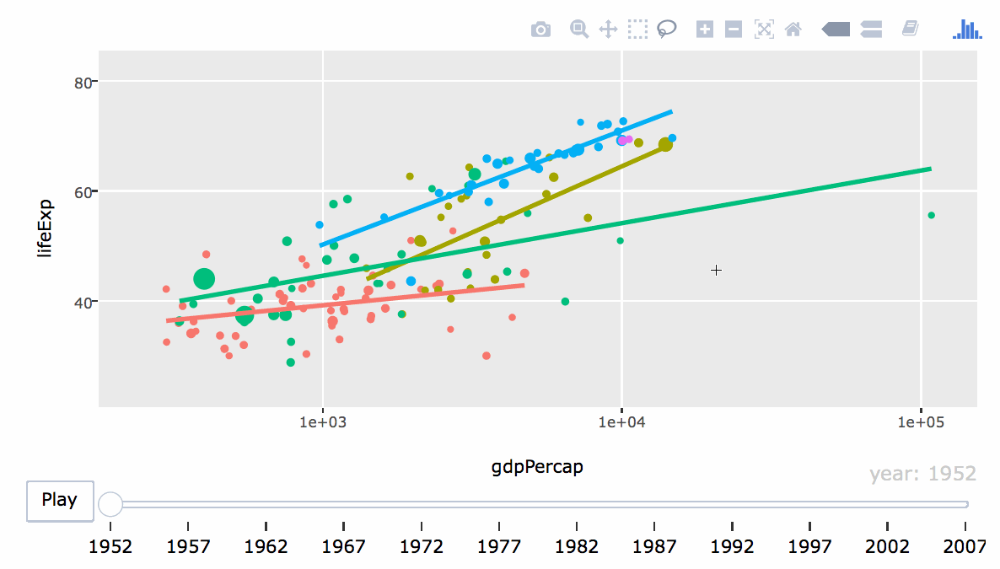
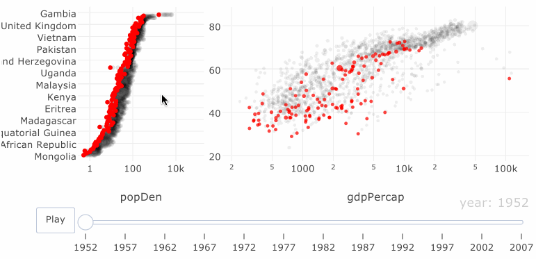
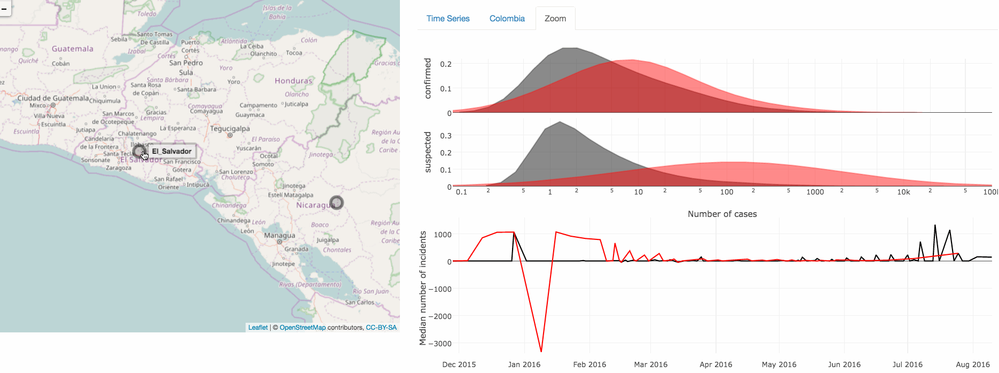

```{r setup, echo = FALSE}
knitr::opts_chunk$set(
  message = FALSE,
  fig.width = 10,
  fig.height = 4,
  comment = "#>",
  collapse = TRUE
)
```

## About me

### Past

<p></p>

* PhD in statistics from Iowa State University (December, 2016)
    * __Dissertation__: Interfacing R with web technologies for interactive statistical graphics ([link](https://github.com/cpsievert/phd-thesis/blob/master/docs/bookdown.pdf))

### Present

<p></p>

* Freelance software engineer, data scientist, and educator
    * Maintaining plotly (~ 2 years!)
        * Looking for "real-world applications".
    * Developing rerddap (interface to NOAA data).
    * Authoring [O'Reilly Oriole](http://www.oreilly.com/oriole/) (online tutorial mixing video, text, code).
        * Looking to run similar live workshops (experience at [Iowa State](http://heike.github.io/R-workshops/), [Monash](http://dicook.github.io/Monash-R/), [plotcon](https://plotcon.plot.ly/workshops))

## Why interactive graphics?

* Why interactive graphics for <b>presentation</b>?
    * Enhances knowledge transfer (see [New York Times](http://www.nytimes.com/interactive/2015/us/year-in-interactive-storytelling.html))
* Why interactive graphics for <b>exploration</b>?
    * Identify structure that otherwise goes missing ([Tukey 1972](http://stat-graphics.org/movies/prim9.html))
    * Better understand/diagnose models ([Wickham, Cook, & Hofmann 2015](http://onlinelibrary.wiley.com/doi/10.1002/sam.11271/abstract)).
    * [<b>Generate insights faster (iteration time is crucial!)</b>](http://stat-graphics.org/movies/tour-de-france.html)
    
<div align="center">
  
</div>
    
## Why interactive graphics _on the web_?    

* Portable (i.e., cross-platform)
* Simple to share (especially self-contained HTML)
* Encourages composability (i.e., reports, dashboards, etc)
* Enables integration of multiple systems (1 + 1 > 2)

## The problem with web graphics for data analytics

* Great for conveying information (viz is _known_), but impractical for exploration (viz is _unknown_).

<div align="center">
  
</div>

* <b>The reality:</b> analysts have to learn/juggle many technologies.
* <b>My goal:</b> An R interface that makes 80% of techniques <b>seamless</b>, <b>quick</b>, and <b>easy</b> (w/o knowledge of web technology).

# Motivating techniques through common data analysis tasks

## 2016 Election Outcomes by County ([Politico](http://rpubs.com/dgrtwo/county-results))

```
     County |   State | TotalVotes| Clinton| Johnson| Stein| Trump| Population|    Area
    --------| --------| ----------|--------|--------|------|------|-----------|--------
1   autauga | alabama |      24661|   0.240|   0.022| 0.004| 0.734|      54571|  594.44
2   baldwin | alabama |      94090|   0.196|   0.026| 0.005| 0.774|     182265| 1589.78
3   barbour | alabama |      10390|   0.467|   0.009| 0.002| 0.523|      27457|  884.88
4      bibb | alabama |       8748|   0.214|   0.014| 0.002| 0.770|      22915|  622.58
5    blount | alabama |      25384|   0.085|   0.013| 0.004| 0.899|      57322|  644.78
6   bullock | alabama |       4701|   0.751|   0.005| 0.002| 0.242|      10914|  622.81
7    butler | alabama |       8685|   0.428|   0.007| 0.001| 0.563|      20947|  776.83
8   calhoun | alabama |      47376|   0.279|   0.024| 0.006| 0.692|     118572|  605.87
9  chambers | alabama |      13778|   0.418|   0.012| 0.003| 0.566|      34215|  596.53
10 cherokee | alabama |      10503|   0.145|   0.014| 0.002| 0.839|      25989|  553.70
# ... with 3,101 more rows
```

* Is there a relationship between population density and voting preference? 

---

<a href="../20161212a/votes.html">
 <div align="center">
   
 </div>
</a>

## Choropleth map of voter turnout

<a href="../20161212a/map.html">
 <div align="center">
   
 </div>
</a>

## Linking proportions with geography

<a href="https://vimeo.com/192528320">
  
</a>


# Hands-on demo

[See here](demo.R) for the R script. [See here](demo.html) for the output. 


## Brushing plus animation

```{r, eval = FALSE, echo = FALSE}
# whoops, this is currently broken?
# devtools::install_github("ropensci/plotly@9370c7476f5355ad810ce5e557a08ae33c470746")
library(gapminder)
g <- crosstalk::SharedData$new(gapminder, ~continent)
gg <- ggplot(g, aes(gdpPercap, lifeExp, color = continent, frame = year)) +
  geom_point(aes(size = pop, ids = country)) +
  geom_smooth(se = FALSE, method = "lm") +
  scale_x_log10()
ggplotly(gg, tooltip = c("continent", "country", "population")) %>% 
    hide_legend() %>%
    layout(
      xaxis = list(title = "GDP per capita"), 
      yaxis = list(title = "Life expectancy")
    ) %>%
  animation_opts(easing = "linear") %>%
  highlight("plotly_click")
```

<a href="../20161212a/gapminder.html">
 <div align="center">
   
 </div>
</a>

## Brushing plus animation

<a href="gapminder2.html">
 <div align="center">
   
 </div>
</a>


## Linked Tree Brushing

<iframe src = "../20161212b/parcoords/index.html" style="border: 0; position:absolute; top:10; left:0; right:0; bottom:0; width:100%; height:80%"></iframe>

---

<iframe src = "../20161212a/USArrests/index.html" style="border: 0; position:absolute; top:0; left:0; right:0; bottom:0; width:100%; height:100%"></iframe>

## The bigger picture

* All these examples: 
    * Are _self-contained_ HTML (easy to share/deploy/embed!)
    * 3 types of manipulation: focusing, arranging, and/or linking views.
* [Cook, Buja, & Swayne 1996](https://www.jstor.org/stable/1390754): {focusing, arranging, linking} => {find Gestalt, pose queries, make comparisons}
    * Linking has different interpretations (database query)
    * Focusing is deceivingly general.
    * Arrangement must (currently) be specified at runtime.
    
<p></p>

#### We can only go so far _without_ shiny

    * What if we want to display a statistical summary of a selecton?

## Dynamically aggregate selections


```{r echo = FALSE, fig.height = 5, fig.width = 10}
library(plotly)
d <- crosstalk::SharedData$new(mpg)
dots <- plot_ly(d, color = ~class, x = ~displ, y = ~cyl)
boxs <- plot_ly(d, color = ~class, x = ~class, y = ~cty) %>% add_boxplot()
bars <- plot_ly(d, x = ~class, color = ~class)

subplot(dots, boxs, titleX = TRUE, titleY = TRUE) %>%
  subplot(bars, nrows = 2, titleX = TRUE, titleY = TRUE) %>%
  layout(
    dragmode = "select",
    barmode = "overlay",
    showlegend = FALSE
  )
```

---

```{r fake, eval = FALSE}
d <- SharedData$new(mpg)
dots <- plot_ly(d, color = ~class, x = ~displ, y = ~cyl)
boxs <- plot_ly(d, color = ~class, x = ~class, y = ~cty) %>% add_boxplot()
bars <- plot_ly(d, x = ~class, color = ~class)

subplot(dots, boxs) %>%
  subplot(bars, nrows = 2) %>%
  layout(
    dragmode = "select",
    barmode = "overlay",
    showlegend = FALSE
  )
```

* plotly.js "natively" supports a few statistical graphics (e.g., bar charts, histograms, and boxplots)
    
* Dynamically updating other statistical graphics (e.g., densities, fitted lines, violins, etc) currently requires [linking views <b>with shiny</b>](https://cpsievert.github.io/plotly_book/linking-views-with-shiny.html)

## For example...

<a href="https://vimeo.com/190610577">
    
</a>

<http://github.com/cpsievert/zikar>

## Future work

* Keep adding documentation and examples to [plotly for R book](https://cpsievert.github.io/plotly_book)
* Further advance <b>plotly</b>'s support for linking views (without <b>shiny</b>).
    * [plotly.js](https://github.com/plotly/plotly.js/issues/1316) itself may gain some support...
* Support for more popular <b>ggplot2</b> extension packages such as <b>ggrepel</b> and <b>ggraph</b>.
    * Integrating <b>plotly</b>'s support for linking tree-structures with <b>ggraph</b> would be particularly interesting.

# Thank you

* Slides -- <http://bit.ly/CEID-UGA>

* Contact
    * Email -- <cpsievert1@gmail.com>
    * Twitter -- <http://twitter.com/cpsievert>
    * GitHub -- <http://github.com/cpsievert>
