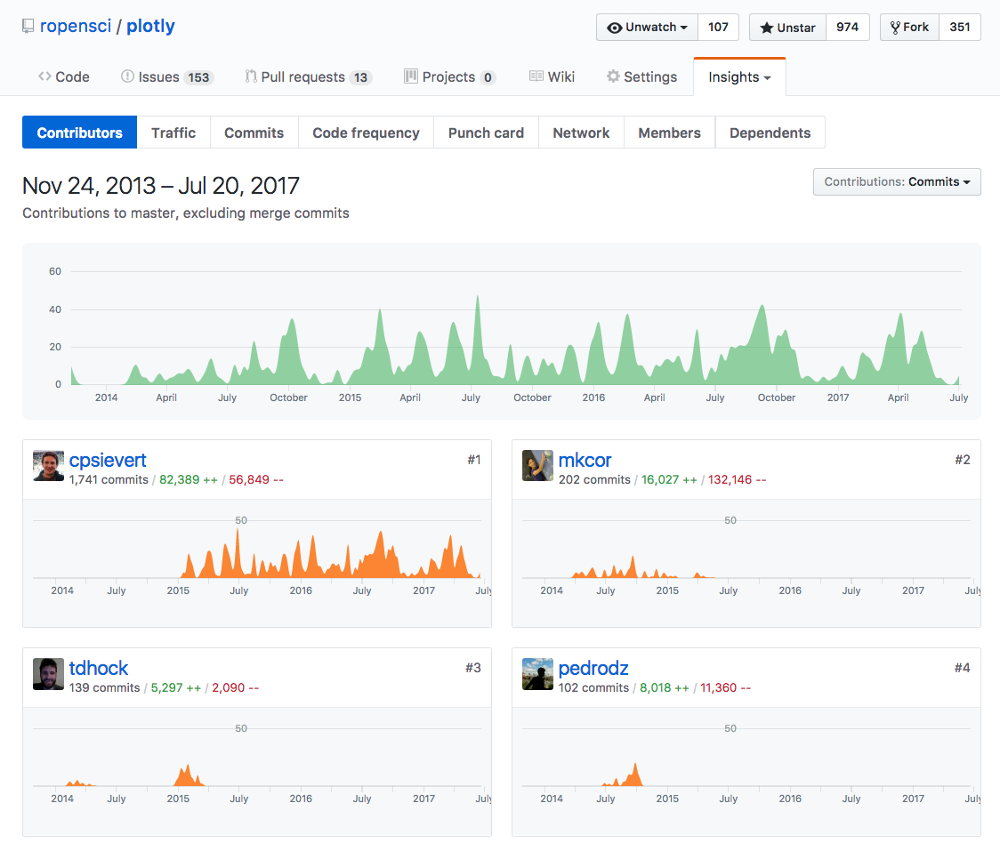
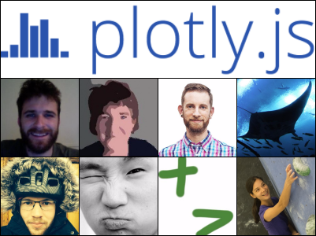

background-image: url(excited_beyond_belief.gif)
background-size: contain
class: center, middle, inverse

# !!!!!!!!!!!!!

---
## What did I do get here?

  

---
## The plotly ecosystem

  

---
## My contributions

  

<!--
## Why am I here?

* My contributions to R package __plotly__.
    * Maintainer since Dec 2015.
    * Implemented a [linked views framework](http://plotly-book.cpsievert.me/linking-views-without-shiny.html), [animation API](http://plotly-book.cpsievert.me/key-frame-animations.html), the `plot_ly()` interface, improved `ggplotly()`.
-->
    
---
## How did I get here?

  

---
## Key moments/people

* __Jan 2012:__ Heike & Di's "experimental" data science course
    * Learned about reproducibility & collaboration (e.g., knitr, git, GitHub)1
    
* __May 2013:__ Internship with Kenny Shirley at AT&T
    * Learned about lack of tools for _exploratory_ web graphics.
    
* __May 2014:__ Google Summer of Code with Toby Dylan Hocking2
    * Learned about converting __ggplot2__ from static to interactive.

* __2015:__ Consultant for plotly2
    * 

* __2017:__ Defended PhD. 

.footnote[ 
[1]: Want your students to be more employable? Teach them git/GitHub!!!

[2]: Wouldn't have been possible without git/GitHub knowledge!
]

---
background-image: url(finished.gif)
background-size: contain
class: bottom, inverse

## Neat story! Is it over?

---
## In Summary

* To the community:
    * 

* To mentors:
    * Be wary of "do everything yourself" projects.
    * 
      * To implement something of academic interest, you need 
    * 
