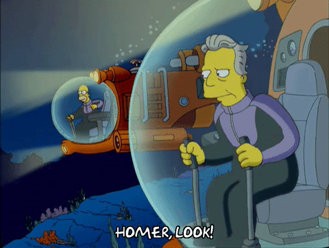

background-image: url(workflow.svg)
background-size: contain
class: inverse

# Data Science Workflow

???

I love this diagram from the R for Data Science book.

Concisely captures the main components.

---
background-image: url(workflow1.svg)
background-size: contain
class: inverse

# <font color="#cc1f29"> Expository vis </font>

.footnote[
Assuming you know _exactly_ what you want to visualize, many good JavaScript frameworks exist (e.g., d3js, Vega, plotly.js, bokeh, etc)!
]

???

The web has become the preferred medium for communicating results.

Once you know what you want to show, plotly.js is a great choice!!

---
background-image: url(workflow2.svg)
background-size: contain
class: inverse

# <font color="#cc1f29"> Exploratory vis </font>

.footnote[
### Too often, analysts juggle several technolgies (R, Python, JavaScript)
]

???

JavaScript lacks tools for iteration (necessary for exploration/discovery!)


---
background-image: url(../gifs/swamp.gif)
background-size: contain
class: inverse, center, bottom

## It is all too easy for statistical thinking to be **swamped by programming tasks.** -- Brian D. Ripley


???

So, this is me, in my 2nd year of grad school, deciding to learn D3 & JavaScript.

It took me 6+ months to implement a single interactive visualization.

And let me tell you, you guys, no joke, believe me, I arose from the swamp, and decide I alone will...


---
background-image: url(../gifs/drain-the-swamp.gif)
background-size: contain
class: inverse, center

# `r emo::ji("point_up")` `r emo::ji("tangerine")` 


---
class: middle
background-image: url(plotly.svg)
background-size: 100px
background-position: 90% 8%

# My mission

A single (R) interface that:

1. Doesn't require knowledge of web technologies.
2. Works seamlessly with other "tidy" tools in R.
3. Easy<sup>1</sup> to declare interactive *techniques that support common data analysis tasks*<sup>2</sup>.

.footnote[ 
[1]: 80% should be easy (i.e., don't require extra knowledge), but the remaining 20% should be possible. <br />
[2]: Analysts usually have different needs from the terminal audience.
]
  
---
background-image: url(plotly.svg)
background-size: 100px
background-position: 90% 8%
## Interactivity augments data exploration!

* Identify structure that otherwise goes missing ([Tukey 1972]()).
* Interactive techniques foster data analysis tasks ([Cook et al 1996]()).
    * Finding Gestalt, posing queries, and making comparisons.
* Better understand/diagnose models ([Wickham, Cook, & Hofmann 2015]()).

???

* Let's not forget -- statisticians have been thinking about the problem for 50 years!
* Easy to get lost in a sea of techniques -- easier if you motivate via data analysis tasks.
* Not everyone has a need to diagnose models, but everyone has a need to get stuff done

---
background-image: url(plotly.svg)
background-size: 100px
background-position: 90% 8%

## Interactivity augments data exploration!

* Identify structure that otherwise goes missing ([Tukey 1972]()).
* Interactive techniques foster data analysis tasks ([Cook et al 1996]()).
    * Finding Gestalt, posing queries, and making comparisons.
* Better understand/diagnose models ([Wickham, Cook, & Hofmann 2015]()).
* Generate insights faster ([Hofmann & Unwin 1999]()).

<div align="center">
  
</div>

???


---
background-image: url(workflow2.svg)
background-size: 250px
background-position: 90% 8%
class: inverse, center, middle

### No matter how complex and polished the individual operations are, it is often 

# the quality of the glue that most directly determines the power of the system.

.footnote[
Quote from Hal Abelson & part of the [tidyverse manifesto](https://cran.r-project.org/package=tidyverse)
]

???

Generating faster insights requires good glue. This comes in two parts:
  * Works seamlessly with other programming interfaces (iteration time!)
  * Works seamlessly with other graphical interfaces (i.e., can link components from independent systems).

---
background-image: url(europe.png)
background-size: contain
class: inverse

---

```r
library(tidyverse)
library(ggplot2)

*# read and clean data
d <- read_csv('GEOSTAT_grid_POP_1K_2011_V2_0_1.csv') %>%
  rbind(read_csv('JRC-GHSL_AIT-grid-POP_1K_2011.csv') %>%
          mutate(TOT_P_CON_DT = '')) %>%
  mutate(
    lat = as.numeric(gsub('.*N([0-9]+)[EW].*', '\\1', GRD_ID))/100,
    lng = as.numeric(gsub('.*[EW]([0-9]+)', '\\1', GRD_ID)) * ifelse(gsub('.*([EW]).*', '\\1', GRD_ID) == 'W', -1, 1) / 100
  ) %>%
  filter(lng > 25, lng < 60) %>%
  group_by(lat = round(lat, 1), lng = round(lng, 1)) %>%
  summarize(value = sum(TOT_P, na.rm = T))  %>%
  ungroup() %>%
  tidyr::complete(lat, lng)

*# visualize
ggplot(d, aes(lng, lat + 5*(value / max(value, na.rm = T)))) +
  geom_line(
    aes(group = lat, text = paste("Population:", value)),
    size = 0.4, alpha = 0.8, color = '#5A3E37', na.rm = T
  ) +
  coord_equal(0.9) + 
  ggthemes::theme_map()

```

---

```r
library(tidyverse)
*library(plotly)

d <- read_csv('GEOSTAT_grid_POP_1K_2011_V2_0_1.csv') %>%
  rbind(read_csv('JRC-GHSL_AIT-grid-POP_1K_2011.csv') %>%
          mutate(TOT_P_CON_DT = '')) %>%
  mutate(
    lat = as.numeric(gsub('.*N([0-9]+)[EW].*', '\\1', GRD_ID))/100,
    lng = as.numeric(gsub('.*[EW]([0-9]+)', '\\1', GRD_ID)) * ifelse(gsub('.*([EW]).*', '\\1', GRD_ID) == 'W', -1, 1) / 100
  ) %>%
  filter(lng > 25, lng < 60) %>%
  group_by(lat = round(lat, 1), lng = round(lng, 1)) %>%
  summarize(value = sum(TOT_P, na.rm = T))  %>%
  ungroup() %>%
  tidyr::complete(lat, lng)

*# make each latitude "highlight-able"
*sd <- crosstalk::SharedData$new(d, ~lat)

ggplot(sd, aes(lng, lat + 5*(value / max(value, na.rm = T)))) +
  geom_line(
    aes(group = lat, text = paste("Population:", value)),
    size = 0.4, alpha = 0.8, color = '#5A3E37', na.rm = T
  ) +
  coord_equal(0.9) + 
  ggthemes::theme_map()
  
*ggplotly()
```

---

<iframe src="europe.html" width="100%" height="750" scrolling="no" seamless="seamless" frameBorder="0"> </iframe>

---
## Linking small multiples

```r
library(plotly)
*library(crosstalk)
*sd <- SharedData$new(txhousing, ~year)
p <- ggplot(sd, aes(month, median, group = year)) + geom_line() +
  facet_wrap(~city, ncol = 2)
(gg <- ggplotly(p, tooltip = "year"))
```

<iframe src="../20170730/09.html" width="100%" height="400" scrolling="no" seamless="seamless" frameBorder="0"> </iframe>


---
## Linking multiple views

<iframe src="https://player.vimeo.com/video/192528320" width="100%" height="550" frameborder="0" webkitallowfullscreen mozallowfullscreen allowfullscreen></iframe>

---

## Linking animated views


---

## Link with other widgets

<iframe src="leaflet2/index.html" width="100%" height="600" scrolling="no" seamless="seamless" frameBorder="0"> </iframe>


---

```r
library(leaflet)
library(crosstalk)
library(plotly)

sd <- SharedData$new(quakes)
stations <- filter_slider("station", "Number of Stations", sd, ~stations)

p <- plot_ly(sd, x = ~depth, y = ~mag) %>% 
  add_markers(alpha = 0.5) %>% 
  highlight("plotly_selected", dynamic = TRUE)

map <- leaflet(sd) %>% 
  addTiles() %>% 
  addCircles()

bscols(p, map, stations)
```


---

```r
library(leaflet)
library(crosstalk)
library(plotly)

*# Input data for every view!
*sd <- SharedData$new(quakes)
stations <- filter_slider("station", "Number of Stations", sd, ~stations)

p <- plot_ly(sd, x = ~depth, y = ~mag) %>% 
  add_markers(alpha = 0.5) %>% 
  highlight("plotly_selected", dynamic = TRUE)

map <- leaflet(sd) %>% 
  addTiles() %>% 
  addCircles()

bscols(p, map, stations)
```


### TAKE HOME MESSAGE: Build upon uniform data structures!

---
class: inverse, middle, center
background-image: url(headshots.png)
background-size: contain

## Standing on the shoulders of giants

---

## In summary


---
class: middle, center

## Thanks! Questions?

Slides: <https://talks.cpsievert.me> <br />

#### Learn more

Plotly book: <https://plotly-book.cpsievert.me> <br />
PhD thesis: <https://github.com/cpsievert/phd-thesis> <br />

#### Contact

Twitter: <a href='https://twitter.com/cpsievert'>@cpsievert</a> <br />
GitHub: <a href='https://github.com/cpsievert'>@cpsievert</a> <br />
Email: <cpsievert1@gmail.com> <br />
Web: <https://cpsievert.me/>

