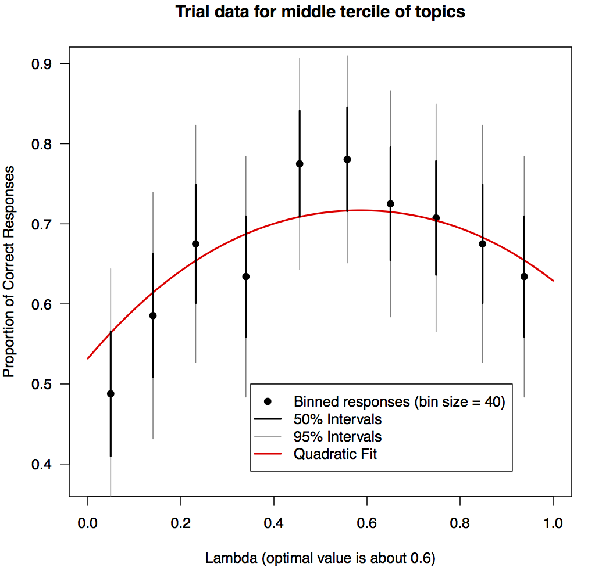
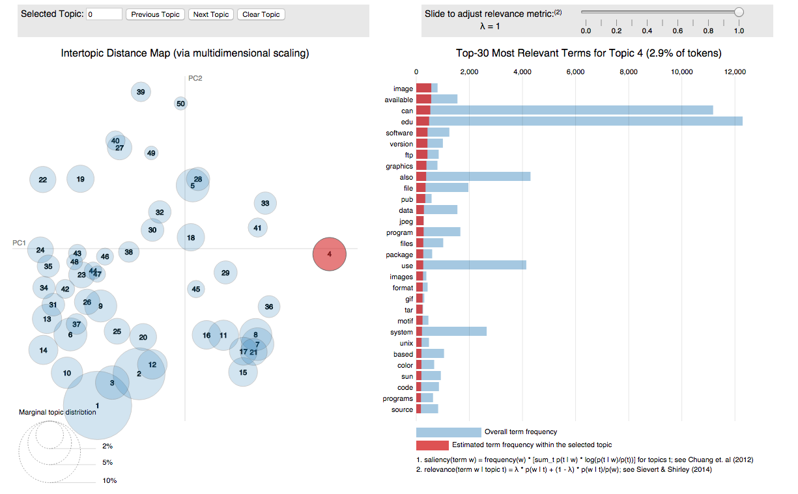
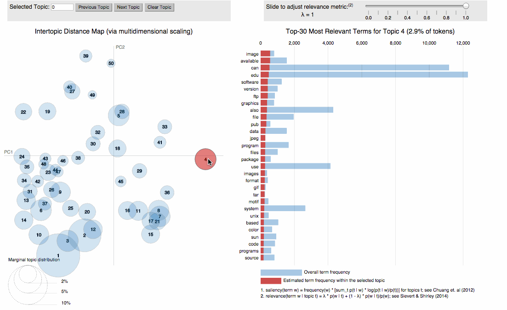
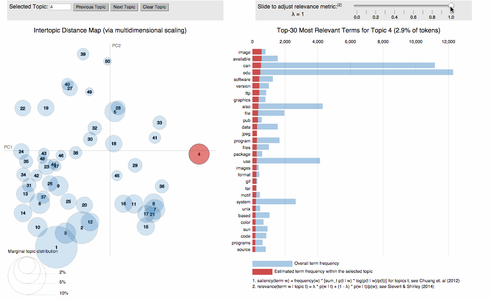
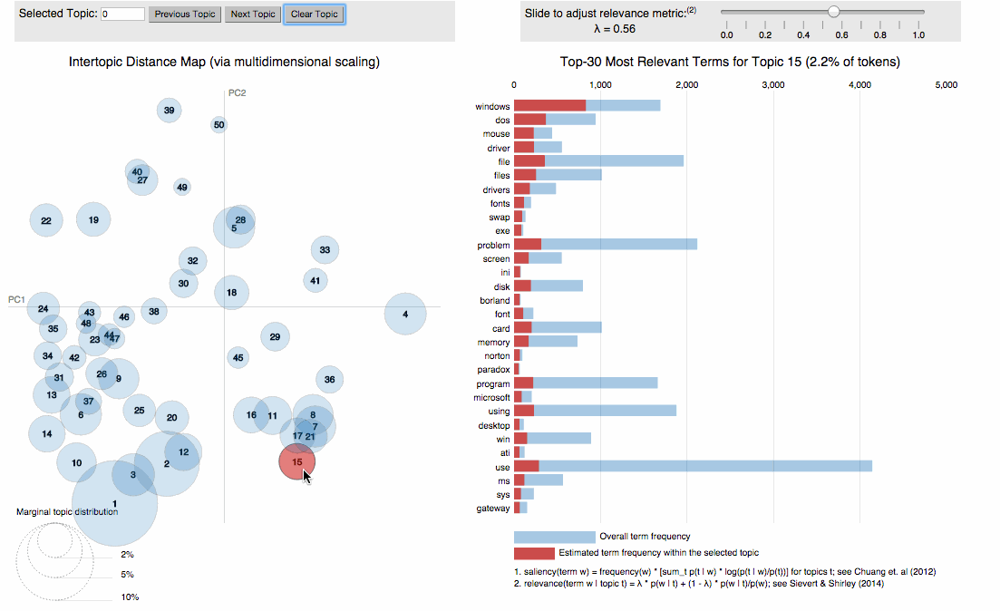

class: principles 

## About me

* PhD in statistics at Iowa State with Dr. Heike Hofmann (Dec 2016) 
  
  * Thesis: [Interfacing R with Web Technologies for Interactive Statistical Graphics and Computing with Data](http://lib.dr.iastate.edu/etd/15422/)
  
* CEO of [Sievert Consulting](https://consulting.cpsievert.me/) LLC (Jan 2017)

  * Clients include: plotly, NOAA, O'Reilly, Sandia
  
  * Looking for more part-time projects
  
* The majority of my work is in interactive data visualization
  
  * Primilarily work in R, dabble in JavaScript and python.
  
  * Maintain numerous R packages including: plotly, LDAvis, pitchRx

---
background-image: url(../20171207/workflow.svg)
background-size: contain
class: inverse

# Data Science Workflow


---
background-image: url(../20171207/workflow1.svg)
background-size: contain
class: inverse

# Expository vis

<br />
<br />
<br />
<br />
<br />
<br />
<br />
<br />
<br />
<br />
<br />
<br />
<br />
<br />
<br />


### The web is the preferred medium for communicating results

### Assuming you know _exactly_ what you want to visualize, many good data vis frameworks exist (e.g. [d3.js](https://d3js.org/))

---
background-image: url(../20171207/workflow2.svg)
background-size: contain
class: inverse

# Exploratory vis

<br />
<br />
<br />
<br />
<br />
<br />
<br />
<br />
<br />
<br />
<br />
<br />
<br />
<br />
<br />

### Web technologies weren't designed for data exploration
### People [seem to have forgotten](http://flowingdata.com/2016/03/08/what-i-use-to-visualize-data/) how interative graphics augment exploration

---
class: principles

## Interactive graphics augment exploration!

* Identify structure that otherwise goes missing ([Tukey 1972](http://stat-graphics.org/movies/prim9.html)).
    
* "Search for information quickly without fully specified questions" ([Unwin & Hofmann, 2000](https://www.researchgate.net/publication/2425912_GUI_and_Command-line_-_Conflict_or_Synergy))
    * "[Mutiple linked views] are the optimal framework for posing queries about data" ([Buja et al 1996](https://www.jstor.org/stable/1390754))
    
    * Check out visual ([Majumder et al 2013](http://amstat.tandfonline.com/doi/abs/10.1080/01621459.2013.808157?journalCode=uasa20#.Wl01_ZM-dTY)) and post-selection ([Berk et al 2013](https://projecteuclid.org/euclid.aos/1369836961)) inference frameworks.
    
* Better understand/diagnose models ([Wickham, Cook, & Hofmann 2015](http://onlinelibrary.wiley.com/doi/10.1002/sam.11271/abstract)).

.footnote[
---

Statisticians were building (very advanced!) int graphics systems decades ago --   <http://stat-graphics.org/movies/>
]

---
class: principles

## Interactive graphics augment exploration!

* Identify structure that otherwise goes missing ([Tukey 1972](http://stat-graphics.org/movies/prim9.html)).

* "Search for information quickly without fully specified questions" ([Unwin & Hofmann, 2000](https://www.researchgate.net/publication/2425912_GUI_and_Command-line_-_Conflict_or_Synergy))
    * "[Mutiple linked views] are the optimal framework for posing queries about data" ([Buja et al 1996](https://www.jstor.org/stable/1390754))
    
    * Check out visual ([Majumder et al 2013](http://amstat.tandfonline.com/doi/abs/10.1080/01621459.2013.808157?journalCode=uasa20#.Wl01_ZM-dTY)) and post-selection ([Berk et al 2013](https://projecteuclid.org/euclid.aos/1369836961)) inference frameworks.
    
* <div class="highlight">Better understand/diagnose models</div> ([Wickham, Cook, & Hofmann 2015](http://onlinelibrary.wiley.com/doi/10.1002/sam.11271/abstract)).

---
## Deeper look at linear model diagnostics

```r
# choose a model by AIC stepping backwards 
mod <- step(lm(mpg ~ ., data = mtcars), trace = FALSE)

# produce (static ggplot2) diagnostic plot
library(GGally)
pm <- ggnostic(mod, mapping = aes(color = am))

# make it interactive
library(plotly)
ggplotly(pm)
```

---

<iframe src="ggnostic.html" width="100%" height="750" scrolling="no" seamless="seamless" frameBorder="0"> </iframe>

???

The noticeably high value of cooksd suggests a large influence on the fitted model. Highlighting this point makes it obvious that it is influential since it has a unusually high response/residual in a fairly sparse region of the design space (i.e., it has a pretty high value of wt) and removing it would significantly reduce the estimated standard deviation (sigma). By comparison, the other two observations with similar values of wt have a response value very close to the overall mean, so even though their value of hat is high, their value of sigma is low.

---
background-image: url(../20170803/tour.gif )
background-size: contain
class: inverse

---
background-image: url(../20170803/tour.gif )
background-size: contain
class: middle

## Cute idea: plot model in the data space!

---
class: middle, inverse

# Designing, building, maintaining, and publishing a *general purpose* vis library (e.g. plotly) is very hard!

### Grad students: make your life easier...design a *domain specific* tool


---
class: middle, inverse

# Designing, building, maintaining, and publishing a *general purpose* vis library (e.g. plotly) is very hard!

### Grad students: make your life easier...design a *domain specific* tool

.footnote[
#### For example: the [R package LDAvis](https://github.com/cpsievert/LDAvis) for topic model interpretation (joint work with [Kenny Shirley](http://www.kennyshirley.com/)).
]

---
class: principles

## An Example: LDA Topic models

* _Topic models_ are a collection of statistical models with the common goal of finding hidden structure in a collection of text documents.

* __Basic example__: Given a document discussing 'sports', you're more likely to see the word 'baseball' in that document compared to a document discussing 'music' (and vice-versa for 'guitar').

* Documents usually don't have a clear "topic", but we can develop models with latent RV to "discover topics". 

* Latent Dirichlet Allocation (LDA) is a topic model which allows documents to be mixtures of topics (Blei, Ng, Jordan; 2003). 

---

### The Generative Model
1. Choose # of topics $K$. Let $V$ be # of unique words (vocabulary).
2. For each document $d \in \{1,...,D\}$, draw $\Theta_d \sim Dir(\alpha)$ where $\Theta_d = (\theta_1, ..., \theta_K) > 0$ and $\sum_{i=1}^K \theta_i = 1$
3. For each topic $k \in \{1,...,K\}$, draw $\Phi_k \sim Dir(\beta)$ where $\Phi_k = (\phi_1, ..., \phi_V) > 0$ and $\sum_{i=1}^K \phi_i = 1$
4. Let $N_d$ be # of words in doc $d$ and $n \in \{1, \dots, N_d\}$. For each word $w_{d, n}$:
    * Draw a (latent) topic, $z_{d, n} \sim Mult(1, \Theta_d)$
    * Draw a word given topic, $w_{d, n} \sim Mult(1, \Phi_{z_{d, n}})$
    
### Model fitting
* Griffiths & Steyvers (2004) derive a collapsed Gibbs sampler. Implemented in R packages __LDAtools__ (Shirley & Sievert, 2013) and __lda__ (Chang, 2015).
* Wide array of fitting algorithms available in __topicmodels__ (Grun & Hornik, 2011) and __mallet__ (Mimno, 2013).

---
## Model Output

<div align="center">
  
</div>

* In the digital humanities (& elsewhere), LDA is often used to "discover topics" in a large collection of text documents. 
* How are researchers supposed to interpret topics? We can't possibly examine each pmf.
* "Overview first, then zoom & filter, then detail on demand" (Schneiderman, 1996)

---
class: principles
## Towards topic interpretation

* Numerous interactive systems allow users to select a topic $z$, then list top ~30 words based on $p(w | z)$ (Gardner et al., 2010; Chaney and Blei, 2012; Snyder et al., 2013).

* But, words likely to occur overall are also likely to occur for a given topic!

* Taddy (2011) proposed to rank terms by $lift = p(w | z)/p(w)$

* But if $p(w)$ is small, $lift$ is large!

* Bischof and Airoldi (2012) propose a new model to directly estimate an average frequency and exclusivity to a given topic.

* Sievert & Shirley (2014) propose choosing $0 < \lambda < 1$, for:

$\text{relevance}(\lambda) = \lambda * p(w|z) + (1 - \lambda) * \text{lift}$

---
## Choosing lambda

<div align="center">
  
</div>

* We expect the optimal value of $\lambda$ to vary across data.
* __LDAvis__ allows users to interactively alter rankings by changing $\lambda$

---

<div align="center">
  <a href="LDAvis/#topic=4">
    
  </a>
</div>


---

<div align="center">
  <a href="LDAvis/#topic=4"> 
    
  </a>
</div>

---

<div align="center">
  <a href="LDAvis/#topic=4"> 
    
  </a>
</div>


---

<div align="center">
  <a href="LDAvis/#topic=15&lambda=0.56&term=win"> 
    
  </a>
</div>

???
http://localhost:8000/#topic=15&lambda=0.56&term=win

The word "win" is probably an abbreviation for "windows" in topic 15. By hovering over "win", we reveal its conditional topic distribution, which is useful finding different uses of that word. Topics 9 and 26 seems to be discussing baseball and hockey, so win is probably referring to "winning games". Topic 39 also seems to be related to sports, but many of the releavnt terms are abbreviations, so "win" may be a team code.


---
class: principles

## Interactive graphics augment exploration!

* Identify structure that otherwise goes missing ([Tukey 1972](http://stat-graphics.org/movies/prim9.html)).
    
* Search for information quickly without fully specified questions ([Unwin & Hofmann, 2000](https://www.researchgate.net/publication/2425912_GUI_and_Command-line_-_Conflict_or_Synergy))
    * <div class="highlight">[Mutiple linked views] are the optimal framework for posing queries about data</div> ([Buja et al 1996](https://www.jstor.org/stable/1390754))
    
    * Check out visual ([Majumder et al 2013](http://amstat.tandfonline.com/doi/abs/10.1080/01621459.2013.808157?journalCode=uasa20#.Wl01_ZM-dTY)) and post-selection ([Berk et al 2013](https://projecteuclid.org/euclid.aos/1369836961)) inference frameworks.
    
* Better understand/diagnose models ([Wickham, Cook, & Hofmann 2015](http://onlinelibrary.wiley.com/doi/10.1002/sam.11271/abstract)).

---

## 2016 Election Outcomes by County ([Politico](http://rpubs.com/dgrtwo/county-results))

```
     County |   State | TotalVotes| Clinton| Johnson| Stein| Trump| Population|    Area
    --------| --------| ----------|--------|--------|------|------|-----------|--------
1   autauga | alabama |      24661|   0.240|   0.022| 0.004| 0.734|      54571|  594.44
2   baldwin | alabama |      94090|   0.196|   0.026| 0.005| 0.774|     182265| 1589.78
3   barbour | alabama |      10390|   0.467|   0.009| 0.002| 0.523|      27457|  884.88
4      bibb | alabama |       8748|   0.214|   0.014| 0.002| 0.770|      22915|  622.58
5    blount | alabama |      25384|   0.085|   0.013| 0.004| 0.899|      57322|  644.78
6   bullock | alabama |       4701|   0.751|   0.005| 0.002| 0.242|      10914|  622.81
7    butler | alabama |       8685|   0.428|   0.007| 0.001| 0.563|      20947|  776.83
8   calhoun | alabama |      47376|   0.279|   0.024| 0.006| 0.692|     118572|  605.87
9  chambers | alabama |      13778|   0.418|   0.012| 0.003| 0.566|      34215|  596.53
10 cherokee | alabama |      10503|   0.145|   0.014| 0.002| 0.839|      25989|  553.70
# ... with 3,101 more rows
```

* Is there a relationship between population density and voting preference? 

---
class: middle, center

<iframe src="https://player.vimeo.com/video/202650161" width="800" height="500" frameborder="0" webkitallowfullscreen mozallowfullscreen allowfullscreen></iframe>

---

.pull-left[

]

.pull-right[
# Lost in a sea of interactive techniques?

### Find your footing by grouping techniques under the data analysis tasks they help accomplish
]

---
background-image: url(../20171207/taxonomy.svg)
background-size: contain
class: bottom, inverse

## Techniques that support data analysis [Buja et al 1996](https://www.jstor.org/stable/1390754)


---
class: inverse, center, middle

# "Statistical software should be expressive, powerful, fast and reliable, but it should also be intuitive, easy to use, flexible, forgiving and consistent"

.footnote[
### From Hofmann & Unwin, [*GUI and Command-line - Conflict or Synergy?*](https://www.researchgate.net/publication/2425912_GUI_and_Command-line_-_Conflict_or_Synergy)
]

---
class: inverse, center, middle

# Statistical software should be <font color='red'>expressive, powerful, fast and reliable</font>, but it should also be <font color='#119dff'>intuitive, easy to use, flexible, forgiving and consistent</font>

.footnote[

### <font color='red'>Programming languages are good at this!</font>

### <font color='#119dff'>Graphical interfaces are good at this!</font>

]

---
background-image: url(https://i.imgur.com/c7NJRa2.gif)
background-size: contain
class: inverse

# The ideal system leverages the benefits of both worlds

---
background-image: url(../gifs/swamp.gif)
background-size: contain
class: inverse, center, bottom

## It is all too easy for statistical thinking to be **swamped by programming tasks.** -- Brian D. Ripley


???

So, this is me, in my 2nd year of grad school, deciding to learn D3 & JavaScript.

It took me 6+ months to implement a single interactive visualization.

And let me tell you, you guys, no joke, believe me, I arose from the swamp, and decide I alone will...


---
background-image: url(../gifs/drain-the-swamp.gif)
background-size: contain
class: inverse, center

# `r emo::ji("point_up")` `r emo::ji("tangerine")` 

---

## What's in the swamp?

.pull-left[
## Exploratory quicksand

<div class="principles">
• Start-up <br/>
• Iteration <br/>
• Dead-end
</div>
]

.pull-right[
## Expository quicksand

<div class="principles">
• Deployment <br/>
• Latency
</div>
]

---
class: inverse, middle, center

## *How* to drain the swamp?

.footnote[
### What follows are some details & my suggestions about how one might go about it
]

---

## How to drain the swamp? <div class="highlight"> R `r emo::ji("package")`s that avoid </div>

.pull-left[
## Exploratory

<div class="principles">
<div class="highlight"> • Start-up quicksand</div> <br/>
• Iteration <br/>
• Dead-end
</div>
]

.pull-right[
## Expository

<div class="principles">
• Deployment <br/>
• Latency
</div>
]

<br/>

<div class="highlight">
* Getting started should be easy!
  * Easy install (CRAN) & copy/paste examples
  * Build upon existing knowledge and tools
<div>

---
background-image: url(../20171207/europe.png)
background-size: contain
class: inverse

---
background-image: url(../20171207/europe.png)
background-size: contain
class: middle

.pull-left[
# Neat, but I can't: 

<div class="principles">
• Query populations <br />
• Zoom/pan <br />
• Compare population at given lat
</div>
]

---

```r
library(tidyverse)

*# read and clean data
d <- read_csv('GEOSTAT_grid_POP_1K_2011_V2_0_1.csv') %>%
  rbind(read_csv('JRC-GHSL_AIT-grid-POP_1K_2011.csv') %>%
          mutate(TOT_P_CON_DT = '')) %>%
  mutate(
    lat = as.numeric(gsub('.*N([0-9]+)[EW].*', '\\1', GRD_ID))/100,
    lng = as.numeric(gsub('.*[EW]([0-9]+)', '\\1', GRD_ID)) * ifelse(gsub('.*([EW]).*', '\\1', GRD_ID) == 'W', -1, 1) / 100
  ) %>%
  filter(lng > 25, lng < 60) %>%
  group_by(lat = round(lat, 1), lng = round(lng, 1)) %>%
  summarize(value = sum(TOT_P, na.rm = T))  %>%
  ungroup() %>%
  tidyr::complete(lat, lng)

*# visualize
ggplot(d, aes(lng, lat + 5*(value / max(value, na.rm = T)))) +
  geom_line(
    aes(group = lat, text = paste("Population:", value)),
    size = 0.4, alpha = 0.8, color = '#5A3E37', na.rm = T
  )
```

---

```r
library(tidyverse)
*library(crosstalk)
*library(plotly)

d <- read_csv('GEOSTAT_grid_POP_1K_2011_V2_0_1.csv') %>%
  rbind(read_csv('JRC-GHSL_AIT-grid-POP_1K_2011.csv') %>%
          mutate(TOT_P_CON_DT = '')) %>%
  mutate(
    lat = as.numeric(gsub('.*N([0-9]+)[EW].*', '\\1', GRD_ID))/100,
    lng = as.numeric(gsub('.*[EW]([0-9]+)', '\\1', GRD_ID)) * ifelse(gsub('.*([EW]).*', '\\1', GRD_ID) == 'W', -1, 1) / 100
  ) %>%
  filter(lng > 25, lng < 60) %>%
  group_by(lat = round(lat, 1), lng = round(lng, 1)) %>%
  summarize(value = sum(TOT_P, na.rm = T))  %>%
  ungroup() %>%
  tidyr::complete(lat, lng)

*# define latitude as "interaction unit"
*sd <- SharedData$new(d, ~lat)

ggplot(sd, aes(lng, lat + 5*(value / max(value, na.rm = T)))) +
  geom_line(
    aes(group = lat, text = paste("Population:", value)),
    size = 0.4, alpha = 0.8, color = '#5A3E37', na.rm = T
  )
  
*ggplotly()
```

---

<iframe src="../20170803/europe.html" width="100%" height="750" scrolling="no" seamless="seamless" frameBorder="0"> </iframe>

---
background-image: url(../20171207/epl.png)
background-size: contain
class: inverse

---
background-image: url(../20171207/epl.png)
background-size: contain
class: middle

.pull-left[
# Neat, but I can't: 

<div class="principles">
• Query different years <br />
• Zoom/pan
</div>
]

---
background-image: url(../20171207/epl.gif)
background-size: contain
class: middle, center 

---
background-image: url(../20171207/epl.gif)
background-size: contain

# Generally useful for comparing within & across panel


---
## An example with Texas housing prices

```r
library(dplyr)
tx <- txhousing %>%
  select(city, year, month, median) %>%
  filter(city %in% c("Galveston", "Midland", "Odessa", "South Padre Island"))
tx
```

```r
#> # A tibble: 748 x 4
#>         city  year month median
#>        <chr> <int> <int>  <dbl>
#>  1 Galveston  2000     1  95000
#>  2 Galveston  2000     2 100000
#>  3 Galveston  2000     3  98300
#>  4 Galveston  2000     4 111100
#>  5 Galveston  2000     5  89200
#>  6 Galveston  2000     6 108600
#>  7 Galveston  2000     7  99000
#>  8 Galveston  2000     8  96200
#>  9 Galveston  2000     9 104000
#> 10 Galveston  2000    10 118800
#> # ... with 738 more rows
```

---
### Compare within and across cities

```r
*TX <- SharedData$new(tx, ~year)
p <- ggplot(TX, aes(month, median, group = year)) + geom_line() +
  facet_wrap(~city, ncol = 2)
highlight(ggplotly(p), dynamic = T, persistent = T, selectize = T)
```

<iframe src="../20171207/txhousing.html" width="100%" height="450" scrolling="no" seamless="seamless" frameBorder="0"> </iframe>

---
## How to drain the swamp? <div class="highlight"> R `r emo::ji("package")`s that avoid </div>

.pull-left[
## Exploratory

<div class="principles">
• Start-up <br/>
• <div class="highlight">Iteration quicksand</div> <br/>
• Dead-end
</div>
]

.pull-right[
## Expository

<div class="principles">
• Deployment <br/>
• Latency
</div>
]

<br/>

<div class="highlight">
* Reduce distance between data and visuals
  * Leverage [grammar of graphics](https://www.amazon.com/Grammar-Graphics-Statistics-Computing/dp/0387245448) (e.g. **ggplot2**, **vega**, etc)
  * Leverage tidy data principles (e.g., **dplyr**, **tidyr**, **broom**, etc)
<div>

---
## Some motivation: query missing values by city

<iframe src="../20171207/txhousing-missing.html" width="100%" height="500" scrolling="no" seamless="seamless" frameBorder="0"> </iframe>

---
class: bottom, left 
background-image: url(../20171207/pipeline.svg)
background-size: contain

## The 'data pipeline'

---

## The implementation

```r
library(plotly)
library(crosstalk)

# define city as 'unit of interaction'
sd <- SharedData$new(txhousing, ~city)

# initiate plot object, ensuring one mark per group
base <- plot_ly(sd, color = I("black")) %>%
  group_by(city)

# transform plot object as if it's a data frame
p1 <- base %>%
  summarise(miss = sum(is.na(median))) %>%
  filter(miss > 0) %>%
  arrange(miss) %>%
  add_bars(x = ~miss, y = ~factor(city, levels = city)) %>%
  layout(barmode = "overlay")

p2 <- add_lines(base, x = ~date, y = ~median, alpha = 0.3)

 subplot(p1, p2, titleX = TRUE, widths = c(0.3, 0.7)) %>% 
  highlight(dynamic = TRUE, persistent = TRUE, selectize = TRUE)
```

---
## More motivation

1. US elections example
2. 


---
## How to drain the swamp? <div class="highlight"> R `r emo::ji("package")`s that avoid </div>

.pull-left[
## Exploratory

<div class="principles">
• Start-up <br/>
• Iteration<br/>
• Dead-end
</div>
]

.pull-right[
## Expository

<div class="principles">
<div class="highlight"> • Deployment quicksand </div> <br/>
• Latency
</div>
]

<br/>

<div class="highlight">
Produce a standalone web page whenever possible
<div>

---
background-image: url(../20171207/server-client.svg)
background-size: contain

---
background-image: url(../20171207/server-client.svg)
background-size: contain
class: middle, center

# Standalone web pages are **much** easier to share, deploy, scale, and maintain.

---
class: middle, bottom
background-image: url(../20171207/pipeline.svg)
background-size: contain

# Where is the pipeline?

---
background-image: url(../20171207/crosstalk.svg)
background-size: contain

## The general model

.footnote[
### Links are specified in R, but the "updating logic" is JavaScript -- no server required!
]


---
## How to drain the swamp? <div class="highlight"> R `r emo::ji("package")`s that avoid </div>

.pull-left[
## Exploratory

<div class="principles">
• Start-up <br/>
• Iteration <br/>
• Dead-end
</div>
]

.pull-right[
## Expository

<div class="principles">
• Deployment <br/>
<div class="highlight">• Latency quicksand</div>
</div>
]

<br/>

<div class="highlight">
* User activity drops w/ delay of 500ms (<a href="https://idl.cs.washington.edu/papers/latency/">Liu & Heer 2014</a>)
  * Support canvas-based (e.g. WebGL) as well as vector (e.g. SVG)
  * Provide API for modifying plots in R (& JavaScript!)
<div>

---

## Base map layer does not require a redraw with a new fillcolor!


---

### Leverage any [plotly.js function](https://plot.ly/javascript/plotlyjs-function-reference/) to *modify* a plot via `plotlyProxy()`

```r
library(shiny)
library(plotly)

ui <- fluidPage(
  selectInput("color", "Canada's fillcolor", colors()),
  plotlyOutput("map")
)

server <- function(input, output, session) {
  
  output$map <- renderPlotly({
    map_data("world", "canada") %>%
      group_by(group) %>%
      plot_mapbox(x = ~long, y = ~lat, color = I("black")) %>%
      add_polygons()
  })
  
  observeEvent(input$color, {
    plotlyProxy("map", session) %>%
      plotlyProxyInvoke("restyle", list(fillcolor = toRGB(input$color)))
  })
}

shinyApp(ui, server)
```


---
## How to drain the swamp? <div class="highlight"> R `r emo::ji("package")`s that avoid </div>

.pull-left[
## Exploratory

<div class="principles">
• Start-up <br/>
• Iteration <br/>
<div class="highlight">• Dead-end quicksand</div>
</div>
]

.pull-right[
## Expository

<div class="principles">
• Deployment <br/>
• Latency
</div>
]

<br/>

<div class="highlight">
* Integrate with other libraries that complement yours
<div>


---
background-image: url(../20170803/plotlyLeaflet.gif)
background-size: contain

## plotly & leaflet

---
background-image: url(../20171207/workflow2.svg)
background-size: 250px
background-position: 90% 8%
class: inverse, center, middle

### No matter how complex and polished the individual operations are, it is often 

# the quality of the glue that most directly determines the power of the system.

.footnote[
Quote from Hal Abelson -- part of the [tidyverse manifesto](https://cran.r-project.org/package=tidyverse)
]

---

```r
library(plotly)
library(leaflet)
library(crosstalk)

*# good glue requires uniform data structures
*sd <- SharedData$new(quakes)

p <- plot_ly(sd, x = ~depth, y = ~mag) %>% 
  add_markers(alpha = 0.5) %>%
  highlight("plotly_selected", dynamic = TRUE)

map <- leaflet(sd) %>% 
  addTiles() %>% 
  addCircles()

bscols(widths = c(6, 6), p, map)
```


---
## How to drain the swamp? <div class="highlight"> R `r emo::ji("package")`s that avoid </div>

.pull-left[
## Exploratory

<div class="principles">
• Start-up <br/>
• Iteration <br/>
<div class="highlight">• Dead-end quicksand</div>
</div>
]

.pull-right[
## Expository

<div class="principles">
• Deployment <br/>
• Latency
</div>
]

<br/>

<div class="highlight">
* Every `r emo::ji("package")` that reduces start-up/iteration will *always* have dead ends. 
* What you leave out is just as important as what you put in!
  * Ask yourself: can others do powerful things _quickly_? 
* Strive for 80/20 rule: 80% easy, other 20% possible
<div>

---

#### Provide tools for "power users"

```
plot_ly(mtcars, x = ~wt, y = ~mpg) %>%
  add_markers(text = ~paste0("http://google.com/#q=", rownames(mtcars))) %>%
  htmlwidgets::onRender("function(el, x) {
    el.on('plotly_click', function(d) {
      var pt = d.points[0];
      var url = pt.data.text[pt.pointNumber];
      window.open(url);
    });
  }")
```

<iframe src="../20171207/onrender.html" width="100%" height="350" scrolling="no" seamless="seamless" frameBorder="0"> </iframe>


---
## How to drain the swamp? <div class="highlight"> R `r emo::ji("package")`s that avoid </div>

.pull-left[
## Exploratory

<div class="principles">
• Start-up <br/>
• Iteration <br/>
<div class="highlight">• Dead-end quicksand</div>
</div>
]

.pull-right[
## Expository

<div class="principles">
• Deployment <br/>
• Latency
</div>
]

<br/>

<div class="highlight">
* Interactive graphics software must be opinionated
  * Techniques should empower data analysis tasks ([Cook et al 1996](https://www.jstor.org/stable/1390754))
* Not enough statisticians influence design nowadays
  * We used to be more involved! <http://stat-graphics.org/movies/>
  * Tech landscape shifted from C/Java to JavaScript 
<div>

---
background-image: url(../20171207/taxonomy.svg)
background-size: contain
class: bottom, inverse

## Techniques that support data analysis [Cook et al 1996](https://www.jstor.org/stable/1390754)

---
background-image: url(../20171207/taxonomy2.svg)
background-size: contain
class: inverse

<h3>
<div class="highlight"> 
  What kind of visualizations should be possible/easy?
</div>
</h3>

---
background-image: url(../20171207/taxonomy3.svg)
background-size: contain
class: inverse

<h3>
<div class="highlight"> 
  How do we help users find the right view?
</div>
</h3>

---
background-image: url(../20171207/taxonomy4.svg)
background-size: contain
class: inverse

<h3>
<div class="highlight"> 
  How to best enable dynamic answers to (statistical) questions?
</div>
</h3>

---

## In summary

.pull-left[
## Exploratory quicksand

* Start-up
  * Build upon existing knowledge and tools
* Iteration
  * Reduce distance between data and visuals
  * Leverage grammar of graphics and tidy-data principles
* Dead-end
  * Integrate with other libraries that complement yours
  * Strive for 80/20 rule: 80% easy, other 20% possible
  * Interactive techniques should empower data analysis tasks
]

.pull-right[
## Expository quicksand

* Deployment
  * Use standalone web pages whenever possible
* Latency
  * User activity drops w/ delay of 500ms
]

---
class: middle, center

## Thanks! Questions?

Slides: <https://talks.cpsievert.me> <br />

#### Contact

`r icon::fa_twitter()` <a href='https://twitter.com/cpsievert'>@cpsievert</a> <br />
`r icon::fa_github()` <a href='https://github.com/cpsievert'>@cpsievert</a> <br />
`r icon::fa_envelope()` <cpsievert1@gmail.com> <br />
`r icon::fa_globe()` <https://cpsievert.me/>

