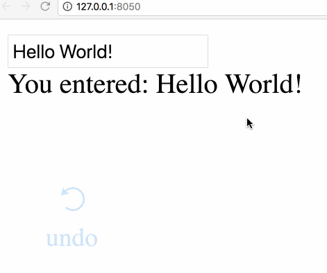
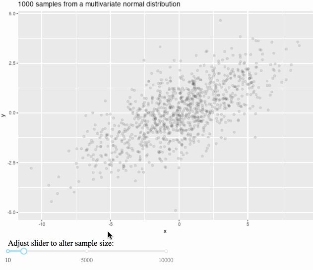
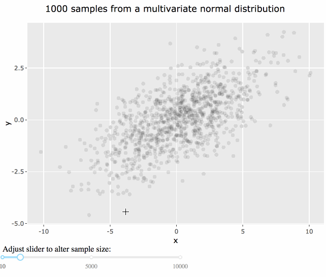
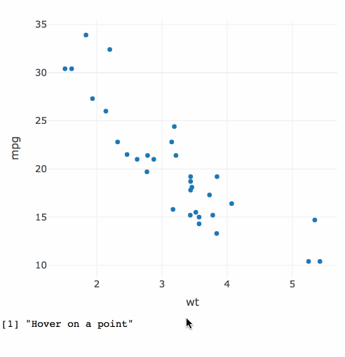
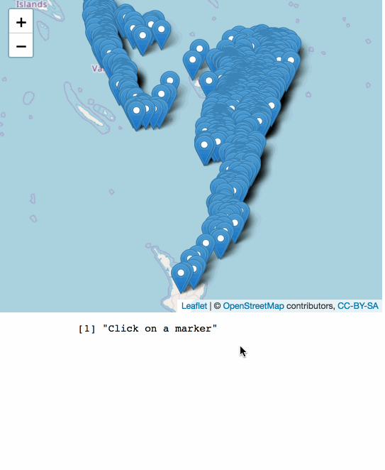
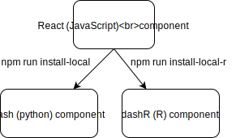
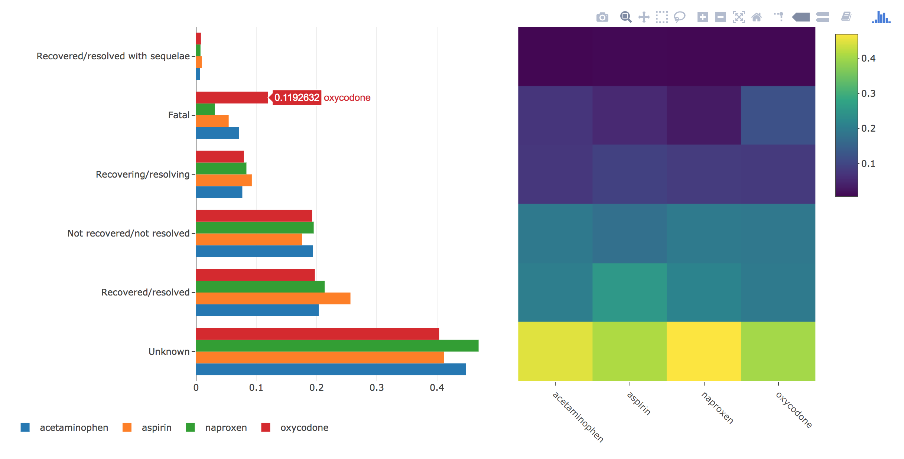
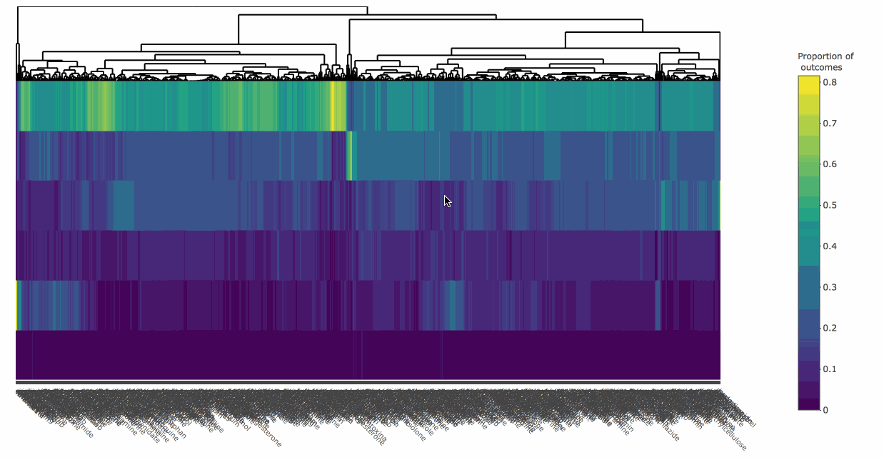

background-image: url(../20171207/workflow.svg)
background-size: contain
class: inverse

# Data science workflow

---
background-image: url(../20171207/workflow1.svg)
background-size: contain
class: inverse

## Web graphics are great for presentation!

<br />
<br />
<br />
<br />
<br />
<br />
<br />
<br />
<br />
<br />
<br />
<br />
<br />
<br />
<br />

### Sharable, portable, composable (i.e., reports, dashboards, etc)

---
background-image: url(../20171207/workflow2.svg)
background-size: contain
class: inverse

## Web technologies aren't designed for this iteration!

<br />
<br />
<br />
<br />
<br />
<br />
<br />
<br />
<br />
<br />
<br />
<br />
<br />
<br />
<br />
<br />

### Follow-up questions (ignited through visualization) may rely on sophisticated computations

---
class: principles

## ...but interactivity augments exploration

* Identify structure that otherwise goes missing ([Tukey 1972](http://stat-graphics.org/movies/prim9.html)).
    
* Search for information quickly without fully specified questions<sup>1</sup> ([Unwin & Hofmann, 2000](https://www.researchgate.net/publication/2425912_GUI_and_Command-line_-_Conflict_or_Synergy))
    * Multiple linked views are the optimal framework for posing queries about data ([Buja, Cook, & Swayne 1996](https://www.jstor.org/stable/1390754))
    
* Diagnose, compare, and understand models ([Wickham, Cook, & Hofmann 2015](http://onlinelibrary.wiley.com/doi/10.1002/sam.11271/abstract)).

.footnote[
---

[1]: Worried about inference? See visual ([Majumder et al 2013](http://amstat.tandfonline.com/doi/abs/10.1080/01621459.2013.808157?journalCode=uasa20#.Wl01_ZM-dTY)) and post-selection ([Berk et al 2013](https://projecteuclid.org/euclid.aos/1369836961)) inference frameworks.
]

---
class: middle, center, inverse

## Statisticians built (very advanced!) int graphics systems decades ago <http://stat-graphics.org/movies/>

.pull-left[

]
.pull-right[

]

## ...the web introduces a whole new set of possibilties & concerns (e.g., distribution, concurrency, reproducibility, security, etc)

---
background-image: url(server-client.svg)
background-size: contain
class: middle, right

# When is a web application necessary?

---
background-image: url(server-client-dim.svg)
background-size: contain
class: middle, right

# Easier to share, scale, and maintain

---
background-image: url(server-client-dim.svg)
background-size: contain
class: middle, right

# What can plotly do in a standalone page?

---
#### Quite a lot!

<iframe src="../20180202/mpg.html" width="100%" height="600" scrolling="no" seamless="seamless" frameBorder="0"> </iframe>

---
### The implementation

```r
library(plotly)
library(crosstalk)

d <- SharedData$new(mpg)
dots <- plot_ly(d, color = ~class, x = ~displ, y = ~cyl)
boxs <- plot_ly(d, color = ~class, x = ~class, y = ~cty) %>% add_boxplot()
bars <- plot_ly(d, x = ~class, color = ~class)

subplot(dots, boxs) %>%
  subplot(bars, nrows = 2) %>%
  layout(barmode = "overlay") %>%
  highlight("plotly_selected")
```

---
#### Another standalone plotly example

<iframe src="../20180202/txmissing.html" width="100%" height="485" scrolling="no" seamless="seamless" frameBorder="0"> </iframe>

---
class: bottom, left 
background-image: url(../20171207/pipeline.svg)
background-size: contain

## "Linking as a <br> database query"


---
class: middle, inverse

<h2 align="center"> Not everything can be (reasonably) framed as a database query!</h2>

.footnote[
#### But a suprising amount can, see:

* [The plotly for R book](https://plotly-book.cpsievert.me/linking-views-without-shiny.html)
* [The R package demos](https://github.com/ropensci/plotly/tree/master/demo)
* [My talks](https://talks.cpsievert.me/)
* [My workshops](https://workshops.cpsievert.me/)
]

---
background-image: url(server-client.svg)
background-size: contain
class: middle, right

## Ok, so you need a web application

---
background-image: url(server-dash.svg)
background-size: contain
class: middle, right

## dash: a python framework for reactive web apps

.footnote[
### dash is a [product](https://plot.ly/products/dash/) of [plotly](https://plot.ly/)
]

---
background-image: url(server-dash.svg)
background-size: contain
class: middle, right

## Built on flask & react (MIT licensed)

.footnote[
### dash is a [product](https://plot.ly/products/dash/) of [plotly](https://plot.ly/)
]

---
background-image: url(server-dash.svg)
background-size: contain
class: middle, right

## Stateless web architecture (easy to scale)

.footnote[
### dash is a [product](https://plot.ly/products/dash/) of [plotly](https://plot.ly/)
]

---
background-image: url(server-dashR.svg)
background-size: contain
class: middle, right

## <font color="red">dashR:</font> an R framework for reactive web apps

.footnote[
**dashR** is not yet released... <br>
...hoping end of summer!
]

<!--
.pull-left[
### dash: a python framework for reactive web apps

* Open source (MIT) **python** library.
* Built on flask (backend), react (frontend), and plotly.js (viz).
]

.pull-right[
### dashR: an R framework for reactive web apps

* Open source (MIT) **R** library (release coming this fall).
* Built on fiery (backend), react (frontend), and plotly.js (viz).
* First class support for **htmlwidgets**.
]
-->

---
class: middle, center, inverse

## But R already has [shiny](https://shiny.rstudio.com/)...why bother with dashR?

---
class: middle, center

# Reason 1: Agile (team) development

## More precisely, easily switch between R/Python backend

---
class: principles

First, a simple **dashR** example:

.pull-left[
```r
library(dashR)
app = Dash$new()
app$layout_set(
  coreInput(
    id = 'inputID', 
    value = 'Hello World!', 
    type = "text"
  ),
  htmlDiv(id = 'outputID')
)
app$callback(
  function(text = input("inputID")) {
    paste("You entered:", text)
  },
  output("outputID")
)
app$run_server()
```
]

.pull-right[

]

---
class: principles

First, a simple **dashR** example:

.pull-left[
```r
library(dashR)
app = Dash$new()
app$layout_set(
  coreInput(
    id = 'inputID', 
    value = 'Hello World!', 
    type = "text"
  ),
  htmlDiv(id = 'outputID')
)
app$callback(
  function(text = input("inputID")) {
    paste("You entered:", text)
  },
  output("outputID")
)
app$run_server()
```
]

.pull-right[

]

### __Note__: undo/redo resolved without a server callback *if* callbacks are pure (output depends solely inputs)

---
class: principles

Easy to switch between Python <-> R

.pull-left[
```r
library(dashR)
app = Dash$new()
app$layout_set(
  coreInput(
    id = 'inputID', 
    value = 'Hello World!', 
    type = "text"
  ),
  htmlDiv(id = 'outputID')
)
app$callback(
  function(text = input("inputID")) {
    paste("You entered:", text)
  },
  output("outputID")
)
app$run_server()
```
]

.pull-right[
```python
import dash
import dash_core_components as core
import dash_html_components as html
app = dash.Dash()
app.layout = html.Div([
    core.Input(
      id = 'inputID',
      value = 'Hello World!',
      type = "text"
    ),
    html.Div(id = 'outputID')
])
@app.callback(
    Output('outputID', 'children'),
    [Input('inputID', 'value')]
)
def update(text):
    return "You entered: " + text
app.run_server()
```
]

---

.pull-left[
```r
library(dashR)
library(ggplot2)
library(MASS)
app <- Dash$new()
app$layout_set(
  htmlDiv(id = 'plot'),
  htmlDiv(
    id = "slider",
    "Adjust slider to alter sample size:",
    coreSlider(
      id = 'n', value = 1000, 
      min = 10, max = 1e4, 
      marks = c(10, 5000, 1e4)
    )
  )
)
app$callback_png(
  function(n = input("n")) {
    covm <- matrix(c(10, 3, 3, 2), 2, 2)
    xy <- mvrnorm(n, c(0, 0), covm)
    d <- data.frame(x = xy[, 1], y = xy[, 2])
    base <- ggplot(d, aes(x, y)) +
      ggtitle(paste(n, "samples from a multivariate normal distribution"))
    if (n >= 5000) base + geom_hex() else base + geom_point(alpha = min(1, 100 / n))
  }, output(id = 'plot')
)
app$run_server()
```
]

.pull-right[
### Random sampling n observations from 2 correlated variables


]

---

.pull-left[
```r
library(dashR)
*library(plotly)
*library(dashRwidgets)
app <- Dash$new()
app$layout_set(
*  htmlwidget(id = 'plot', name = "plotly"),
  htmlDiv(
    id = "slider",
    "Adjust slider to alter sample size:",
    coreSlider(
      id = 'n', value = 1000, 
      min = 10, max = 1e4, 
      marks = c(10, 5000, 1e4)
    )
  )
)
app$callback(
  function(n = input("n")) {
    covm <- matrix(c(10, 3, 3, 2), 2, 2)
    xy <- MASS::mvrnorm(n, c(0, 0), covm)
    d <- data.frame(x = xy[, 1], y = xy[, 2])
    base <- ggplot(d, aes(x, y)) +
      ggtitle(paste(n, "samples from a multivariate normal distribution"))
    p <- if (n >= 5000) base + geom_hex() else base + geom_point(alpha = min(1, 100 / n))
*    ggplotly(p)
*  }, output(id = 'plot', 'widget')
)
app$run_server()
```
]

.pull-right[
### Render htmlwidgets in dashR via dashRwidgets!


]


---
class: principles

Can even access input events for some htmlwidgets (e.g. **plotly**, **leaflet**)!

.pull-left[
```r
library(dashR)
*library(dashRwidgets)
*library(plotly)
*p <- plot_ly(
*  mtcars, x = ~wt, y = ~mpg, 
*  key = row.names(mtcars)
*)
app <- Dash$new()
app$layout_set(
*  htmlwidget(
*    id = 'plotID', 
*    widget = p
*  ),
  htmlDiv(id = 'hover')
)
app$callback_print(
  function(hover = input("plotID", "input_plotly_hover")) {
    if (!length(hover)) "Hover on a point" else hover
  },
  output(id = 'hover')
)
app$run_server()
```
]

.pull-right[

]

---
class: principles

Can even access input events for some htmlwidgets (e.g. **plotly**, **leaflet**)!

.pull-left[
```r
library(dashR)
library(dashRwidgets)
*library(leaflet)
*p <- leaflet(quakes) %>% 
*  addTiles() %>% 
*  addMarkers()
app <- Dash$new()
app$layout_set(
  htmlwidget(
    id = 'plotID', 
    widget = p
  ),
  htmlDiv(id = "marker-click")
)
app$callback_print(
  function(click = input("plotID", "input_marker_click")) {
    if (!length(click)) "Click on a marker" else click
  },
  output(id = 'marker-click')
)
app$run_server()
```
]

.pull-right[

]

---
background-image: url(htmlwidgets.gif)
background-size: contain
class: bottom, right

#### <http://gallery.htmlwidgets.org/>


---
class: middle, center, inverse

# Reason 2: leverage the dash & react communities

---
class: principles

* __dash__/__dashR__ components are *transpiled* from [React](https://reactjs.org/) components.
    * If someone creates a component for a __dash__, it's trivial to use in __dashR__ (& vice-versa).<sup>1</sup>
    * If you know JavaScript, [use our template to write your own](https://dash.plot.ly/plugins)!
    * There are 1,000s of [existing React components](https://github.com/brillout/awesome-react-components).

<br />

<div align="center">
  
</div>

.footnote[
[1]: Except using the `htmlwidget()` component in **dash**
]

---
class: principles

For example, both `core.Input()` (python) and `coreInput()` (R)
wrap [the same React component](https://github.com/plotly/dash-core-components/blob/master/src/components/Input.react.js) from the [dash-core-component](https://github.com/plotly/dash-core-components) library

```javascript
import React, {Component} from 'react';
import {omit} from 'ramda';

export default class Input extends Component {
  render() {
    const {setProps, value} = this.props;
    return (
      <input
        value={value}
        onChange={e => {
            setProps({value: e.target.value});
        }}
        
      />
    );
  }
}
```

Other **dash** component libraries: [dash-html-components](https://github.com/plotly/dash-html-components), [dash-core-components](https://github.com/plotly/dash-core-components), [dash-svg-components](https://github.com/plotly/dash-svg-components), [dash-table-experiments](https://github.com/plotly/dash-table-experiments), [dash-colorscales](https://github.com/plotly/dash-colorscales), [Video-Engine-Dash](https://github.com/SkyRatInd/Video-Engine-Dash)

---
class: middle, center, inverse

# Visualizing openFDA data with dashR

## <font color="red">Example 1: Visualizing adverse drug outcomes</font>
## Example 2: Visualizing drug recall enforcements

---
class: middle, center

# First, let's survey some existing work

---
background-image: url(medcheck.gif)
background-size: contain


#### https://medcheck.octoconsulting.com


---
class: middle, center, inverse

## What about *comparing a few* similar drugs? 

---
background-image: url(openfda-dashboard.gif)
background-size: contain

#### https://github.com/statwonk/openfda-dashboard

---
class: middle, center, inverse

## What about comparing *many* drugs?

---

## Heatmap is a bit more scalable!

<a href="heat-bars.html">
  
</a>

---

#### Heatmap of 1000 drug outcomes (made with [heatmaply](http://cran.r-project.org/package=heatmaply) and [plotly](http://cran.r-project.org/package=plotly))

<a href="heatmap.html">
  
</a>

---
class: middle, center, inverse

## What about comparing *millions* of drugs?

---
class: center, middle

# Overview first, then zoom and filter, then details on demand 

Dr. Ben Shneiderman

.footnote[
### In other words, show summary stats first, then guided exploration to raw data.
]

---
background-image: url(pca.gif)
background-size: contain


---
class: middle, center, inverse

# Visualizing openFDA data with dashR

## Example 1: Visualizing adverse drug outcomes
## <font color="red">Example 2: Visualizing drug recall enforcements</font>

---
background-image: url(enforcement.gif)
background-size: contain


---
class: middle,principles

## Thanks! Questions? 

Slides: <https://talks.cpsievert.me> <br>
Learn more: <https://dash.plot.ly> (soon <https://dashR.plot.ly>)
Dash gallery: <https://dash.plot.ly/gallery> 

#### Contact me:

`r icon::fa_twitter()` <a href='https://twitter.com/cpsievert'>@cpsievert</a> <br />
`r icon::fa_github()` <a href='https://github.com/cpsievert'>@cpsievert</a> <br />
`r icon::fa_envelope()` <cpsievert1@gmail.com> <br />
`r icon::fa_globe()` <https://cpsievert.me/>


