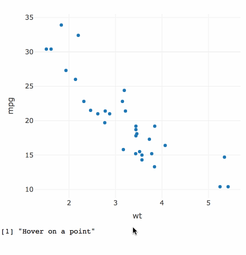
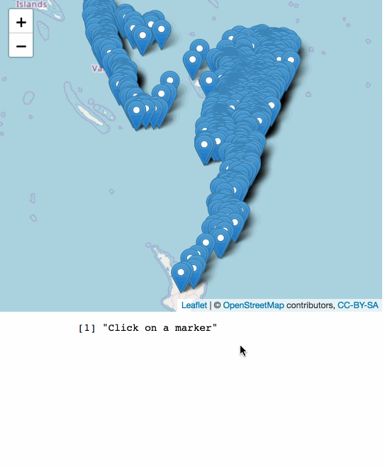
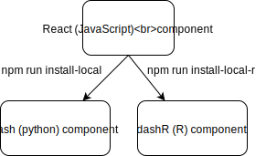

background-image: url(server-client.svg)
background-size: contain
class: middle, right

## dash: a python framework for reactive web apps

.footnote[
### dash is a [product](https://plot.ly/products/dash/) of [plotly](https://plot.ly/)
]

---
background-image: url(server-dash.svg)
background-size: contain
class: middle, right

## MIT licensed: built on flask & react
[Paid services](https://plot.ly/dash/pricing/) (e.g. private cloud, training, etc)

---
background-image: url(server-dashR.svg)
background-size: contain
class: middle, right

## <font color="red">dashR:</font> an R framework for reactive web apps

.footnote[
**dashR** is not yet released... <br>
...hoping end of fall!
]

<!--
.pull-left[
### dash: a python framework for reactive web apps

* Open source (MIT) **python** library.
* Built on flask (backend), react (frontend), and plotly.js (viz).
]

.pull-right[
### dashR: an R framework for reactive web apps

* Open source (MIT) **R** library (release coming this fall).
* Built on fiery (backend), react (frontend), and plotly.js (viz).
* First class support for **htmlwidgets**.
]
-->

---
class: middle, center, inverse

## But R already has [shiny](https://shiny.rstudio.com/)...why bother with dashR?

---
class: middle, center

# Reason 1: Agile development

## Easily switch between R/Python backend


---
class: principles

A **dashR** template:

.pull-left[
```r
library(dashR)
app = Dash$new()
app$layout_set(
*  # defines the layout/UI
*  # (a collection of "components")
)
app$callback(
*  # maps input(s) -> output
)
app$run_server()
```


Can have multiple callbacks, but only one layout
]

---
class: principles

A simple **dashR** app:

.pull-left[
```r
library(dashR)
app = Dash$new()
app$layout_set(
*  coreInput(
*    id = 'a', 
*    value = 'Hello World!', 
*    type = "text"
*  ),
*  htmlDiv(id = 'b')
)
app$callback(
*  function(text = input("a")) {
*    paste("You entered:", text)
*  },
*  output("b")
)
app$run_server()
```
]

.pull-right[

]

---
class: principles

Easy to switch between Python <-> R

.pull-left[
```r
library(dashR)
app = Dash$new()
app$layout_set(
  coreInput(
    id = 'a', 
    value = 'Hello World!', 
    type = "text"
  ),
  htmlDiv(id = 'b')
)
app$callback(
  function(text = input("a")) {
    paste("You entered:", text)
  },
  output("b")
)
app$run_server()
```
]

.pull-right[
```python
import dash
import dash_core_components as core
import dash_html_components as html
app = dash.Dash()
app.layout = html.Div([
    core.Input(
      id = 'a',
      value = 'Hello World!',
      type = "text"
    ),
    html.Div(id = 'b')
])
@app.callback(
    Output('b', 'children'),
    [Input('a', 'value')]
)
def update(text):
    return "You entered: " + text
app.run_server()
```
]

---

.pull-left[
```r
library(dashR)
library(ggplot2)
library(MASS)
app <- Dash$new()
app$layout_set(
  htmlDiv(id = 'plot'),
  htmlDiv(
    id = "slider",
    "Adjust slider to alter sample size:",
    coreSlider(
      id = 'n', value = 1000, 
      min = 10, max = 1e4, 
      marks = c(10, 5000, 1e4)
    )
  )
)
app$callback_png(
  function(n = input("n")) {
    covm <- matrix(c(10, 3, 3, 2), 2, 2)
    xy <- mvrnorm(n, c(0, 0), covm)
    d <- data.frame(x = xy[, 1], y = xy[, 2])
    base <- ggplot(d, aes(x, y)) +
      ggtitle(paste(n, "samples from a multivariate normal distribution"))
    if (n >= 5000) base + geom_hex() else base + geom_point(alpha = min(1, 100 / n))
  }, output(id = 'plot')
)
app$run_server()
```
]

.pull-right[
### Random sampling n observations from 2 correlated variables


]

---

.pull-left[
```r
library(dashR)
*library(plotly)
*library(dashRwidgets)
app <- Dash$new()
app$layout_set(
*  htmlwidget(id = 'plot', name = "plotly"),
  htmlDiv(
    id = "slider",
    "Adjust slider to alter sample size:",
    coreSlider(
      id = 'n', value = 1000, 
      min = 10, max = 1e4, 
      marks = c(10, 5000, 1e4)
    )
  )
)
app$callback(
  function(n = input("n")) {
    covm <- matrix(c(10, 3, 3, 2), 2, 2)
    xy <- MASS::mvrnorm(n, c(0, 0), covm)
    d <- data.frame(x = xy[, 1], y = xy[, 2])
    base <- ggplot(d, aes(x, y)) +
      ggtitle(paste(n, "samples from a multivariate normal distribution"))
    p <- if (n >= 5000) base + geom_hex() else base + geom_point(alpha = min(1, 100 / n))
*    ggplotly(p)
*  }, output(id = 'plot', 'widget')
)
app$run_server()
```
]

.pull-right[
### Render htmlwidgets in dashR via dashRwidgets!


]


---
class: principles

Can even access input events for some htmlwidgets (e.g. **plotly**, **leaflet**)!

.pull-left[
```r
library(dashR)
*library(dashRwidgets)
*library(plotly)
*p <- plot_ly(
*  mtcars, x = ~wt, y = ~mpg, 
*  key = row.names(mtcars)
*)
app <- Dash$new()
app$layout_set(
*  htmlwidget(
*    id = 'plotID', 
*    widget = p
*  ),
  htmlDiv(id = 'hover')
)
app$callback_print(
  function(hover = input("plotID", "input_plotly_hover")) {
    if (!length(hover)) "Hover on a point" else hover
  },
  output(id = 'hover')
)
app$run_server()
```
]

.pull-right[

]

---
class: principles

Can even access input events for some htmlwidgets (e.g. **plotly**, **leaflet**)!

.pull-left[
```r
library(dashR)
library(dashRwidgets)
*library(leaflet)
*p <- leaflet(quakes) %>% 
*  addTiles() %>% 
*  addMarkers()
app <- Dash$new()
app$layout_set(
  htmlwidget(
    id = 'plotID', 
    widget = p
  ),
  htmlDiv(id = "marker-click")
)
app$callback_print(
  function(click = input("plotID", "input_marker_click")) {
    if (!length(click)) "Click on a marker" else click
  },
  output(id = 'marker-click')
)
app$run_server()
```
]

.pull-right[

]

---
class: middle, center, inverse

# Reason 2: leverage the dash & react communities

---
class: principles

* __dash__/__dashR__ components are *transpiled* from [React](https://reactjs.org/) components.
    * If someone creates a component for a __dash__, it's trivial to use in __dashR__ (& vice-versa).<sup>1</sup>
    * If you know JavaScript, [use our template to write your own](https://dash.plot.ly/plugins)!
    * There are 1,000s of [existing React components](https://github.com/brillout/awesome-react-components).

<br />

<div align="center">
  
</div>

.footnote[
[1]: Except using the `htmlwidget()` component in **dash**
]

---
class: middle, center, inverse

# Visualizing finance data with dashR

## For code, see -- <https://dash.plot.ly/gallery>

---
background-image: url(../gifs/forecast.gif)
background-size: contain
class: middle

.footnote[
Built with **dashR**, **plotly**, and **forecast**
]

---
class: middle

<div align="center">
  <a href="https://dash-yield-curve.plot.ly/" >
    
  </a>
</div>

---

<div align="center">
  <a href="https://vanguard-report.herokuapp.com/" >
    
  </a>
</div>


---
class: middle,principles

## Thanks! Questions? 

Slides: <https://talks.cpsievert.me> <br>
Learn more: <https://dash.plot.ly> (soon <https://dashR.plot.ly>)

#### Contact me:

`r icon::fa_twitter()` <a href='https://twitter.com/cpsievert'>@cpsievert</a> <br />
`r icon::fa_github()` <a href='https://github.com/cpsievert'>@cpsievert</a> <br />
`r icon::fa_envelope()` <cpsievert1@gmail.com> <br />
`r icon::fa_globe()` <https://cpsievert.me/>


