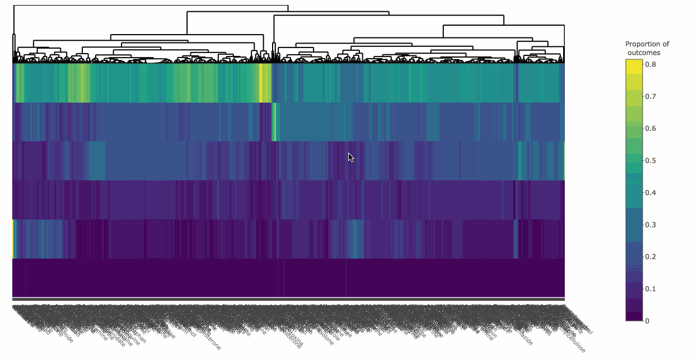

background-image: url(server-dash.svg)
background-size: contain
class: middle, right

## MIT licensed: built on flask & react
[Paid services](https://plot.ly/dash/pricing/) (e.g. private cloud, on-premise, etc)

---
background-image: url(server-dashR.svg)
background-size: contain
class: middle, right

## <font color="red">dashR:</font> an R framework for reactive web apps

.footnote[
**dashR** is not yet released...
]

---
class: middle, center, inverse

## But R already has [shiny](https://shiny.rstudio.com/)...why bother with dashR?

---
class: middle, center

# Reason 1: Agile development

## Easily switch between R/Python backend


---
class: principles

A **dashR** template:

.pull-left[
```r
library(dashR)
app = Dash$new()
app$layout_set(
*  # defines the layout/UI
*  # (a collection of "components")
)
app$callback(
*  # maps input(s) -> output
)
app$run_server()
```


Can have multiple callbacks, but only one layout
]

---
class: principles

A simple **dashR** app:

.pull-left[
```r
library(dashR)
app = Dash$new()
app$layout_set(
*  coreInput(
*    id = 'a', 
*    value = 'Hello World!', 
*    type = "text"
*  ),
*  htmlDiv(id = 'b')
)
app$callback(
*  function(text = input("a")) {
*    paste("You entered:", text)
*  },
*  output("b")
)
app$run_server()
```
]

.pull-right[

]

---
class: principles


.pull-left[
dashR version

```r
library(dashR)
app = Dash$new()
app$layout_set(
  coreInput(
    id = 'a', 
    value = 'Hello World!', 
    type = "text"
  ),
  htmlDiv(id = 'b')
)
app$callback(
  function(text = input("a")) {
    paste("You entered:", text)
  },
  output("b")
)
app$run_server()
```
]

.pull-right[
dash (python) version

```python
import dash
import dash_core_components as core
import dash_html_components as html
app = dash.Dash()
app.layout = html.Div([
    core.Input(
      id = 'a',
      value = 'Hello World!',
      type = "text"
    ),
    html.Div(id = 'b')
])
@app.callback(
    Output('b', 'children'),
    [Input('a', 'value')]
)
def update(text):
    return "You entered: " + text
app.run_server()
```
]

---
class: middle, center, inverse

# Reason 2: stateless web architecture

---
class: middle, principles

### What does stateless mean?

* A stateless server treats each request as an independent transaction that is unrelated to any previous request.

### When is it important?

* Scaling websites to many concurrent users

### How does dashR manage to be stateless?

* __dash__/__dashR__'s dependency graph is managed on the client via [dash-renderer](https://github.com/plotly/dash-renderer)

  * When a callback needs to be executed, the client makes an HTTP request to an R server.
  
  * As long as callback functions do not create side-effects, requests can be managed in a stateless fashion

---
class: middle, center, inverse

# Reason 3: leverage the dash & react communities

---
class: principles

* __dash__/__dashR__ components are *transpiled* from [React](https://reactjs.org/) components

    * If someone creates a component for a __dash__, it's trivial to use in __dashR__ (& vice-versa)
    
    * If you know JavaScript, [use our template to write your own](https://dash.plot.ly/plugins)!
    
    * There are 1,000s of [existing React components](https://github.com/brillout/awesome-react-components)

<br />

<div align="center">
  
</div>

---
class: middle, center, inverse

# Visualizing openFDA data 

## <font color="red">Example 1: Visualizing adverse drug outcomes</font>
## Example 2: Visualizing drug recall enforcements

---
class: middle, center

# First, let's survey some existing work

---
background-image: url(../20180515/medcheck.gif)
background-size: contain


#### https://medcheck.octoconsulting.com


---
class: middle, center, inverse

## What about *comparing* drug outcomes? 

---
background-image: url(../20180515/openfda-dashboard.gif)
background-size: contain
class: bottom, right

#### [Work by Christopher Peters](https://github.com/statwonk/openfda-dashboard)

---
class: middle, center, inverse

## What about comparing *many* drugs?

---

## Heatmap is a bit more scalable!

<a href="../20180515/heat-bars.html">
  
</a>

---

#### Heatmap of 1000 drug outcomes (made with [heatmaply](http://cran.r-project.org/package=heatmaply) and [plotly](http://cran.r-project.org/package=plotly))

<a href="../20180515/heatmap.html">
  
</a>

---
class: middle, center, inverse

## What about comparing *millions* of drugs?

---
class: center, middle

# Overview first, then zoom and filter, then details on demand 

Dr. Ben Shneiderman

.footnote[
### In other words, show summary stats first, then guided exploration to raw data.
]

---

<div align="center" >
<iframe src="https://player.vimeo.com/video/285119443" width="640" height="480" frameborder="0" webkitallowfullscreen mozallowfullscreen allowfullscreen></iframe>
</div>


---
class: middle, center, inverse

# Visualizing openFDA data 

## Example 1: Visualizing adverse drug outcomes
## <font color="red">Example 2: Visualizing drug recall enforcements</font>

---

<div align="center" >
<iframe src="https://player.vimeo.com/video/285120278" width="640" height="480" frameborder="0" webkitallowfullscreen mozallowfullscreen allowfullscreen></iframe>
</div>

---
class: middle,principles

## Thanks! Questions? 

Slides: <https://talks.cpsievert.me>

#### Contact me:

`r icon::fa_twitter()` <a href='https://twitter.com/cpsievert'>@cpsievert</a> <br />
`r icon::fa_github()` <a href='https://github.com/cpsievert'>@cpsievert</a> <br />
`r icon::fa_envelope()` <cpsievert1@gmail.com> <br />
`r icon::fa_globe()` <https://cpsievert.me/>


