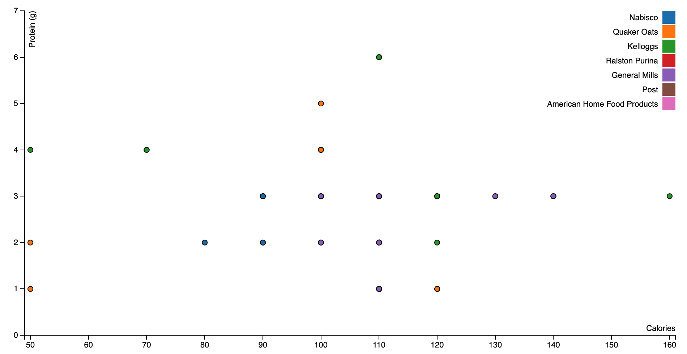
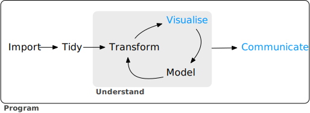
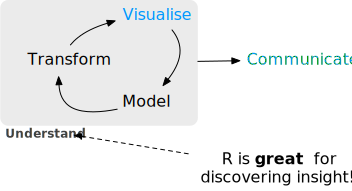

class: middle, center, inverse

# Why JavaScript?

### Carson Sievert, PhD <br/> Software Engineer, RStudio

### Slides: https://talks.cpsievert.me

### `r icon::fa_twitter()` <a href='https://twitter.com/cpsievert'>@cpsievert</a> <br/> `r icon::fa_globe()` <https://cpsievert.me> <br/> `r icon::fa_envelope()` <cpsievert1@gmail.com>

---
class: middle, center, inverse

<font color="#BF0F0F" style="font-size:2em;position:absolute;top:75px;left:340px">When to</font>


# Why JavaScript?

### Carson Sievert, PhD <br/> Software Engineer, RStudio

### Slides: https://talks.cpsievert.me

### `r icon::fa_twitter()` <a href='https://twitter.com/cpsievert'>@cpsievert</a> <br/> `r icon::fa_globe()` <https://cpsievert.me> <br/> `r icon::fa_envelope()` <cpsievert1@gmail.com>

---
class: middle

## "Of course someone has to write for loops. <br> It doesn’t have to be you."

- Jenny Bryan (Software Engineer, RStudio)

```{r xaringan-themer, include = FALSE}
knitr::opts_chunk$set(message = FALSE)
# install.packages(xaringan)
# devtools::install_github("gadenbuie/xaringanthemer")
xaringanthemer::mono_light(
  base_color = "#005DAA",
  background_color =  "#FFFFFF", #"#b9ebfa", # "#7AD1EC", 
  text_font_family = "'Futura'",
  header_font_family = "'Futura'",
  header_h1_font_size = "50px",
  text_color = "#C03925",
  code_inline_color = "#C03925", 
  link_color ="#7AD1EC",
  code_font_size = "1.3em",
  text_slide_number_color = "transparent",
  extra_css = list(
    ".remark-code-line" = list("color" = "#000000"),
    ".scroll-output" = list(
      "height" = "95%",
      "overflow-y" = "scroll",
      "font-size" = "0.7em"
    )
  )
)
```

---
class: middle


<font color="#BF0F0F" style="font-size:2em;position:absolute;top:205px;right:125px">JavaScript</font>

## "Of course someone has to write for loops. It doesn’t have to be you."

- Me, for similar reasons

---
class: middle

## Why avoid for loops (and JavaScript)?

> <font style='font-size:1.5em'> "It is all too easy for statistical thinking to be swamped by programming tasks." </font> (Brian D. Ripley)

---

## What does this R code do?

<pre><code>
out1 <- vector("double", ncol(mtcars))
for (i in seq_along(mtcars)) {
  out1[[i]] <- mean(mtcars[[i]], na.rm = TRUE)
}

out2 <- vector("double", ncol(mtcars))
for (i in seq_along(mtcars)) {
  out2[[i]] <- median(mtcars[[i]], na.rm = TRUE)
}
</code></pre>


.footnote[
Example from Hadley Wickham's _Building Tidy Tools_ [workshop](https://blog.rstudio.com/2019/02/06/rstudio-conf-2019-workshops/).
]

---

## For loops emphasize the objects

<pre><code>
<font color="red">out1</font> <- vector("double", <font color="red">ncol(mtcars)</font>)
for (i in seq_along(<font color="red">mtcars</font>)) {
  <font color="red">out1[[i]]</font> <- mean(<font color="red">mtcars[[i]]</font>, na.rm = TRUE)
}

<font color="red">out2</font> <- vector("double", <font color="red">ncol(mtcars))</font>
for (i in seq_along(<font color="red">mtcars</font>)) {
  <font color="red">out2[[i]]</font> <- median(<font color="red">mtcars[[i]]</font>, na.rm = TRUE)
}
</code></pre>

.footnote[
Example from Hadley Wickham's _Building Tidy Tools_ [workshop](https://blog.rstudio.com/2019/02/06/rstudio-conf-2019-workshops/).
]

---

## Not the actions

<pre><code>
out1 <- vector("double", ncol(mtcars))
for (i in seq_along(mtcars)) {
  out1[[i]] <- <font color="red">mean</font>(mtcars[[i]], na.rm = TRUE)
}

out2 <- vector("double", ncol(mtcars))
for (i in seq_along(mtcars)) {
  out2[[i]] <- <font color="red">median</font>(mtcars[[i]], na.rm = TRUE)
}
</code></pre>

.footnote[
Example from Hadley Wickham's _Building Tidy Tools_ [workshop](https://blog.rstudio.com/2019/02/06/rstudio-conf-2019-workshops/).
]

---

## Functional programming weights equally


<pre><code>
library(purrr)
means <- map_dbl(<font color="red">mtcars</font>, <font color="red">mean</font>)
medians <- map_dbl(<font color="red">mtcars</font>, <font color="red">median</font>)
</code></pre>

.footnote[
Example from Hadley Wickham's _Building Tidy Tools_ [workshop](https://blog.rstudio.com/2019/02/06/rstudio-conf-2019-workshops/).
]


---

## Functional programming weights equally


<pre><code>
library(purrr)
means <- map_dbl(<font color="red">mtcars</font>, <font color="red">mean</font>)
medians <- map_dbl(<font color="red">mtcars</font>, <font color="red">median</font>)
</code></pre>

### For more, see ["The Joy of Functional Programming (for Data Science)"](https://www.youtube.com/watch?v=bzUmK0Y07ck) by Hadley Wickham

.footnote[
Example from Hadley Wickham's _Building Tidy Tools_ [workshop](https://blog.rstudio.com/2019/02/06/rstudio-conf-2019-workshops/).
]

---

<font color="#BF0F0F" style="font-size:2em; position:absolute; top:20px; left:100px">JavaScript</font>


## For loop emphasizes objects 

<br>
<br>
<br>

### JavaScript: a language for manipulating the Document **Object** Model (DOM)!

* <font style="font-size:1.5em">D3 make it easier to map data to the DOM, but you're still <i>working with</i> HTML/SVG/CSS etc.</font>

---
## D3 scatterplot example



---

.scroll-output[
```html
<!DOCTYPE html>
<html>
<meta charset="utf-8">

<style>
body {
  font: 11px sans-serif;
}

.axis path,
.axis line {
  fill: none;
  stroke: #000;
  shape-rendering: crispEdges;
}

.dot {
  stroke: #000;
}

.tooltip {
  position: absolute;
  width: 200px;
  height: 28px;
  pointer-events: none;
}
</style>
<body>
<script src="https://d3js.org/d3.v3.min.js"></script>

<script>
var margin = {top: 20, right: 20, bottom: 30, left: 40},
    width = 960 - margin.left - margin.right,
    height = 500 - margin.top - margin.bottom;

/* 
 * value accessor - returns the value to encode for a given data object.
 * scale - maps value to a visual display encoding, such as a pixel position.
 * map function - maps from data value to display value
 * axis - sets up axis
 */ 

// setup x 
var xValue = function(d) { return d.Calories;}, // data -> value
    xScale = d3.scale.linear().range([0, width]), // value -> display
    xMap = function(d) { return xScale(xValue(d));}, // data -> display
    xAxis = d3.svg.axis().scale(xScale).orient("bottom");

// setup y
var yValue = function(d) { return d["Protein (g)"];}, // data -> value
    yScale = d3.scale.linear().range([height, 0]), // value -> display
    yMap = function(d) { return yScale(yValue(d));}, // data -> display
    yAxis = d3.svg.axis().scale(yScale).orient("left");

// setup fill color
var cValue = function(d) { return d.Manufacturer;},
    color = d3.scale.category10();

// add the graph canvas to the body of the webpage
var svg = d3.select("body").append("svg")
    .attr("width", width + margin.left + margin.right)
    .attr("height", height + margin.top + margin.bottom)
  .append("g")
    .attr("transform", "translate(" + margin.left + "," + margin.top + ")");

// add the tooltip area to the webpage
var tooltip = d3.select("body").append("div")
    .attr("class", "tooltip")
    .style("opacity", 0);

// load data
d3.csv("cereal.csv", function(error, data) {

  // change string (from CSV) into number format
  data.forEach(function(d) {
    d.Calories = +d.Calories;
    d["Protein (g)"] = +d["Protein (g)"];
//    console.log(d);
  });

  // don't want dots overlapping axis, so add in buffer to data domain
  xScale.domain([d3.min(data, xValue)-1, d3.max(data, xValue)+1]);
  yScale.domain([d3.min(data, yValue)-1, d3.max(data, yValue)+1]);

  // x-axis
  svg.append("g")
      .attr("class", "x axis")
      .attr("transform", "translate(0," + height + ")")
      .call(xAxis)
    .append("text")
      .attr("class", "label")
      .attr("x", width)
      .attr("y", -6)
      .style("text-anchor", "end")
      .text("Calories");

  // y-axis
  svg.append("g")
      .attr("class", "y axis")
      .call(yAxis)
    .append("text")
      .attr("class", "label")
      .attr("transform", "rotate(-90)")
      .attr("y", 6)
      .attr("dy", ".71em")
      .style("text-anchor", "end")
      .text("Protein (g)");

  // draw dots
  svg.selectAll(".dot")
      .data(data)
    .enter().append("circle")
      .attr("class", "dot")
      .attr("r", 3.5)
      .attr("cx", xMap)
      .attr("cy", yMap)
      .style("fill", function(d) { return color(cValue(d));}) 
      .on("mouseover", function(d) {
          tooltip.transition()
               .duration(200)
               .style("opacity", .9);
          tooltip.html(d["Cereal Name"] + "<br/> (" + xValue(d) 
	        + ", " + yValue(d) + ")")
               .style("left", (d3.event.pageX + 5) + "px")
               .style("top", (d3.event.pageY - 28) + "px");
      })
      .on("mouseout", function(d) {
          tooltip.transition()
               .duration(500)
               .style("opacity", 0);
      });

  // draw legend
  var legend = svg.selectAll(".legend")
      .data(color.domain())
    .enter().append("g")
      .attr("class", "legend")
      .attr("transform", function(d, i) { return "translate(0," + i * 20 + ")"; });

  // draw legend colored rectangles
  legend.append("rect")
      .attr("x", width - 18)
      .attr("width", 18)
      .attr("height", 18)
      .style("fill", color);

  // draw legend text
  legend.append("text")
      .attr("x", width - 24)
      .attr("y", 9)
      .attr("dy", ".35em")
      .style("text-anchor", "end")
      .text(function(d) { return d;})
});

</script>
</body>
</html>
```
]
  
---
### 'High-level' JS libraries reduce 'DOM cruft'

<div align="center">
  
</div>

.pull-left[
```html
<html>
  <script src="https://cdn.plot.ly/plotly-latest.min.js"></script>
  <body>
    <div id="graph"></div>
  </body>
</html>
```
]

.pull-right[
```javascript
var bar = {
  x: [1, 2, 3],
  y: ["a", "b", "c"],
  type: "bar"
}
Plotly.plot("graph", {data: [bar]})
```
]

---
### 'High-level' JS libraries reduce 'DOM cruft'

- <font style="font-size:1.5em"> 👍 Compared to D3, more weight on the domain problem</font>
* <font style="font-size:1.5em"> 👎 HTML boilerplate</font>
- <font style="font-size:1.5em"> 👎 Web tech generally lacks tools for data transformation and inspection</font>

<br/>

.pull-left[
```html
<html>
  <script src="https://cdn.plot.ly/plotly-latest.min.js"></script>
  <body>
    <div id="graph"></div>
  </body>
</html>
```
]

.pull-right[
```javascript
var bar = {
  x: [1, 2, 3],
  y: ["a", "b", "c"],
  type: "bar"
}
Plotly.plot("graph", {data: [bar]})
```
]

---
## Data science workflow



.footnote[
Diagram from Wickham and Grolemund (2017), [_R for Data Science_](https://r4ds.had.co.nz/) 
]

---
class: middle


---
class: middle


---
class: middle



---
background-image: url(why-not-both.gif)
background-size: contain


<!--
Programming in JavaScript might help you create graphics that help your audience explore data, but I don't recommend it for helping yourself 
-->

---
### htmlwidgets: a bridge between R and JS libraries

<http://gallery.htmlwidgets.org>


---

```r
library(plotly)
albersusa::usa_sf("laea") %>% 
  cartogram::cartogram_cont("pop_2014") %>%
  plot_ly(us_cont) %>% 
  add_sf(color = ~pop_2014, split = ~name, span = I(1), text = ~paste(name, scales::number_si(pop_2014))) %>%
  colorbar(title = "Population \n 2014")
```

<iframe src="cartogram.html" width="100%" height="450" scrolling="no" seamless="seamless" frameBorder="0"> </iframe>

---

## htmlwidgets: nice for single view interaction

https://vimeo.com/315707813


---
background-image: url(https://i.imgur.com/T7GSpv9.gif)
background-size: contain

## shiny: great for coordinating multiple views


<!--

## So, when _should_ statisticians learn JavaScript?

1. You know _exactly_ what type of visual interface you want
  -  Weeks to prototype in shiny+ggplot2, months to prototype in D3js
    
2. The 'prior art' doesn't do what you need
  - Nowadays, you can get a *long* way with **htmlwidgets**, **shiny**, and **rmarkdown**

3. You want to build tools that enable others
-->

---
## That being said...

Knowing 'enough' JavaScript can be powerful, especially if you leverage existing 'scaffolding'!

```r
plot_ly(mtcars, x = ~wt, y = ~mpg) %>%
  add_markers(
    text = rownames(mtcars),
    customdata = paste0("http://google.com/#q=", rownames(mtcars))
  ) %>%
  htmlwidgets::onRender("function(el) {
    el.on('plotly_click', function(d) {
      var url = d.points[0].customdata;
      window.open(url);
    });
  }")
```

---

## Click on a point to google search

<iframe src="scatterplot.html" width="100%" height="370" scrolling="no" seamless="seamless" frameBorder="0"> </iframe>

### Learn more about registering custom JavaScript events with **plotly** -- <https://plotly-r.com/javascript.html>

---

## So, you want to 'learn JavaScript'

### Have a goal in mind and learn the fundamentals

HTML, JSON, *vanilla* JavaScript, and CSS. Maybe D3.

### Don't get caught up in the framework-of-the-day (e.g. React, Vue, Angular, etc)

Especially if you're willing and able to use **shiny**.

### Don't waste your time on build tools (e.g., Webpack, Grunt, etc)

You can get a long way doing thing the old-fashioned way.

---

## In summary

### functional programming : for loops :: htmlwidgets : JavaScript
  * Don't waste your time on programming 'cruft' if don't need to!
  
  
* Programming in JavaScript, like for loops, pulls focus away from the main task/action.
    * Functional programming offers a nice alternative to for loops

* Web programming tools are not designed for EDA
  * Bad at transforming and inspecting data

* R bindings to JS libs (i.e., htmlwidgets, shiny, etc) help bring the power of the web 
