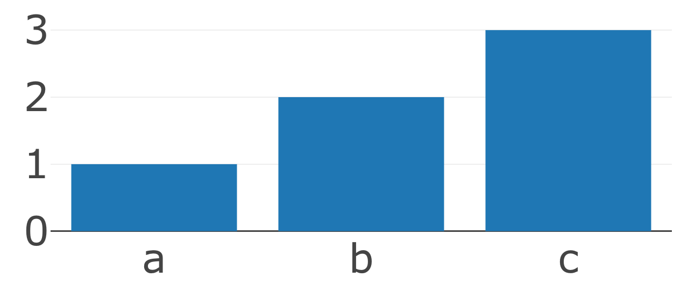
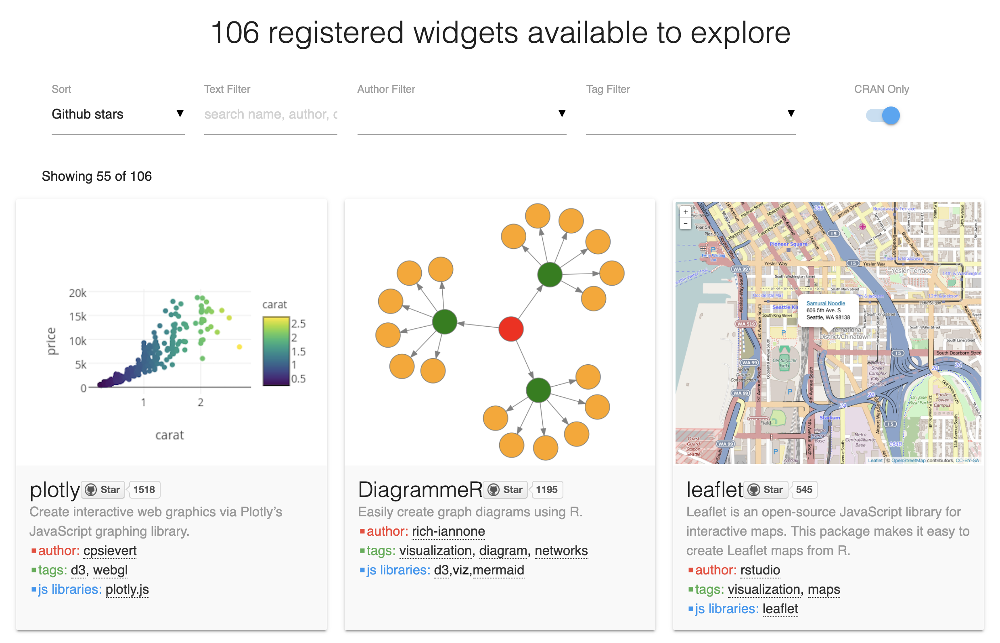
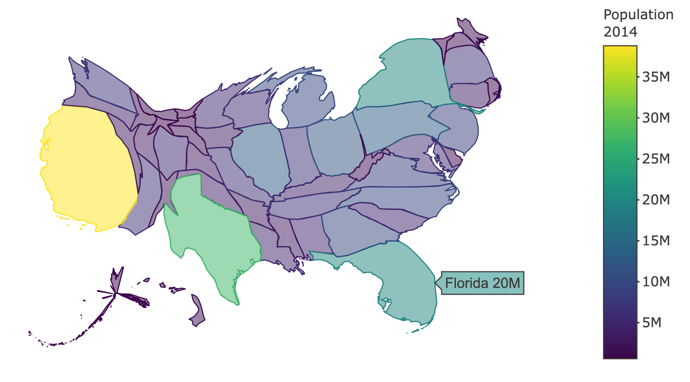
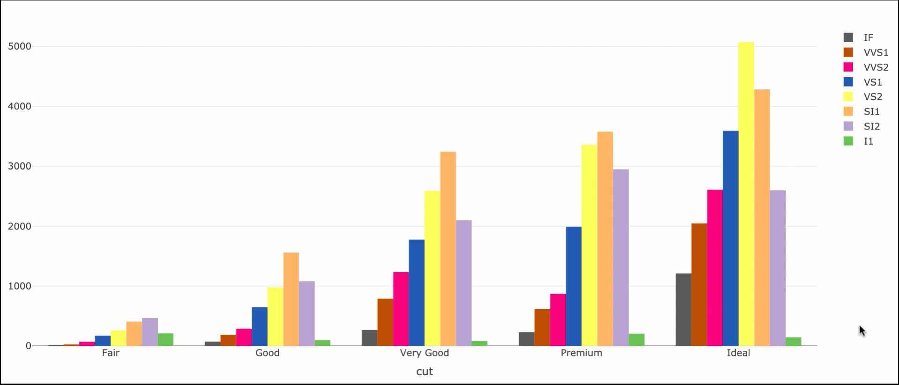
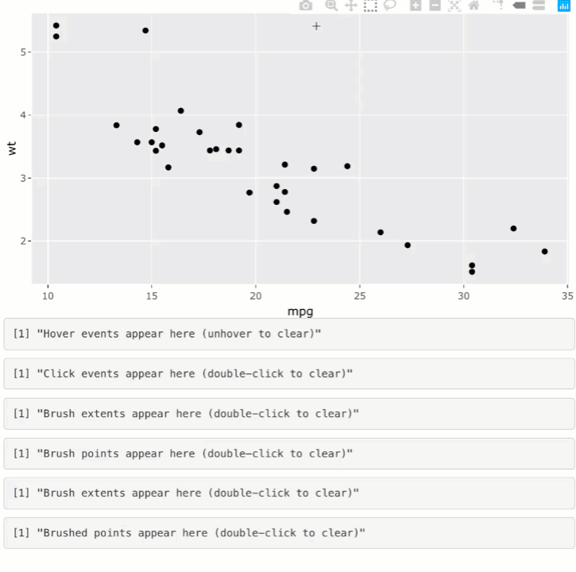
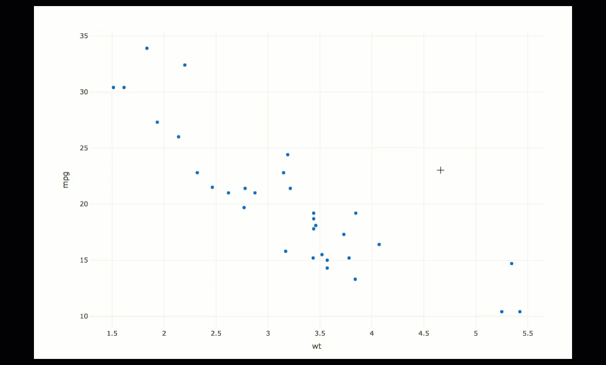

class: middle, center, inverse

# Why JavaScript?

### Carson Sievert, PhD <br/> Software Engineer, RStudio

### Slides: http://bit.ly/jsm_19

### `r icon::fa_twitter()` <a href='https://twitter.com/cpsievert'>@cpsievert</a> <br/> `r icon::fa_globe()` <https://cpsievert.me> <br/> `r icon::fa_envelope()` <cpsievert1@gmail.com>

---
background-image: url(karl-moustache.jpg)
background-size: contain
class: huge-font

<font color = "#005DAA">Mo</font> <font color = "white">us</font> <font color = "#005DAA">t</font> <font color = "white">ach</font> <font color = "#005DAA">ivation</font>

---
class: middle, center, inverse

<font color="#BF0F0F" style="font-size:2em;position:absolute;top:75px;left:340px">Why not</font>


# Why JavaScript?

### Carson Sievert, PhD <br/> Software Engineer, RStudio

### Slides: http://bit.ly/jsm_19

### `r icon::fa_twitter()` <a href='https://twitter.com/cpsievert'>@cpsievert</a> <br/> `r icon::fa_globe()` <https://cpsievert.me> <br/> `r icon::fa_envelope()` <cpsievert1@gmail.com>

---
class: middle, center, inverse

<font color="#BF0F0F" style="font-size:2em;position:absolute;top:75px;left:340px">When to</font>


# Why JavaScript?

### Carson Sievert, PhD <br/> Software Engineer, RStudio

### Slides: http://bit.ly/jsm_19

### `r icon::fa_twitter()` <a href='https://twitter.com/cpsievert'>@cpsievert</a> <br/> `r icon::fa_globe()` <https://cpsievert.me> <br/> `r icon::fa_envelope()` <cpsievert1@gmail.com>

---
class: middle

## "Of course someone has to write for loops. <br> It doesn’t have to be you."

- Jenny Bryan (Software Engineer, RStudio)

```{r xaringan-themer, include = FALSE}
knitr::opts_chunk$set(message = FALSE)
# devtools::install_github("gadenbuie/xaringanthemer")
xaringanthemer::mono_light(
  base_color = "#005DAA",
  background_color =  "#FFFFFF", #"#b9ebfa", # "#7AD1EC", 
  text_font_family = "'Futura'",
  header_font_family = "'Futura'",
  header_h1_font_size = "50px",
  text_color = "#C03925",
  code_inline_color = "#C03925", 
  link_color ="#7AD1EC",
  code_font_size = "1.3em",
  text_slide_number_color = "transparent",
  extra_css = list(
    ".remark-code-line" = list("color" = "#000000"),
    ".scroll-output" = list(
      "height" = "95%",
      "overflow-y" = "scroll",
      "font-size" = "0.7em"
    ),
    ".large-font" = list("font-size" = "1.5em"),
    ".huge-font" = list("font-size" = "3em"),
    ".small-code" = list("font-size" = "1em")
  )
)
```

---
class: middle


<font color="#BF0F0F" style="font-size:2em;position:absolute;top:205px;right:125px">JavaScript</font>

## "Of course someone has to write for loops. It doesn’t have to be you."

- Me, for similar reasons

---
class: middle


<font color="#BF0F0F" style="font-size:2em;position:absolute;top:205px;right:475px">JavaScript</font>

## Why avoid for loops?

> <font style='font-size:1.5em'> "It is all too easy for statistical thinking to be swamped by programming tasks." </font> (Brian D. Ripley)

---

## What does this R code do?

<pre><code>
out1 <- vector("double", ncol(mtcars))
for (i in seq_along(mtcars)) {
  out1[[i]] <- mean(mtcars[[i]], na.rm = TRUE)
}

out2 <- vector("double", ncol(mtcars))
for (i in seq_along(mtcars)) {
  out2[[i]] <- median(mtcars[[i]], na.rm = TRUE)
}
</code></pre>


.footnote[
Example from Hadley Wickham's _Building Tidy Tools_ [workshop](https://blog.rstudio.com/2019/02/06/rstudio-conf-2019-workshops/).
]

---

## For loops emphasize the objects

<pre><code>
<font color="red">out1</font> <- vector("double", <font color="red">ncol(mtcars)</font>)
for (i in seq_along(<font color="red">mtcars</font>)) {
  <font color="red">out1[[i]]</font> <- mean(<font color="red">mtcars[[i]]</font>, na.rm = TRUE)
}

<font color="red">out2</font> <- vector("double", <font color="red">ncol(mtcars))</font>
for (i in seq_along(<font color="red">mtcars</font>)) {
  <font color="red">out2[[i]]</font> <- median(<font color="red">mtcars[[i]]</font>, na.rm = TRUE)
}
</code></pre>

.footnote[
Example from Hadley Wickham's _Building Tidy Tools_ [workshop](https://blog.rstudio.com/2019/02/06/rstudio-conf-2019-workshops/).
]

---

## Not the actions

<pre><code>
out1 <- vector("double", ncol(mtcars))
for (i in seq_along(mtcars)) {
  out1[[i]] <- <font color="red">mean</font>(mtcars[[i]], na.rm = TRUE)
}

out2 <- vector("double", ncol(mtcars))
for (i in seq_along(mtcars)) {
  out2[[i]] <- <font color="red">median</font>(mtcars[[i]], na.rm = TRUE)
}
</code></pre>

.footnote[
Example from Hadley Wickham's _Building Tidy Tools_ [workshop](https://blog.rstudio.com/2019/02/06/rstudio-conf-2019-workshops/).
]

---

## Functional programming weights equally


<pre><code>
library(purrr)
means <- map_dbl(<font color="red">mtcars</font>, <font color="red">mean</font>)
medians <- map_dbl(<font color="red">mtcars</font>, <font color="red">median</font>)
</code></pre>

.footnote[
Example from Hadley Wickham's _Building Tidy Tools_ [workshop](https://blog.rstudio.com/2019/02/06/rstudio-conf-2019-workshops/).
]


---

## Functional programming weights equally


<pre><code>
library(purrr)
means <- map_dbl(<font color="red">mtcars</font>, <font color="red">mean</font>)
medians <- map_dbl(<font color="red">mtcars</font>, <font color="red">median</font>)
</code></pre>

### For more, see ["The Joy of Functional Programming (for Data Science)"](https://www.youtube.com/watch?v=bzUmK0Y07ck) by Hadley Wickham

.footnote[
Example from Hadley Wickham's _Building Tidy Tools_ [workshop](https://blog.rstudio.com/2019/02/06/rstudio-conf-2019-workshops/).
]

---
class:inverse

<font color="#BF0F0F" style="font-size:2em; position:absolute; top:20px; left:100px">JavaScript/D3</font>


## For loop emphasizes objects 

<br>
<br>
<br>

### The low-level graphics API (e.g. SVG, Canvas, etc) is often far removed from the domain problem
  
---
class: small-code

### 'High-level' JS libraries

<div align="center">
  
</div>

.pull-left[
```html
<html>
  <script src="https://cdn.plot.ly/plotly-latest.min.js"></script>
  <body>
    <div id="graph"></div>
  </body>
</html>
```
]

.pull-right[
```javascript
var bar = {
  x: [1, 2, 3],
  y: ["a", "b", "c"],
  type: "bar"
}
Plotly.plot("graph", {data: [bar]})
```
]

---
class:small-code
### 'High-level' JS libraries

- <font style="font-size:1.5em"> `r emo::ji("+1")` Compared to D3, more weight on the intention</font>
* <font style="font-size:1.5em"> `r emo::ji("-1")` HTML boilerplate</font>
- <font style="font-size:1.5em"> `r emo::ji("-1")` Web tech is not designed for data exploration, <b>but R is!</b> </font>

<br/>

.pull-left[
```html
<html>
  <script src="https://cdn.plot.ly/plotly-latest.min.js"></script>
  <body>
    <div id="graph"></div>
  </body>
</html>
```
]

.pull-right[
```javascript
var bar = {
  x: [1, 2, 3],
  y: ["a", "b", "c"],
  type: "bar"
}
Plotly.plot("graph", {data: [bar]})
```
]


---
background-image: url(why-not-both2.gif)
background-size: contain


---
### htmlwidgets: a bridge between R and JS libraries

<a href="http://gallery.htmlwidgets.org">
  
</a>


---
class: small-code

### htmlwidgets: computing+graphics synergy

```r
library(plotly)
albersusa::usa_sf("laea") %>% 
  cartogram::cartogram_cont("pop_2014") %>%
  plot_ly(us_cont) %>% 
  add_sf(color = ~pop_2014, split = ~name, span = I(1), text = ~paste(name, scales::number_si(pop_2014))) %>%
  colorbar(title = "Population \n 2014")
```

<div align="center">
  
</div>

---
class: small-code

### htmlwidgets: *within view* interaction for 'free'

```r
library(plotly)
plot_ly(diamonds, x = ~cut, color = ~clarity, colors = "Accent")
```



---
### What about *across view* interaction?


---
class: small-code

### shiny: manage communication _across views_

Most **htmlwidgets** allow you to access user events in **shiny**

.pull-left[
```r
library(shiny)
ui <- fluidPage(
  plotlyOutput("p"),
  verbatimTextOutput("click")
)
server <- function(input, output) {
  output$p <- renderPlotly({
    plot_ly(mtcars, x = ~wt, y = ~mpg)
  })
  output$click <- renderPrint({
*    event_data("plotly_click")
  })
}
shinyApp(ui, server)
```
]

.pull-right[

]

---

### shiny itself isn't slow, your R code is!

Do you _need_ to redraw the entire graph? [Probably not](https://plotly-r.com/linking-views-with-shiny.html#shiny-performance)!


---
### What about "non-standard interaction"?



---
class: small-code

### Time to JavaScript!

```r
plot_ly(mtcars, x = ~wt, y = ~mpg) %>%
  add_markers(
    customdata = paste0(
      "http://google.com/#q=", rownames(mtcars)
    )
  ) %>%
  htmlwidgets::onRender("
    function(el) {
*      el.on('plotly_click', function(d) {
*        var url = d.points[0].customdata;
*        window.open(url);
*      });
    }
  ")
```

### Learn more about registering custom JavaScript events with **plotly** -- <https://plotly-r.com/javascript.html>

---
class: large-font

## In summary
  
* Programming in JavaScript, like for loops, can distract from the main task/action.
    * Over-emphasis on objects that are far removed from your domain problem

* R bindings to JS libs (i.e., htmlwidgets, shiny, etc), best of both worlds!
  * If you hit a dead-end with these tools, *then it's time to learn JavaScript*!
  
---
class: middle, center, inverse, large-font

## Thank you!


### Slides <https://bit.ly/jsm_19> <br>
### `r icon::fa_twitter()` <a href="https://twitter.com/cpsievert">@cpsievert</a> <br>
### `r icon::fa_envelope()` <cpsievert1@gmail.com> <br>
### `r icon::fa_globe()` <https://cpsievert.me/>
  
