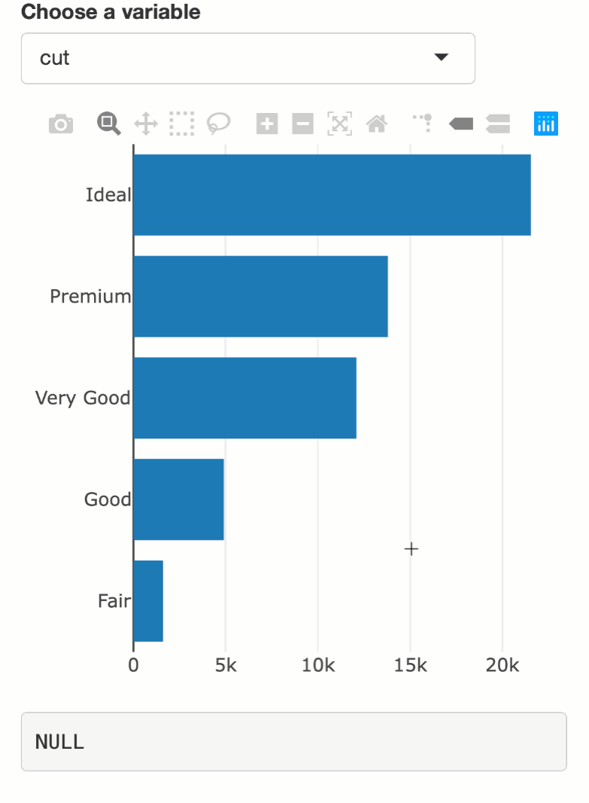

background-image: url(your-turn.jpeg)
background-size: contain
class: inverse, principles

<h2 align="center"> Your turn </h2>

1. Open the slides:  [bit.ly/jj-shiny-day](https://bit.ly/jj-shiny-day)

2. Go to this address <https://rstudio.cloud/project/446255>. This hosted RStudio instance contains materials for today's workshop.
    * Login or sign up to RStudio Cloud (it's free)
    * Click "Save a Permanent Copy" to copy the project to your account.

3. Ask me any question at any time by going to [slido.com](https://www.sli.do) and enter event code #H808 (or use [this link](https://app.sli.do/event/hwgdwyr2)). I'll try to check these questions periodically (upvote questions if you'd like them answered!)

```{r, include = FALSE}
library(plotly)
library(countdown)
knitr::opts_chunk$set(
  message = FALSE,
  out.width = "70%",
  comment = "#>",
  collapse = TRUE,
  fig.align = "center"
)

include_vimeo <- function(id, width = "100%", height = "450") {
  url <- sprintf("https://player.vimeo.com/video/%s?title=0&byline=0&portrait=0", id)
  htmltools::tags$iframe(
    src = url,
    width = width,
    height = height,
    frameborder = "0",
    seamless = "seamless",
    webkitAllowFullScreen = NA,
    mozallowfullscreen = NA,
    allowFullScreen = NA
  )
}
```

```{r, echo=FALSE}
countdown(minutes = 5, seconds = 0, bottom = 0, color_background = "black")
```

---
class: principles

### About me

* Started at RStudio about 1 year ago
    * First edition of [plotly for R book](https://plotly-r.com) coming very soon!
    * Authored **shinymeta** with Joe Cheng
    * Maintaining/contributing to: **plotly**, **shiny**, **htmlwidgets**, **rmarkdown**, etc.
    
* Previously freelance consultant
    * Maintained **plotly** R package (since 2015)
    * Developed **shiny** apps for exploratory visualization
  
* PhD in statistics at Iowa State (December 2016)
    * Dissertation mainly on interactive statistical graphics

---

### About plotly

* The R package **plotly** provides R bindings to the (MIT-licensed) JavaScript library [plotly.js](https://github.com/plotly/plotly.js).

```r
library(plotly)
plot_ly(diamonds, x = ~cut, color = ~clarity, colors = "Accent")
```

```{r, echo = FALSE}
include_vimeo("315707813", height = 420)
```

---
class: inverse, principles

## plotly works wherever htmlwidgets do!

* At the R/RStudio console
    * Printing at the console generates and opens HTML file.
    * Use RStudio or `htmlwidgets::saveWidget()` to save HTML file.

* In R Markdown documents
    * Use awesome R Markdown templates like [flexdashboard](https://rmarkdown.rstudio.com/flexdashboard/).
    
* In Shiny apps
    * Build sophisticated web applications that leverage the computing power of R
    
#### [Demo](https://rstudio.cloud/project/446255)

---
### Use Shiny inputs to trigger re-render

.pull-left[
```r
library(shiny)
library(plotly)

ui <- fluidPage(
* selectInput(
*   "y", "Choose a variable", 
*   choices = names(diamonds)
* ),
  plotlyOutput("p")
)

server <- function(input, output) {

  output$p <- renderPlotly({
    plot_ly(
*     y = diamonds[[input$y]]
    )
  })
  
}

shinyApp(ui, server)
```
]

.pull-right[

]

---
### Access output interaction as an input value

.pull-left[
```r
library(shiny)
library(plotly)

ui <- fluidPage(
  selectInput(
    "y", "Choose a variable", 
    choices = names(diamonds)
  ),
  plotlyOutput("p"),
  verbatimTextOutput("hover")
)

server <- function(input, output) {
  output$p <- renderPlotly({
    plot_ly(y = diamonds[[input$y]])
  })
* output$hover <- renderPrint({
*   #Think of this like an input value
*   event_data("plotly_hover")
* })
}

shinyApp(ui, server)
```
]

.pull-right[

]

---
### Many types of output interactions

Access hover, click, click&drag, etc, as input values:

* `plotly::plotlyOutput()`
    * https://plotly-r.com/linking-views-with-shiny.html#shiny-plotly-inputs
    
* `leaflet::leafletOutput()`
    * https://rstudio.github.io/leaflet/shiny.html

* `DT::dataTableOutput()`
    * https://rstudio.github.io/DT/shiny.html

* `shiny::plotOutput()` & `shiny::imageOutput()`
    * Interactive plots section of https://shiny.rstudio.com/gallery/
    * https://shiny.rstudio.com/articles/plot-interaction.html
    * https://shiny.rstudio.com/articles/selecting-rows-of-data.html
    * https://shiny.rstudio.com/articles/plot-interaction-advanced.html
    
.footnote[
Many other [htmlwidgets](http://www.htmlwidgets.org/) packages also expose output interactions as input values.
]

---
### An example: sales data drill-down

```{r, echo = FALSE}
include_vimeo("307597838", height = 500)
```

---
### sales transactions

.pull-left[
```r
library(tidyverse)
sales <- read_csv("data/sales.csv")
glimpse(sales)
```

```r
#> Observations: 9,994
#> Variables: 5
#> $ id           <chr> "CG-12520", "CG-12520", "DV-13045", "SO-20335…
#> $ category     <chr> "Furniture", "Furniture", "Office  Supplies", …
#> $ sub_category <chr> "Bookcases", "Chairs", "Labels", "Tables", "S…
#> $ order_date   <date> 2016-11-08, 2016-11-08, 2016-06-12, 2015-10-…
#> $ sales        <dbl> 261.9600, 731.9400, 14.6200, 957.5775, 22.368…
```
]

.pull-right[
```r
sales %>%
  group_by(category) %>%
  summarise(n = sum(sales))
```

```r
#> # A tibble: 3 x 2
#>   category              n
#>   <chr>             <dbl>
#> 1 Furniture       742000.
#> 2 Office Supplies 719047.
#> 3 Technology      836154.
```
]


---
### sales transactions (continued)

.pull-left[
```r
library(tidyverse)
sales <- read_csv("data/sales.csv")
glimpse(sales)
```

```r
#> Observations: 9,994
#> Variables: 5
#> $ id           <chr> "CG-12520", "CG-12520", "DV-13045", "SO-20335…
#> $ category     <chr> "Furniture", "Furniture", "Office  Supplies", …
#> $ sub_category <chr> "Bookcases", "Chairs", "Labels", "Tables", "S…
#> $ order_date   <date> 2016-11-08, 2016-11-08, 2016-06-12, 2015-10-…
#> $ sales        <dbl> 261.9600, 731.9400, 14.6200, 957.5775, 22.368…
```
]

.pull-right[
```r
sales %>%
  count(category, wt = sales)
```

```r
#> # A tibble: 3 x 2
#>   category              n
#>   <chr>             <dbl>
#> 1 Furniture       742000.
#> 2 Office Supplies 719047.
#> 3 Technology      836154.
```
]

---
### sales transactions (continued)

.pull-left[
```r
library(tidyverse)
sales <- read_csv("data/sales.csv")
glimpse(sales)
```

```r
#> Observations: 9,994
#> Variables: 5
#> $ id           <chr> "CG-12520", "CG-12520", "DV-13045", "SO-20335…
#> $ category     <chr> "Furniture", "Furniture", "Office  Supplies", …
#> $ sub_category <chr> "Bookcases", "Chairs", "Labels", "Tables", "S…
#> $ order_date   <date> 2016-11-08, 2016-11-08, 2016-06-12, 2015-10-…
#> $ sales        <dbl> 261.9600, 731.9400, 14.6200, 957.5775, 22.368…
```
]

.pull-right[
```r
sales %>%
  count(category, wt = sales) %>%
  plot_ly(x = ~category, y = ~n)
```

]


---
### Accessing sales category clicks

.pull-left[
```r
library(shiny)
ui <- fluidPage(
  plotlyOutput("category"),
* verbatimTextOutput("info")
)
server <- function(input, output) {
  output$category <- renderPlotly({
    sales %>%
      count(category, wt = sales) %>%
      plot_ly(x = ~category, y = ~n)
  })
  output$info <- renderPrint({
*   event_data("plotly_click")
  })
}
shinyApp(ui, server)
```
]

.pull-right[

]

---
### Plotting sub-categories

.pull-left[
```r
library(shiny)
ui <- fluidPage(
  plotlyOutput("category"),
* plotlyOutput("sub_category")
)
server <- function(input, output) {
  output$category <- renderPlotly({
    sales %>%
      count(category, wt = sales) %>%
      plot_ly(x = ~category, y = ~n)
  })
  output$sub_category <- renderPlotly({
    d <- event_data("plotly_click")
    if (is.null(d)) return(NULL)
    
*   sales %>%
*     filter(category %in% d$x) %>%
*     count(sub_category, wt = sales) %>%
*     plot_ly(x = ~sub_category, y = ~n)
  })
}
shinyApp(ui, server)
```
]

.pull-right[

]

---
background-image: url(your-turn.jpeg)
background-size: contain
class: inverse, principles

<h2 align="center"> Your turn </h2>

* Open the `demo/04-sales-drill.R` script in RStudio Cloud.

* Run the Shiny app. Play around with it.

* What's wrong with the app?


```{r, echo=FALSE}
countdown(minutes = 3, seconds = 0, bottom = 0, color_background = "black")
```

---
## Scoping event data

By default `event_data()` listens to _every_ `plotlyOutput()`.

```r
server <- function(input, output) {

  output$category <- renderPlotly({
    sales %>%
      count(category, wt = sales) %>%
      plot_ly(x = ~category, y = ~n)
  })
  
  output$sub_category <- renderPlotly({
*   # This responds to clicks on output$sub_category!
*   d <- event_data("plotly_click")
    if (is.null(d)) return(NULL)
    
    sales %>%
      filter(category %in% d$x) %>%
      count(sub_category, wt = sales) %>%
      plot_ly(x = ~sub_category, y = ~n) %>%
      layout(xaxis = list(title = d$x))
  })
}
```

---
## Scoping event data

Match the `source` argument of `plot_ly()` (or `ggplotly()`) with `event_data()`.

```r
server <- function(input, output) {
  
  output$category <- renderPlotly({
    sales %>%
      count(category, wt = sales) %>%
*     plot_ly(x = ~category, y = ~n, source = "category")
  })
  
  output$sub_category <- renderPlotly({
*   d <- event_data("plotly_click", source = "category")
    if (is.null(d)) return(NULL)
    
    sales %>%
      filter(category %in% d$x) %>%
      count(sub_category, wt = sales) %>%
      plot_ly(x = ~sub_category, y = ~n) %>%
      layout(xaxis = list(title = d$x))
  })
}
```

---
background-image: url(your-turn.jpeg)
background-size: contain
class: inverse, principles

<h2 align="center"> Your turn </h2>

* Open the `demo/04-sales-drill-scoped.R` script in RStudio Cloud.

* Add the ability to click a `sub_category` to populate a line chart of `sales` by `order_date`.

Hints:
  * You'll need another `plotlyOutput()` that makes use of `add_lines()`
  * Use a similar coding pattern to `output$sub_category`'s logic


```{r, echo=FALSE}
countdown(minutes = 7, seconds = 0, bottom = 0, color_background = "black")
```

---

<a href="https://community.rstudio.com/t/shiny-developer-series-episode-1-follow-up-thread/29491">
  
</a>


---
## Want a more 'classic drill-down'?

```{r, echo = FALSE}
include_vimeo("328763167", height = 450)
```

https://plotly-r.com/linking-views-with-shiny.html#drill-down

---
## Drill-down across multiple views!

```{r, echo = FALSE}
include_vimeo("328768848")
```

https://plotly-r.com/linking-views-with-shiny.html#drill-down

---
## UI pro-tip: leave 'breadcrumbs'

```{r, echo = FALSE}
include_vimeo("328770954")
```

https://plotly-r.com/linking-views-with-shiny.html#drill-down


---
## Another example: brushing a histogram to update scatterplot

```{r, echo = FALSE}
include_vimeo("318129005", height = 450)
```

---
## Useful layout attributes for histogram brushing

```r
plot_ly(diamonds, x = ~depth) %>%
  layout(
    dragmode = "select", 
    selectdirection = "h"
  )
```

<div align="center">
  
</div>


---
## Accessing brush limits

.pull-left[
```r
library(shiny)

ui <- fluidPage(
  plotlyOutput("bars"),
  verbatimTextOutput("info")
)

server <- function(input, output) {
  
  output$bars <- renderPlotly({
    plot_ly(diamonds, x = ~depth) %>%
      layout(dragmode = "select", selectdirection = "h")
  })
  
  output$info <- renderPrint({
*   event_data("plotly_brushing")
  })
}

shinyApp(ui, server)
```
]

.pull-right[

]


---
## Applying the brush (i.e., selecting rows)

.pull-left[
```r
server <- function(input, output) {
  
  output$bars <- renderPlotly({
    plot_ly(diamonds, x = ~depth) %>%
      layout(dragmode = "select", selectdirection = "h")
  })
  
  brushed <- reactive({
    brush <- event_data("plotly_brushing")
*    if (is.null(brush)) {
*      TRUE
*    } else {
*      between(
*        diamonds$depth, 
*        brush$x[1], 
*        brush$x[2]
*      )
*    }
  })
  
  output$info <- renderPrint({
    summary(brushed())
  })
}
```
]

.pull-right[

]

---
## Updating the scatterplot

.pull-left[
```r
server <- function(input, output) {

  output$bars <- renderPlotly({
    plot_ly(diamonds, x = ~depth) %>%
      layout(dragmode = "select", selectdirection = "h")
  })
  
  brushed <- reactive({
    brush <- event_data("plotly_brushed")
    if (is.null(brush)) TRUE else between(diamonds$depth, brush$x[1], brush$x[2])
  })
  
  output$scatter <- renderPlotly({
    diamonds %>%
*     filter(brushed()) %>%
      plot_ly(
        x = ~carat, 
        y = ~price, 
        alpha = 0.2
      ) %>%
      toWebGL()
  })
}
```
]

.pull-right[

]

---
## Performance note: use `toWebGL()`!

.pull-left[
```r
server <- function(input, output) {

  output$bars <- renderPlotly({
    plot_ly(diamonds, x = ~depth) %>%
      layout(dragmode = "select", selectdirection = "h")
  })
  
  brushed <- reactive({
    brush <- event_data("plotly_brushing")
    if (is.null(brush)) TRUE else between(diamonds$depth, brush$x[1], brush$x[2])
  })
  
  output$scatter <- renderPlotly({
    diamonds %>%
      filter(brushed()) %>%
      plot_ly(
        x = ~carat, 
        y = ~price, 
        alpha = 0.2
      ) %>%
*     toWebGL()
  })
}
```
]

.pull-right[

<br>
<br>
<br>
Uses a Canvas-based renderer instead of SVG (think png versus pdf)
]

---
## Performance note: use summaries!

.pull-left[
```r
server <- function(input, output) {

  output$bars <- renderPlotly({
    plot_ly(diamonds, x = ~depth) %>%
      layout(dragmode = "select", selectdirection = "h")
  })
  
  brushed <- reactive({
    brush <- event_data("plotly_brushing")
    if (is.null(brush)) TRUE else between(diamonds$depth, brush$x[1], brush$x[2])
  })
  
  output$scatter <- renderPlotly({
    diamonds %>%
      filter(brushed()) %>%
      plot_ly(
        x = ~carat, 
        y = ~price, 
        alpha = 0.2
      ) %>%
*     add_histogram2dcontour()
  })
}
```
]

.pull-right[

<br>
<br>
<br>
It can also pay to minimize the amount of data sent over-the-wire (make this even more scalable by [summarizing server-side](https://github.com/ropensci/plotly/blob/master/inst/examples/shiny/crossfilter_kde/app.R))
]
  
---
class: inverse, middle, principles

## General notes on brushing responsively

* `plotly_brushed` / `plotly_selected`: fires once after mouseup.
* `plotly_brushing` / `plotly_selecting`: fires rapidly while brush moving.

* If the response to a brush event is slow, consider these options:
    * Do continous updates help? If not, use `plotly_brushed`.
    * Do intermediate updates matter? If not, `debounce()` rapid firing events.
    * Use `plotlyProxy()` to partially modify plotly graphs

* Learn more about improving responsiveness:
  - https://plotly-r.com/linking-views-with-shiny.html#shiny-performance
  - https://resources.rstudio.com/webinars/accessing-and-responding-to-plotly-events-in-shiny-carson-sievert

---
## How about brushing the scatterplot?

<div align="center">
  
</div>

---
## Accessing brushed data points

.pull-left[
```r
library(shiny)

ui <- fluidPage(
  plotlyOutput("scatter"),
  verbatimTextOutput("info")
)

server <- function(input, output) {
  
  output$scatter <- renderPlotly({
    plot_ly(
      diamonds, alpha = 0.2,
      x = ~carat, y = ~price
    ) %>%
    toWebGL() %>%
*   event_register("plotly_selecting")
  })
  
  output$info <- renderPrint({
*   event_data("plotly_selecting")
  })
  
}

shinyApp(ui, server)
```
]

.pull-right[

]

---
## How do we determine which rows are brushed?

.pull-left[
```r
library(shiny)

ui <- fluidPage(
  plotlyOutput("scatter"),
  verbatimTextOutput("info")
)

server <- function(input, output) {
  
  output$scatter <- renderPlotly({
    plot_ly(
      diamonds, alpha = 0.2,
      x = ~carat, y = ~price
    ) %>%
    toWebGL() %>%
*   event_register("plotly_selecting")
  })
  
  output$info <- renderPrint({
*   event_data("plotly_selecting")
  })
  
}

shinyApp(ui, server)
```
]

.pull-right[

]

---
## Attach a row identifier!

.pull-left[
```r
library(shiny)

ui <- fluidPage(
  plotlyOutput("scatter"),
  verbatimTextOutput("info")
)

server <- function(input, output) {
  
  output$scatter <- renderPlotly({
    plot_ly(
      diamonds, alpha = 0.2,
      x = ~carat, y = ~price,
*     customdata = seq(1, nrow(diamonds))
    ) %>%
    toWebGL() %>%
    event_register("plotly_selecting")
  })
  
  output$info <- renderPrint({
    event_data("plotly_selecting")
  })
  
}

shinyApp(ui, server)
```
]

.pull-right[

]

---
## Updating the histogram

.pull-left[
```r
server <- function(input, output) {
  
  output$scatter <- renderPlotly({
    plot_ly(diamonds, alpha = 0.2, x = ~carat, y = ~price, customdata = seq(1, nrow(diamonds))) %>% toWebGL() %>% event_register("plotly_selecting")
  })
  
  output$bars <- renderPlotly({
    d <- event_data("plotly_selecting")
*   if (is.null(d)) {
*     plot_ly(diamonds, x = ~depth)
*   } else {
*     diamonds %>%
*       slice(d$customdata) %>%
*       plot_ly(x = ~depth)
*   }
  })
  
}

shinyApp(ui, server)
```
]

.pull-right[

]

---
## Pro-tip: overlay selections with relative frequencies!

.pull-left[
```r
server <- function(input, output) {
  
  output$scatter <- renderPlotly({
    plot_ly(diamonds, alpha = 0.2, x = ~carat, y = ~price, customdata = seq(1, nrow(diamonds)), selected = list(marker = list(color = "red"))) %>% toWebGL() %>% event_register("plotly_selecting")
  })
  
  output$bars <- renderPlotly({
    base <- diamonds %>%
      plot_ly(
        x = ~depth, alpha = 0.3,
*       histnorm = "probability density"
      ) %>%
      add_histogram()
    
    d <- event_data("plotly_selecting")
    if (is.null(d))  return(base)
    
    add_histogram(
      base, color = I("red"),
      data = slice(diamonds, d$customdata)
    )
  })
  
}

shinyApp(ui, server)
```
]

.pull-right[

]

---

### Advanced linking example: cross-filtering 350,000 flights

```{r, echo = FALSE}
include_vimeo("318129502")
```

[App](https://testing-apps.shinyapps.io/crossfilter/) / [Code](https://github.com/ropensci/plotly/blob/master/inst/examples/shiny/crossfilter/app.R)

This approach scales to about 5 million on my laptop

---

### Advanced linking example: cross-filter with comparisons

```{r, echo = FALSE}
include_vimeo("307598246")
```

[App](https://testing-apps.shinyapps.io/crossfilter_compare) / [Code](https://github.com/ropensci/plotly/blob/master/inst/examples/shiny/crossfilter_compare/app.R)

---
class: inverse, middle, principles

## Managing 'hidden state'

* Advanced linking sometimes requires management of 'hidden state'. 

* A Shiny app has 'hidden state' if output(s) can't be fully determined by the UI's current `input` values.

* 'Hidden state' often surfaces when selections need to persist or accumulate.
  * It also surfaces when there are multiple controllers for the same event data (e.g., [drill-down with 'back' button](https://plotly-r.com/linking-views-with-shiny.html#drill-down)).

* Persistent selection is very useful for making comparisons

---
## Making comparisons...way more useful than transient filtering!

```{r, echo = FALSE}
include_vimeo("353646796")
```

https://tutorials.cpsievert.me/20190821/#32
https://tutorials.cpsievert.me/20190821/shiny/05-solution/app.R

---
## Managing state with `reactiveVal()`

.pull-left[
```r
library(shiny)

ui <- fluidPage(
  actionButton("minus", "-1"),
  actionButton("plus", "+1"),
  textOutput("value")
)

server <- function(input, output) {
  val <- reactiveVal(0)     
  observeEvent(input$minus, {
    newValue <- val() - 1
    val(newValue)
  })
  observeEvent(input$plus, {
    newValue <- val() + 1
    val(newValue)
  })
  output$value <- renderText(val())
}

shinyApp(ui, server)
```
]

.pull-right[

]

---
### Remembering event data

.pull-left[
```r
library(shiny)

ui <- fluidPage(
  plotlyOutput("p"),
  verbatimTextOutput("cars")
)

server <- function(input, output) {
  output$p <- renderPlotly({
    plot_ly(mtcars, x = ~wt, y = ~mpg)
  })
  hover_data <- reactiveVal()
  observeEvent(event_data("plotly_hover"), {
    new_hover <- rbind(
      hover_data(), 
      event_data("plotly_hover")
    )
    hover_data(new_hover)
  })
  observeEvent(event_data("plotly_doubleclick"), {
    hover_data(NULL)
  })
  output$cars <- renderPrint(hover_data())
}

shinyApp(ui, server)
```
]

.pull-right[

]

---
class: inverse, middle, principles

## In summary

* plotly is an htmlwidget that works with R/RStudio, rmarkdown, and shiny

* Use `event_data()` to access user events with plotly graph(s) inside Shiny applications.

* Use `event_data()` to inform other views of the data
  * Often by filtering "raw" data to subset of interest
  
* Go beyond the typical "naive" filtering approach
  * Provide context by overlaying relative frequencies
  * Enable comparisons by persisting selections and controls for selection color/appearance.

* Be aware that [plotly can link views without shiny](https://plotly-r.com/client-side-linking.html), but [linking with shiny](https://plotly-r.com/linking-views-with-shiny.html) is _way more_ powerful.

---
### Go forth, create linked views!

```{r, echo = FALSE}
include_vimeo("372903411")
```

Awesome example of linking views with Shiny in Flexdashboard by Kyle Walker https://walkerke.shinyapps.io/neighborhood_diversity/

---
background-image: url(rstudio.svg)
background-size: 90%
class: principles, center

## Thanks for listening! Questions?

<br>
<br>
<br>
<br>
<br>
<br>
<br>
<br>
<br>
<br>
<br>
<br>

Slides <https://bit.ly/jj-shiny-day> <br>
`r icon::fa_twitter()` <a href="https://twitter.com/cpsievert">@cpsievert</a> <br>
`r icon::fa_github()` <a href="https://github.com/cpsievert">@cpsievert</a> <br>
`r icon::fa_envelope()` <cpsievert1@gmail.com> <br>
`r icon::fa_globe()` [cpsievert.me](https://cpsievert.me)

