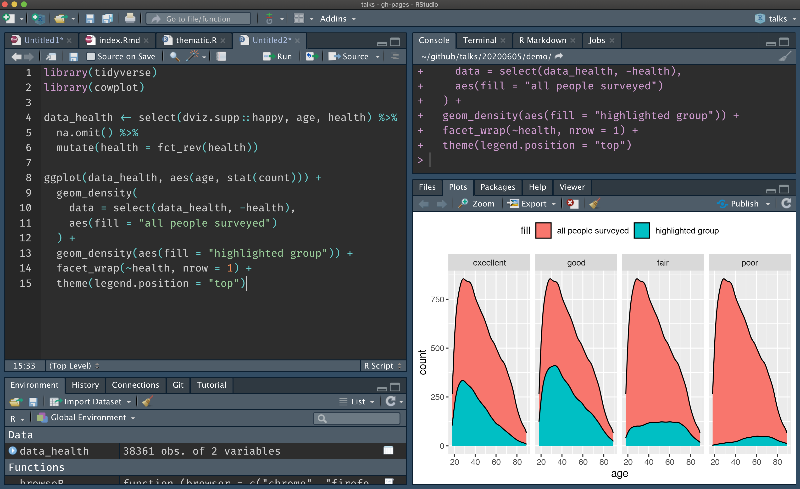

class: middle, center

# Reproducible Shiny Apps with Shinymeta

### Carson Sievert

### Slides: https://bit.ly/sdss2020

`r icon::fa_twitter()` [@cpsievert](https://twitter.com/cpsievert)

`r icon::fa_github()` [@cpsievert](https://github.com/cpsievert)

`r icon::fa_globe()` [cpsievert.me](https://cpsievert.me) 

`r icon::fa_envelope()` <cpsievert1@gmail.com> 


.footnote[
Slides released under <a href='https://github.com/cpsievert/talks/blob/gh-pages/LICENSE'>Creative Commons</a>
]

---
class: middle, center

# ~~Reproducible Shiny Apps with Shinymeta~~

#### [Here's my rstudio::conf talk on shinymeta](https://rstudio.com/speakers/carson-sievert/); instead, I'd like to present

# thematic: plot theming made easieR


```{r setup, echo = FALSE, message = FALSE}
library(thematic)
library(ggplot2)
library(lattice)
library(flair)
knitr::opts_chunk$set(
  message = FALSE,
  comment = "#>",
  collapse = TRUE,
  fig.align = "center",
  out.width = "100%",
  fig.asp = 1,
  #cache = TRUE,
  #fig.retina = 2,
  dev = "svg"
)
include_vimeo <- function(id, width = "100%", height = "450") {
  url <- sprintf("https://player.vimeo.com/video/%s?title=0&byline=0&portrait=0", id)
  htmltools::tags$iframe(
    src = url,
    width = width,
    height = height,
    frameborder = "0",
    seamless = "seamless",
    webkitAllowFullScreen = NA,
    mozallowfullscreen = NA,
    allowFullScreen = NA
  )
}
auto_config_set(auto_config(
  bg = "#002B36", fg = "#FDF6E3", 
  accent = "#2AA198", 
  # 2 is better for non-ragg
  font = font_spec("Roboto Condensed", 2)
))
```

```{scss, echo = FALSE}
@import url(https://fonts.googleapis.com/css?family=Pacifico);
body {
  font-family: Roboto Condensed;
}
h1, h2, h3 {
  font-family: Roboto Condensed;
}
.remark-slide-content {
  background-color: #002B36;
  color: #FDF6E3;
  a {
    color: #2AA198;
  }
  &.darkly {
    background-color: #222;
    color: #FFF;
    a {
      color: #0CE3AC;
    }
  }
  &.dark-mode {
    background-color:  #444;
    color: #e4e4e4;
    a {
      color: #e39777;
    }
  }
  
  &.lucid {
    background-color: #3D4752;
    color: #FFFFFF;
  }
  
  &.large {
    font-size: 1.5rem
  }
  
  &.contrast {
    background-color: #FFFFFF;
    color: black;
  }
}
```

---
## [**thematic**](https://github.com/rstudio/thematic): simplified theming for **ggplot2**, **lattice**, and **base** R graphics


Not yet on CRAN, but install it now with:

```r
remotes::install_github("rstudio/thematic")
library(thematic)
```

For auto-theming in **shiny**, you'll currently need:

```r
remotes::install_github("rstudio/shiny")
```

For auto-theming in **rmarkdown**, you'll currently need:

```r
remotes::install_github("rstudio/rmarkdown#1706")
```

#### Learn more <https://rstudio.github.io/thematic/>

---
class: contrast

### R graphics can be made interactive w/ **shiny** (and/or **plotly**)!

<div align="center">
  
</div>

#### <https://shiny.rstudio.com/gallery/isee.html>

---
class: contrast

### Another example 

<div align="center">
  
</div>

#### <https://github.com/rpodcast/ames_explorer>

---
class: contrast

### A big problem: R plots are unaware of CSS


---
class: contrast

### ...but they can be with thematic's auto-theming!

<div align="center">
  
</div>

---
class: contrast

### Another problem: R plots are unaware of RStudio themes

<div align="center">
  
</div>

---
class: contrast

### ...but they can be with thematic's auto-theming!

<div align="center">
  
</div>

---
class: middle, center

## RStudio Cloud Demo

Visit the demo at <https://bit.ly/thematic-cloud>

<div>
  <a href="https://rstudio.cloud/project/1208127" target="_blank">
    
  </a>
</div>


---
class: large, contrast, middle

## When should I use auto-theming?

* Best used in a **shiny** runtime.
  * Works regardless of _how_ you style the page.

* Some other scenarios where it can work:
    * In RStudio's plot viewer pane
    * In `rmarkdown::html_document()`
        * Use **bslib**, not inline CSS, to style the page
    * Auto value "defaults" are provided via `auto_config_set()`
        * Useful for custom non-HTML output formats

* When auto-theming "fails", it defaults to the usual white background + black foreground.
  
* Auto-theming is optional, avoid it entirely by providing colors (and/or fonts) directly in `thematic_on()`.

---
## [**thematic**](https://github.com/rstudio/thematic): simplified theming of R plots

The main color settings are `bg`, `fg`, `accent` (they default to `"auto"`).

.pull-left[
```{r intro, eval = FALSE, echo = FALSE}
thematic_on(
  bg = "#002B36", 
  fg = "#FDF6E3", 
  accent = "#2AA198"
)
library(ggplot2)
ggplot(mtcars, aes(wt, mpg)) + 
  geom_point() + 
  geom_smooth() 
```

```{r, echo = FALSE}
decorate("intro", eval = FALSE) %>%
  flair('"#002B36"', background = "#002B36", color = "white") %>%
  flair('"#2AA198"', background = "#2AA198", color = "white")
```

]

.pull-right[
```{r, echo = FALSE, fig.asp = 0.9}
thematic_on(font = "auto")
ggplot(mtcars, aes(wt, mpg)) + 
  geom_point(size = 4) + 
  geom_smooth(size = 2.5) +
  theme(legend.position = "top")
```
]

(BTW, the values here intentionally match the CSS of my slides)


---
## [**thematic**](https://github.com/rstudio/thematic): simplified theming of R plots

Also specify any `font` known to R or any [Google Font](https://fonts.google.com/)<sup>1</sup> (e.g., <span style="font-family:Pacifico">Pacifico</span>)

.pull-left[
```{r fonts, eval = FALSE, echo = FALSE}
thematic_on(
  bg = "#002B36", 
  fg = "#FDF6E3", 
  accent = "#2AA198",
  font = "Pacifico"
)
library(ggplot2)
ggplot(mtcars, aes(wt, mpg)) + 
  geom_point() + 
  geom_smooth() 
```

```{r, echo = FALSE}
decorate("fonts", eval = FALSE) %>%
  flair('"#002B36"', background = "#002B36", color = "white") %>%
  flair('"#2AA198"', background = "#2AA198", color = "white") %>%
  flair("Pacifico")
```

]

.pull-right[
```{r, echo = FALSE, fig.asp = 0.8}
thematic_on(font = font_spec("Pacifico", 2))
last_plot()
```
]

.footnote[
1. Requires **showtext** or **ragg** to be installed, and potential other "setup" (for details, see <https://rstudio.github.io/thematic>)
]


---
## [**thematic**](https://github.com/rstudio/thematic): simplified theming of R plots

Use `font_spec()` to control other font settings (e.g., `scale`)

.pull-left[
```{r fonts-scale, eval = FALSE, echo = FALSE}
thematic_on(
  bg = "#002B36", 
  fg = "#FDF6E3", 
  accent = "#2AA198",
  font=font_spec("Pacifico", scale=2)
)
library(ggplot2)
ggplot(mtcars, aes(wt, mpg)) + 
  geom_point() + 
  geom_smooth() 
```

```{r, echo = FALSE}
decorate("fonts-scale", eval = FALSE) %>%
  flair('"#002B36"', background = "#002B36", color = "white") %>%
  flair('"#2AA198"', background = "#2AA198", color = "white") %>%
  flair("scale=2")
```

]

.pull-right[
```{r, echo = FALSE, fig.asp = 0.8}
thematic_on(font = font_spec("Pacifico", 3))
last_plot()
```
]

.footnote[
1. Requires **showtext** or **ragg** to be installed, and potential other "setup" (for details, see <https://rstudio.github.io/thematic>)
]


---
## [**thematic**](https://github.com/rstudio/thematic): simplified theming of R plots

**thematic** informs `theme()` _defaults_ (i.e., plot specific code takes priority)

.pull-left[
```{r theme, eval = FALSE, echo = FALSE}
thematic_on(
  bg = "#002B36", 
  fg = "#FDF6E3", 
  accent = "#2AA198",
  font = "Pacifico"
)
library(ggplot2)
ggplot(mtcars, aes(wt, mpg)) + 
  geom_point() + 
  geom_smooth() + 
  theme(axis.title = element_text(color = "#6C71C4"))
```

```{r, echo = FALSE}
decorate("theme", eval = FALSE) %>%
  flair('"#002B36"', background = "#002B36", color = "white") %>%
  flair('"#2AA198"', background = "#2AA198", color = "white") %>%
  flair('"#6C71C4"', background = "#6C71C4", color = "white")
```

]

.pull-right[
```{r, echo = FALSE, fig.asp = 0.8}
thematic_on(font = font_spec("Pacifico", 2))
ggplot(mtcars, aes(wt, mpg)) + 
  geom_point(size = 4) + 
  geom_smooth(size = 2.5) +
  theme(axis.title = element_text(color = "#6C71C4"))
```
]


---
## [**thematic**](https://github.com/rstudio/thematic): simplified theming of R plots

**thematic** informs `theme()` _and geom_ defaults

.pull-left[
```{r geom, eval = FALSE, echo = FALSE}
thematic_on(
  bg = "#002B36", 
  fg = "#FDF6E3", 
  accent = "#D33682",
  font = "Pacifico"
)
library(ggplot2)
ggplot(mtcars, aes(wt, mpg)) + 
  geom_point(color = "#586E75") + 
  geom_smooth() + 
  theme(axis.title = element_text(color = "#6C71C4"))
```

```{r, echo = FALSE}
decorate("geom", eval = FALSE) %>%
  flair('"#002B36"', background = "#002B36", color = "white") %>%
  flair('"#D33682"', background = "#D33682", color = "white") %>%
  flair('"#586E75"', background = "#586E75", color = "white") %>%
  flair('"#6C71C4"', background = "#6C71C4", color = "white")
```

]

.pull-right[
```{r, echo = FALSE, fig.asp = 0.8}
thematic_on(accent = "#D33682", font = font_spec("Pacifico", 2))
ggplot(mtcars, aes(wt, mpg)) + 
  geom_point(color = "#586E75", size = 4) + 
  geom_smooth(size = 2.5) +
  theme(axis.title = element_text(color = "#6C71C4"))
```
]

---
## [**thematic**](https://github.com/rstudio/thematic): simplified theming of R plots

Uses `bg`, `fg`, `accent` to construct a new default for sequential colorscales.

.pull-left[

```{r seq, eval = FALSE, echo = FALSE}
thematic_on(
  bg = "#002B36", 
  fg = "#FDF6E3", 
  accent = "#2AA198",
  font = "Roboto Condensed"
)
library(ggplot2)
ggplot(mtcars, aes(wt, mpg)) +
  geom_point(aes(color = cyl))
```

```{r, echo = FALSE}
decorate("seq", eval = FALSE) %>%
  flair('"#002B36"', background = "#002B36", color = "white") %>%
  flair('"#2AA198"', background = "#2AA198", color = "white") %>%
  flair("color = cyl") 
```

]

.pull-right[
```{r, echo = FALSE}
thematic_on(font = "auto")
ggplot(mtcars, aes(wt, mpg)) + 
  geom_point(aes(color = cyl), size = 4) +
  theme(legend.position = "top")
```
]

---
## [**thematic**](https://github.com/rstudio/thematic): simplified theming of R plots

Customize with `sequential_gradient()` (here is `fg` -> `accent`)

.pull-left[
```{r seq3, eval = FALSE, echo = FALSE}
thematic_on(
  bg = "#002B36", 
  fg = "#FDF6E3", 
  accent = "#2AA198",
  font = "Roboto Condensed",
  sequential=sequential_gradient(1,0)
)
library(ggplot2)
ggplot(mtcars, aes(wt, mpg)) +
  geom_point(aes(color = cyl))
```

```{r, echo = FALSE}
decorate("seq3", eval = FALSE) %>%
  flair('"#002B36"', background = "#002B36", color = "white") %>%
  flair('"#2AA198"', background = "#2AA198", color = "white") %>%
  flair("color = cyl") %>%
  flair_rx("sequential.*")
```
]

.pull-right[
```{r, echo = FALSE}
thematic_on(font = "auto", sequential = sequential_gradient(1, 0))
last_plot()
```
]

.footnote[
For more examples, see the [customization article](http://rstudio.github.io/thematic/articles/customize.html).
]

---
## [**thematic**](https://github.com/rstudio/thematic): simplified theming of R plots

Opt-out with `NA`.

.pull-left[
```{r seq2, eval = FALSE, echo = FALSE}
thematic_on(
  bg = "#002B36", 
  fg = "#FDF6E3", 
  accent = "#2AA198",
  font = "Roboto Condensed",
  sequential = NA
)
library(ggplot2)
ggplot(mtcars, aes(wt, mpg)) +
  geom_point(aes(color = cyl))
```

```{r, echo = FALSE}
decorate("seq2", eval = FALSE) %>%
  flair('"#002B36"', background = "#002B36", color = "white") %>%
  flair('"#2AA198"', background = "#2AA198", color = "white") %>%
  flair_rx("sequential.*")
```

]

.pull-right[
```{r, echo = FALSE}
thematic_on(font = "auto", sequential = NA)
last_plot()
```
]


---
## [**thematic**](https://github.com/rstudio/thematic): simplified theming of R plots

Also sets qualitative colorscale defaults to [Okabe-Ito](https://jfly.uni-koeln.de/color/) (colour-blind safe)

.pull-left[
```{r qual, eval = FALSE, echo = FALSE}
thematic_on(
  bg = "#002B36", 
  fg = "#FDF6E3", 
  accent = "#2AA198",
  font = "Roboto Condensed"
)
library(ggplot2)
ggplot(mtcars, aes(wt, mpg)) +
  geom_point(aes(color=factor(cyl)))
```

```{r, echo = FALSE}
decorate("qual", eval = FALSE) %>%
  flair('"#002B36"', background = "#002B36", color = "white") %>%
  flair('"#2AA198"', background = "#2AA198", color = "white") %>%
  flair("color=factor(cyl)")
```
]

.pull-right[
```{r, echo = FALSE}
thematic_on(font = "auto")
ggplot(mtcars, aes(wt, mpg)) + 
  geom_point(aes(color = factor(cyl)), size = 4) +
  theme(legend.position = "top")
```
]

---
## [**thematic**](https://github.com/rstudio/thematic): simplified theming of R plots

Customize with any vector of color codes

.pull-left[
```{r qual-custom, eval = FALSE, echo = FALSE}
thematic_on(
  bg = "#002B36", 
  fg = "#FDF6E3", 
  accent = "#2AA198",
  font = "Roboto Condensed",
  qualitative = c(
    "#1B9E77", "#D95F02", "#7570B3"
  )
)
library(ggplot2)
ggplot(mtcars, aes(wt, mpg)) +
  geom_point(aes(color=factor(cyl)))
```

```{r, echo = FALSE}
decorate("qual-custom", eval = FALSE) %>%
  flair('"#002B36"', background = "#002B36", color = "white") %>%
  flair('"#2AA198"', background = "#2AA198", color = "white") %>%
  flair('"#1B9E77"', background = "#1B9E77", color = "white") %>%
  flair('"#D95F02"', background = "#D95F02", color = "white") %>%
  flair('"#7570B3"', background = "#7570B3", color = "white") %>%
  flair("color=factor(cyl)")
```

For **ggplot2**, `qualitative` is only relevant if there are enough colors to encode the levels.
]

.pull-right[
```{r, echo = FALSE}
thematic_on(font = "auto", qualitative = RColorBrewer::brewer.pal(8, "Dark2"))
last_plot()
```
]

---
## [**thematic**](https://github.com/rstudio/thematic): simplified theming of R plots

Opt-out with `NA`

.pull-left[
```{r qual-na, eval = FALSE, echo = FALSE}
thematic_on(
  bg = "#002B36", 
  fg = "#FDF6E3", 
  accent = "#2AA198",
  font = "Roboto Condensed",
  qualitative = NA
)
library(ggplot2)
ggplot(mtcars, aes(wt, mpg)) +
  geom_point(aes(color=factor(cyl)))
```

```{r, echo = FALSE}
decorate("qual-na", eval = FALSE) %>%
  flair('"#002B36"', background = "#002B36", color = "white") %>%
  flair('"#2AA198"', background = "#2AA198", color = "white") %>%
  flair_rx("qualitative.*") %>%
  flair("color=factor(cyl)")
```
]

.pull-right[
```{r, echo = FALSE}
thematic_on(font = "auto", qualitative = NA)
last_plot()
```
]


---
## [**thematic**](https://github.com/rstudio/thematic): simplified theming of R plots

[**thematic**](https://github.com/rstudio/thematic) works with **ggplot2** (and extensions)

.pull-left[
```{r ggrepel, eval = FALSE, echo = FALSE}
thematic_on(
  bg = "#002B36", 
  fg = "#FDF6E3", 
  accent = "#2AA198",
  font = "Roboto Condensed"
)
library(ggplot2)
ggplot(mtcars, aes(wt, mpg)) +
  ggrepel::geom_text_repel(
    aes(color = factor(cyl), label = row.names(mtcars))
  )
```

```{r, echo = FALSE}
decorate("ggrepel", eval = FALSE) %>%
  flair('"#002B36"', background = "#002B36", color = "white") %>%
  flair('"#2AA198"', background = "#2AA198", color = "white") %>%
  flair("ggrepel::geom_text_repel")
```
]

.pull-right[
```{r, echo = FALSE, fig.asp=1}
thematic_on(font = "auto")
ggplot(mtcars, aes(wt, mpg)) + 
  ggrepel::geom_text_repel(
    aes(color = factor(cyl), label = row.names(mtcars))
  ) +
  theme(legend.position = "top")
```
]

---
## [**thematic**](https://github.com/rstudio/thematic): simplified theming of R plots

Also **lattice** graphics:

```{r lattice, eval = FALSE, echo = FALSE}
lattice::show.settings()
```

```{r, echo = FALSE}
decorate("lattice", eval = FALSE) %>%
  flair("lattice")
```

```{r, echo = FALSE, fig.asp=0.618, out.width="80%"}
thematic_on(font = font_spec("auto", 1))
lattice::show.settings()
```


---
## [**thematic**](https://github.com/rstudio/thematic): simplified theming of R plots

Also **base** graphics:

```{r base, eval = FALSE}
par(mfrow = c(1, 2))
hist(rnorm(100))
plot(rep(1:5, each = 5), rep(1:5, 5), col = 1:25, pch = 1:25)
```

```{r, echo = FALSE, fig.asp=0.55, out.width="80%"}
thematic_on(font = font_spec("auto", 1))
par(mfrow = c(1, 2))
hist(rnorm(100))
plot(rep(1:5, each = 5), rep(1:5, 5), col = 1:25, pch = 1:25, cex = 1.5)
```

---
## [**thematic**](https://github.com/rstudio/thematic): simplified theming of R plots

...but, for accents, you'll have to inform `col`

```{r base2, eval = FALSE, echo = FALSE}
plot(cars, main = "Stopping Distance versus Speed")
lines(stats::lowess(cars), col = thematic_get_option("accent"))
```

```{r, echo = FALSE}
decorate("base2", eval = FALSE) %>%
  flair('col = thematic_get_option("accent")')
```

```{r, echo = FALSE, fig.asp=0.55, out.width="80%"}
thematic_on(font = font_spec("auto", 1.25))
plot(cars, main = "Stopping Distance versus Speed")
lines(stats::lowess(cars), col = thematic_get_option("accent"), lwd = 3)
```

---
## [**thematic**](https://github.com/rstudio/thematic): simplified theming of R plots

...and same for sequential colorscales

```{r base3, eval = FALSE, echo = FALSE}
par(mfrow = c(1, 2))
image(volcano)
image(volcano, col = thematic_get_option("sequential"))
```

```{r, echo = FALSE}
decorate("base3", eval = FALSE) %>%
  flair('col = thematic_get_option("sequential")')
```

```{r, echo = FALSE, fig.asp=0.55, out.width="80%"}
thematic_on(font = font_spec("auto", 1.25))
par(mfrow = c(1, 2))
image(volcano)
image(volcano, col = thematic_get_option("sequential"))
```

---
class: contrast

## Future work for thematic

* Get **thematic** to play nicely with "complete" **ggplot2** themes (e.g., `theme_minimal()`, `ggthemes::theme_tufte()`, `ggthemes::theme_fivethirtyeight()`, etc).

* Get `plotly::ggplotly()` (and maybe `plotly::plot_ly()`) playing nicely with **thematic**.

* Documentation improvements

* Submit to CRAN

---
class: large

### Summary

* `thematic_on()` (and `thematic_off()`) to use **thematic** in a global fashion

* `thematic_shiny()`/`thematic_rmd()` to use globally for a particular **shiny** app or **rmarkdown** document

* Check out `thematic_with_theme()` to use **thematic** in a local fashion

* By default, `"auto"` colors are enabled...this generally works when:
  * A **shiny** runtime is generating the plots
  * Inside `rmarkdown::html_document()` (custom styling should to be done via **bslib**, not inline CSS)
  * Inside RStudio
  
* Use `thematic_on(font = "auto")` to enable auto fonts...this generally works if it resolves to a Google Font (or font known to R)
  
* If auto-theming "fails", provide non-auto values directly to `thematic_on()` and/or `auto_config_set()`

---
class: center, middle

## Thank you! Any questions?

### Slides: <https://bit.ly/sdss2020>

### Learn more: <https://rstudio.github.io/thematic>

#### Contact

`r icon::fa_twitter()` <a href='https://twitter.com/cpsievert'>@cpsievert</a> <br />
`r icon::fa_github()` <a href='https://github.com/cpsievert'>@cpsievert</a> <br />
`r icon::fa_envelope()` <cpsievert1@gmail.com> <br />
`r icon::fa_globe()` <https://cpsievert.me/>


.footnote[
Slides made possible thanks to [**xaringan**](https://github.com/yihui/xaringan) and [**flair**](https://github.com/kbodwin/flair)
]

