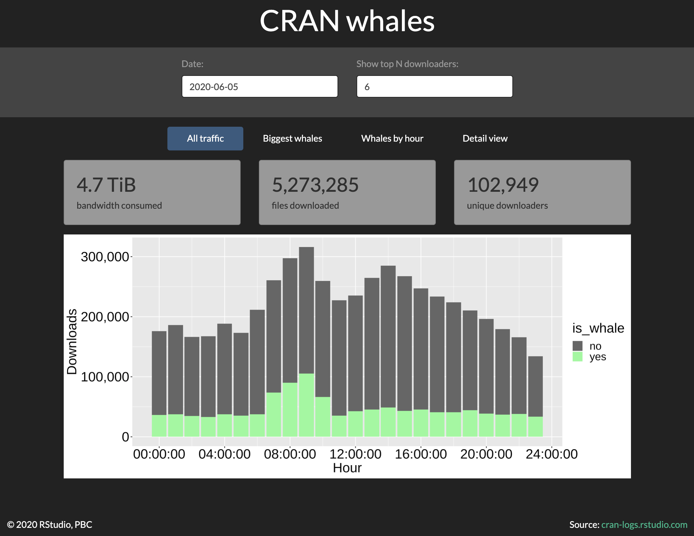
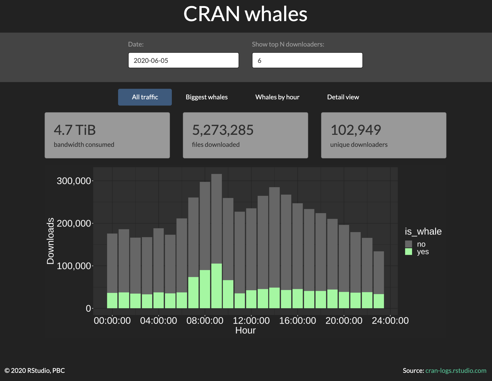
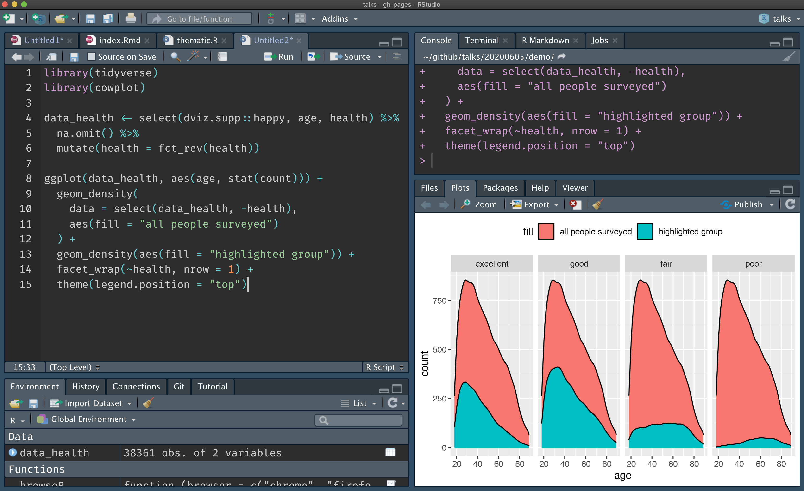
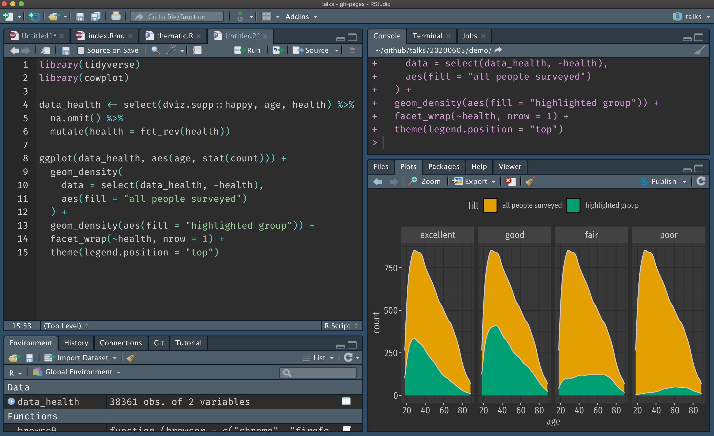

class: middle, center

# thematic: plot theming made easieR

### Carson Sievert

### Slides: https://bit.ly/thematic-show-tell

### Website: <https://rstudio.github.io/thematic/>


```{r setup, echo = FALSE, message = FALSE}
library(thematic)
library(ggplot2)
library(lattice)
library(flair)
knitr::opts_chunk$set(
  message = FALSE,
  comment = "#>",
  collapse = TRUE,
  fig.align = "center",
  out.width = "100%",
  fig.asp = 1,
  #cache = TRUE,
  #fig.retina = 2,
  dev = "svg"
)
include_vimeo <- function(id, width = "100%", height = "450") {
  url <- sprintf("https://player.vimeo.com/video/%s?title=0&byline=0&portrait=0", id)
  htmltools::tags$iframe(
    src = url,
    width = width,
    height = height,
    frameborder = "0",
    seamless = "seamless",
    webkitAllowFullScreen = NA,
    mozallowfullscreen = NA,
    allowFullScreen = NA
  )
}
auto_config_set(auto_config(
  bg = "#002B36", fg = "#FDF6E3", 
  accent = "#2AA198", 
  # 2 is better for non-ragg
  font = font_spec("Roboto Condensed", 2)
))
```

```{scss, echo = FALSE}
@import url(https://fonts.googleapis.com/css?family=Pacifico);
body {
  font-family: Roboto Condensed;
}
h1, h2, h3 {
  font-family: Roboto Condensed;
}
.remark-slide-content {
  background-color: #002B36;
  color: #FDF6E3;
  a {
    color: #2AA198;
  }
  &.darkly {
    background-color: #222;
    color: #FFF;
    a {
      color: #0CE3AC;
    }
  }
  &.dark-mode {
    background-color:  #444;
    color: #e4e4e4;
    a {
      color: #e39777;
    }
  }
  
  &.lucid {
    background-color: #3D4752;
    color: #FFFFFF;
  }
  
  &.large {
    font-size: 1.5rem
  }
  
  &.contrast {
    background-color: #FFFFFF;
    color: black;
  }
}
```

---
## [**thematic**](https://github.com/rstudio/thematic): simplified theming for **ggplot2**, **lattice**, and **base** R graphics


Not yet on CRAN, but install it now with:

```r
remotes::install_github("rstudio/thematic")
library(thematic)
```

For auto-theming in **shiny**, you'll currently need:

```r
remotes::install_github("rstudio/shiny")
```

For auto-theming in **rmarkdown**, you'll currently need:

```r
remotes::install_github("rstudio/rmarkdown#1706")
```


---
class: contrast

### Problem: R plots know nothing about CSS


---
class: contrast

### `shinythemes::shinytheme("darkly")` ... 😞

<div align="right">
  
</div>

---
class: contrast

### Solution: `thematic::thematic_on()`

<div align="right">
  
</div>


---
class: contrast

### Solution: `thematic::thematic_on()` ...🎉

<div align="right">
  
</div>

---
class: contrast

### Works with _any_ HTML/CSS

<div align="right">
  
</div>

---
class: contrast

### Write custom CSS in R with **bootstraplib**!

<div align="center">
  
</div>

---
class: contrast

### Realtime-theming with **bootstraplib**

<div align="center">
  
</div>

---
class: contrast

### Can even work w/ `html_document()` (independent of **shiny**)


---
class: contrast

### What about non-HTML documents?

<div align="center">
  
</div>

---
class: contrast

### Provide colors & fonts to `thematic_on()`

<div align="center">
  
</div>

---
class: contrast

### Can also work with complete ggplot2 themes!

<div align="center">
  
</div>

---
class: contrast

### Problem: R plots know nothing about RStudio themes ...😞

<div align="center">
  
</div>

---
class: contrast

### Solution: `thematic::thematic_on()`

<div align="center">
  
</div>

---
class: contrast

### Solution: `thematic::thematic_on()` ...🎉

<div align="center">
  
</div>

---
class: large

### Summary

* Call `thematic_on()` to make your R plots CSS/theme aware in **shiny**, **rmarkdown**, and RStudio! 🎉 

* If auto-theming doesn't work for you, provide colors & fonts to `thematic_on()`
  * Any [Google Font](https://fonts.google.com/) works "out-of-the-box" (no install needed)

---
class: center, middle

## Thank you!

### Slides: <https://bit.ly/thematic-show-tell>

### Learn more: <https://rstudio.github.io/thematic>

#### Contact

`r icon::fa_twitter()` <a href='https://twitter.com/cpsievert'>@cpsievert</a> <br />
`r icon::fa_github()` <a href='https://github.com/cpsievert'>@cpsievert</a> <br />
`r icon::fa_globe()` <https://cpsievert.me/>

