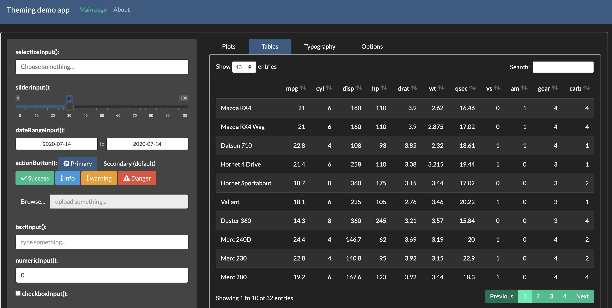

class: middle, center

# Styling Shiny & R Markdown with bootstraplib & thematic

### Carson Sievert, Software Engineer @ RStudio

### Slides: https://bit.ly/noRth2020

`r icon::fa_twitter()` [@cpsievert](https://twitter.com/cpsievert)

`r icon::fa_github()` [@cpsievert](https://github.com/cpsievert)

`r icon::fa_globe()` [cpsievert.me](https://cpsievert.me) 

`r icon::fa_envelope()` <cpsievert1@gmail.com> 


```{r setup, echo = FALSE, message = FALSE}
library(thematic)
library(ggplot2)
library(lattice)
library(flair)
knitr::opts_chunk$set(
  message = FALSE,
  comment = "#>",
  collapse = TRUE,
  fig.align = "center",
  out.width = "100%",
  fig.asp = 1,
  #cache = TRUE,
  #fig.retina = 2,
  dev = "svg"
)
include_vimeo <- function(id, width = "100%", height = "450") {
  url <- sprintf("https://player.vimeo.com/video/%s?title=0&byline=0&portrait=0", id)
  htmltools::tags$iframe(
    src = url,
    width = width,
    height = height,
    frameborder = "0",
    seamless = "seamless",
    webkitAllowFullScreen = NA,
    mozallowfullscreen = NA,
    allowFullScreen = NA
  )
}
xaringanExtra::use_panelset()
xaringanExtra::style_panelset(
  panel_tab_font_family = "Fira Code, Menlo, Consolas, Monaco, Liberation Mono, Lucida Console, monospace"
)
auto_config_set(auto_config(
  bg = "#002B36", fg = "#FDF6E3", 
  accent = "#2AA198", 
  # 2 is better for non-ragg
  font = font_spec("Roboto Condensed", 2)
))
```

```{scss, echo = FALSE}
@import url(https://fonts.googleapis.com/css?family=IBM+Plex+Sans);
body {
  font-family: IBM Plex Sans;
}
h1, h2, h3 {
  font-family: IBM Plex Sans;
}
.remark-slide-content {
  background-color: #002B36;
  color: #FDF6E3;
  a {
    color: #2AA198;
  }
  &.darkly {
    background-color: #222;
    color: #FFF;
    a {
      color: #0CE3AC;
    }
  }
  &.dark-mode {
    background-color:  #444;
    color: #e4e4e4;
    a {
      color: #e39777;
    }
  }
  
  &.lucid {
    background-color: #3D4752;
    color: #FFFFFF;
  }
  
  &.large {
    font-size: 1.5rem
  }
  
  &.contrast {
    background-color: #FFFFFF;
    color: black;
    a {
      color: #74AADB;
    }
  }
}
```

---
class: contrast, large

## New tools for styling Shiny & R Markdown

__bootstraplib__: tools for styling HTML from R (e.g., Shiny apps, `rmarkdown::html_document()`, etc)

```r
remotes::install_github("rstudio/bootstraplib")
```

__thematic__: simplified theming of R plots (e.g., **ggplot2**, **lattice**, **base**)

```r
remotes::install_github("rstudio/thematic")
```

.footnote[
Documentation:

<https://rstudio.github.io/bootstraplib> <br/>
<https://rstudio.github.io/thematic>
]

---
class: contrast

## Running code examples

#### <span style="color:red">WARNING: much of this is a work-in-progress and may change!</span>

On RStudio Cloud (<https://bit.ly/thematic-cloud>)

<div>
  <a href="https://rstudio.cloud/project/1208127" target="_blank">
    
  </a>
</div>


Or, locally 

```r
library(remotes)
install_github("rstudio/shiny@demo/bootstraplib")
install_github("rstudio/rmarkdown#1706")
install_github("rstudio/DT@sass")
install_github("ropensci/plotly")
install.packages(c('shinythemes', 'ggplot2', 'lattice'))
```

---
class: large

## Approaches to styling Shiny & R Markdown

1. __I'm just happy it works__ (accept the defaults)
2. __I want a different 'pre-packaged' look__ (**shinythemes**)
3. __I want specific fonts/colors/styles__ (custom CSS)


---
class: large

## Approaches to styling Shiny & R Markdown

1. [__I'm just happy it works__ (accept the defaults)](#6)
2. __I want a different 'pre-packaged' look__ (**shinythemes**)
3. __I want specific fonts/colors/styles__ (custom CSS)

---
class: contrast

### Example app with default styling

.panelset[

.panel[.panel-name[Code]
```r
library(shiny)
ui <- navbarPage("Theming demo app", ...)
```

Imagine the `...` has a bunch of shiny UI (e.g., `selectInput()`, `sliderInput()`, `wellPanel()`, etc)
]

.panel[.panel-name[Result]


]

]


---
class: large

## Approaches to styling Shiny & R Markdown

1. __I'm just happy it works__ (accept the defaults)
2. [__I want a different 'pre-packaged' look__ (**shinythemes**)](#8)
3. __I want specific fonts/colors/styles__ (custom CSS)

---
class: contrast

### Flatly theme

.panelset[

.panel[.panel-name[Code]
```{r flatly, eval = FALSE, echo = FALSE}
library(shiny)
ui <- navbarPage(
  "Theming demo app", ..., 
  theme = shinythemes::shinytheme("flatly")
)
```

```{r, echo = FALSE}
decorate("flatly", eval = FALSE) %>%
  flair('shinythemes::shinytheme("flatly")')
```
]

.panel[.panel-name[Result]


]
]

---
class: contrast

### Darkly theme

.panelset[

.panel[.panel-name[Code]
```{r darkly, eval = FALSE, echo = FALSE}
library(shiny)
ui <- navbarPage(
  "Theming demo app", ..., 
  theme = shinythemes::shinytheme("darkly")
)
```

```{r, echo = FALSE}
decorate("darkly", eval = FALSE) %>%
  flair('shinythemes::shinytheme("darkly")')
```

]

.panel[.panel-name[Result]



]
]

---
class: contrast

### Superhero theme

.panelset[

.panel[.panel-name[Code]
```{r superhero, eval = FALSE, echo = FALSE}
library(shiny)
ui <- navbarPage(
  "Theming demo app", ..., 
  theme = shinythemes::shinytheme("superhero")
)
```

```{r, echo = FALSE}
decorate("superhero", eval = FALSE) %>%
  flair('shinythemes::shinytheme("superhero")')
```

]

.panel[.panel-name[Result]


]

]

---
class: large

## Approaches to styling Shiny & R Markdown

1. __I'm just happy it works__ (accept the defaults)
2. __I want a different 'pre-packaged' look__ (**shinythemes**)
3. [__I want specific fonts/colors/styles__  (custom CSS)](#12)
  * Writing custom CSS to override styles is tedious and error prone!
  
.footnote[
See also Joe Cheng's [recent rstudio::conf talk](https://rstudio.com/resources/rstudioconf-2020/styling-shiny-apps-with-sass-and-bootstrap-4/)
]


---
class: large

## Approaches to styling Shiny & R Markdown

1. __I'm just happy it works__ (accept the defaults)
2. __I want a different 'pre-packaged' look__ (**shinythemes**)
3. [__I want specific fonts/colors/styles__  (custom CSS)](#12)
  * Writing custom CSS to override styles is tedious and error prone!
  * Instead, use __bootstraplib__ to customize Bootstrap CSS using simple R functions.

.footnote[
See also Joe Cheng's [recent rstudio::conf talk](https://rstudio.com/resources/rstudioconf-2020/styling-shiny-apps-with-sass-and-bootstrap-4/)
]


---
class: contrast

### To use bootstraplib with shiny, do:

.panelset[

.panel[.panel-name[Code]
```{r bootstraplib, eval = FALSE, echo = FALSE}
library(shiny)
library(bootstraplib)
shinyOptions(bootstraplib = TRUE)
bs_theme_new()
ui <- navbarPage("Theming demo app", ...)
```

```{r, echo = FALSE}
decorate("bootstraplib", eval = FALSE) %>%
  flair('library(bootstraplib)') %>%
  flair('shinyOptions(bootstraplib = TRUE)') %>%
  flair('bs_theme_new()') 
```

This'll upgrade Bootstrap (the underlying CSS framework) from 3 to 4
]

.panel[.panel-name[Bootstrap 3]
```{r bootstraplib3, eval = FALSE, echo = FALSE}
library(shiny)
library(bootstraplib)
shinyOptions(bootstraplib = TRUE)
bs_theme_new(version = 3)
ui <- navbarPage("Theming demo app", ...)
```

```{r, echo = FALSE}
decorate("bootstraplib3", eval = FALSE) %>%
  flair('version = 3') 
```

If, for some reason, you still want Bootstrap 3 (shiny's current default)
]

.panel[.panel-name[Result]


]
]


---
class: contrast

### Like shinythemes, can specify a 'pre-packaged' theme

.panelset[

.panel[.panel-name[Code]
```{r solar, eval = FALSE, echo = FALSE}
library(shiny)
library(bootstraplib)
shinyOptions(bootstraplib = TRUE)
bs_theme_new(bootswatch = "solar")
ui <- navbarPage("Theming demo app", ...)
```

```{r, echo = FALSE}
decorate("solar", eval = FALSE) %>%
  flair('bootswatch = "solar"') 
```

Meaning you can use a Bootstrap 4 only theme (e.g., solar, [sketchy](https://bootswatch.com/sketchy), [minty](https://bootswatch.com/minty), etc)

]

.panel[.panel-name[Result]


]


]


---
class: contrast

### Customize the main colors

.panelset[

.panel[.panel-name[Code]
```{r custom, eval = FALSE, echo = FALSE}
library(shiny)
library(bootstraplib)
shinyOptions(bootstraplib = TRUE)
bs_theme_new()
bs_theme_base_colors(bg = "#002B36", fg = "#EEE8D5")
bs_theme_accent_colors(primary = "#2AA198")
ui <- navbarPage("Theming demo app", ...)
```

```{r, echo = FALSE}
decorate("custom", eval = FALSE) %>%
  flair('bs_theme_base_colors') %>%
  flair('bs_theme_accent_colors') %>%
  flair('"#002B36"', background = "#002B36", color = "white") %>%
  flair('"#EEE8D5"', background = "#EEE8D5") %>%
  flair('"#2AA198"', background = "#2AA198", color = "white")
```

]

.panel[.panel-name[Result]


]


]


---
class: contrast

### Customize the fonts

.panelset[

.panel[.panel-name[Code]
```{r custom-fonts, eval = FALSE, echo = FALSE}
library(shiny)
library(bootstraplib)
shinyOptions(bootstraplib = TRUE)
bs_theme_new()
bs_theme_base_colors(bg = "#002B36", fg = "#EEE8D5")
bs_theme_accent_colors(primary = "#2AA198")
bs_theme_fonts("Fira Code")
ui <- navbarPage(
  "Theming demo app", ...,
  tags$link(href = "https://fonts.googleapis.com/css?family=Fira+Code", rel = "stylesheet")
)
```

```{r, echo = FALSE}
decorate("custom-fonts", eval = FALSE) %>%
  flair_rx('bs_theme_fonts.*') %>%
  flair_rx('.*googleapis.*')
```

[See here](https://rstudio.github.io/bootstraplib/articles/recipes.html#fonts-1) for more on how to properly import font files

]

.panel[.panel-name[Result]


]
]

---
class: contrast

### 'Core' Shiny input widgets reflect bootstraplib theme

.panelset[

.panel[.panel-name[selectInput()]

<br>
<div align="center">
 
</div>

]

.panel[.panel-name[sliderInput()]

<br>
<div align="center">
 
</div>

]

.panel[.panel-name[dateInput()]

<br>
<div align="center">
 
</div>

]

.panel[.panel-name[textInput()/numericInput()]

<br>
<div align="center">
 
</div>

]

]

---
class: contrast

### Oh no, R plots are unaware of the app's styling 😞

.panelset[

.panel[.panel-name[Result]


]
]


---
class: contrast

### thematic to the rescue! 🎉 

.panelset[

.panel[.panel-name[Result]


]

.panel[.panel-name[Code]
```{r custom-thematic, eval = FALSE, echo = FALSE}
library(shiny)
library(bootstraplib)
shinyOptions(bootstraplib = TRUE)
bs_theme_new()
bs_theme_base_colors(bg = "#002B36", fg = "#EEE8D5")
bs_theme_accent_colors(primary = "#2AA198")
thematic::thematic_shiny()
ui <- navbarPage(
  "Theming demo app", ...,
  tags$link(href = "//fonts.googleapis.com/css?family=Fira+Code", rel = "stylesheet")
)
```

```{r, echo = FALSE}
decorate("custom-thematic", eval = FALSE) %>%
  flair_rx('thematic::thematic.*')
```

* __thematic__'s [auto-theming](https://rstudio.github.io/thematic/articles/auto.html) essentially translates CSS styles into new R defaults. It works:
  * Regardless of _how_ you style the Shiny app
  * With RStudio and R Markdown (although, custom CSS styles must come from **bootstraplib**)
]
]


---
class: contrast

### Auto colors _and fonts_! 🎉 

.panelset[

.panel[.panel-name[Result]


]

.panel[.panel-name[Code]
```{r custom-thematic-fonts, eval = FALSE, echo = FALSE}
library(shiny)
library(bootstraplib)
shinyOptions(bootstraplib = TRUE)
bs_theme_new()
bs_theme_base_colors(bg = "#002B36", fg = "#EEE8D5")
bs_theme_accent_colors(primary = "#2AA198")
bs_theme_fonts("Fira Code")
thematic::thematic_shiny(font = "auto")
ui <- navbarPage(
  "Theming demo app", ...,
  tags$link(href = "//fonts.googleapis.com/css?family=Fira+Code", rel = "stylesheet")
)
```

```{r, echo = FALSE}
decorate("custom-thematic-fonts", eval = FALSE) %>%
  flair_rx('font = "auto"')
```

Works as long as either:

1. R can already render the font.
2. The font is Google Font (and **showtext** is installed)

]
]


---
class: contrast

### Now, with bootstraplib's 'real-time' themer ✨ 

.panelset[

.panel[.panel-name[Result]

<br>
```{r, echo = FALSE}
include_vimeo("411238499")
```

]

.panel[.panel-name[Code]

```{r preview, eval = FALSE, echo = FALSE}
library(shiny)
library(bootstraplib)
shinyOptions(bootstraplib = TRUE)
bs_theme_new()
thematic::thematic_shiny(font = "auto")
bs_theme_preview()
```

```{r, echo = FALSE}
decorate("preview", eval = FALSE) %>%
  flair_rx('bs_theme_preview')
```

* `bs_theme_preview()` gives you a demo app with the real-time themer
* To run any app with the themer, use `run_with_themer()`

]
]

---
class: middle, center

# Demo

---
class: contrast

### 'Auto-theming' in R Markdown's `html_document()`


---
class: contrast

### 'Custom-theming' in other output formats


---
## [**thematic**](https://github.com/rstudio/thematic): simplified theming of R plots

The main color settings are `bg`, `fg`, `accent` (they default to `"auto"`).

.pull-left[
```{r intro, eval = FALSE, echo = FALSE}
thematic_on(
  bg = "#002B36", 
  fg = "#FDF6E3", 
  accent = "#2AA198"
)
library(ggplot2)
ggplot(mtcars, aes(wt, mpg)) + 
  geom_point() + 
  geom_smooth() 
```

```{r, echo = FALSE}
decorate("intro", eval = FALSE) %>%
  flair('"#002B36"', background = "#002B36", color = "white") %>%
  flair('"#2AA198"', background = "#2AA198", color = "white")
```

]

.pull-right[
```{r, echo = FALSE, fig.asp = 0.9}
thematic_on(font = "auto")
ggplot(mtcars, aes(wt, mpg)) + 
  geom_point(size = 4) + 
  geom_smooth(size = 2.5) +
  theme(legend.position = "top")
```
]

(BTW, the values here intentionally match the CSS of my slides)


---
## [**thematic**](https://github.com/rstudio/thematic): simplified theming of R plots

Also specify any `font` known to R or any [Google Font](https://fonts.google.com/)<sup>1</sup> (e.g., <span style="font-family:Pacifico">Pacifico</span>)

.pull-left[
```{r fonts, eval = FALSE, echo = FALSE}
thematic_on(
  bg = "#002B36", 
  fg = "#FDF6E3", 
  accent = "#2AA198",
  font = "Pacifico"
)
library(ggplot2)
ggplot(mtcars, aes(wt, mpg)) + 
  geom_point() + 
  geom_smooth() 
```

```{r, echo = FALSE}
decorate("fonts", eval = FALSE) %>%
  flair('"#002B36"', background = "#002B36", color = "white") %>%
  flair('"#2AA198"', background = "#2AA198", color = "white") %>%
  flair("Pacifico")
```

]

.pull-right[
```{r, echo = FALSE, fig.asp = 0.8}
thematic_on(font = font_spec("Pacifico", 2))
last_plot()
```
]

.footnote[
1. Requires **showtext** or **ragg** to be installed, and potential other "setup" (for details, see <https://rstudio.github.io/thematic>)
]


---
## [**thematic**](https://github.com/rstudio/thematic): simplified theming of R plots

Use `font_spec()` to control other font settings (e.g., `scale`)

.pull-left[
```{r fonts-scale, eval = FALSE, echo = FALSE}
thematic_on(
  bg = "#002B36", 
  fg = "#FDF6E3", 
  accent = "#2AA198",
  font=font_spec("Pacifico", scale=2)
)
library(ggplot2)
ggplot(mtcars, aes(wt, mpg)) + 
  geom_point() + 
  geom_smooth() 
```

```{r, echo = FALSE}
decorate("fonts-scale", eval = FALSE) %>%
  flair('"#002B36"', background = "#002B36", color = "white") %>%
  flair('"#2AA198"', background = "#2AA198", color = "white") %>%
  flair("scale=2")
```

]

.pull-right[
```{r, echo = FALSE, fig.asp = 0.8}
thematic_on(font = font_spec("Pacifico", 3))
last_plot()
```
]

.footnote[
1. Requires **showtext** or **ragg** to be installed, and potential other "setup" (for details, see <https://rstudio.github.io/thematic>)
]


---
## [**thematic**](https://github.com/rstudio/thematic): simplified theming of R plots

**thematic** informs `theme()` _defaults_ (i.e., plot specific code takes priority)

.pull-left[
```{r theme, eval = FALSE, echo = FALSE}
thematic_on(
  bg = "#002B36", 
  fg = "#FDF6E3", 
  accent = "#2AA198",
  font = "Pacifico"
)
library(ggplot2)
ggplot(mtcars, aes(wt, mpg)) + 
  geom_point() + 
  geom_smooth() + 
  theme(axis.title = element_text(color = "#6C71C4"))
```

```{r, echo = FALSE}
decorate("theme", eval = FALSE) %>%
  flair('"#002B36"', background = "#002B36", color = "white") %>%
  flair('"#2AA198"', background = "#2AA198", color = "white") %>%
  flair('"#6C71C4"', background = "#6C71C4", color = "white")
```

]

.pull-right[
```{r, echo = FALSE, fig.asp = 0.8}
thematic_on(font = font_spec("Pacifico", 2))
ggplot(mtcars, aes(wt, mpg)) + 
  geom_point(size = 4) + 
  geom_smooth(size = 2.5) +
  theme(axis.title = element_text(color = "#6C71C4"))
```
]


---
## [**thematic**](https://github.com/rstudio/thematic): simplified theming of R plots

**thematic** informs `theme()` _and geom_ defaults

.pull-left[
```{r geom, eval = FALSE, echo = FALSE}
thematic_on(
  bg = "#002B36", 
  fg = "#FDF6E3", 
  accent = "#D33682",
  font = "Pacifico"
)
library(ggplot2)
ggplot(mtcars, aes(wt, mpg)) + 
  geom_point(color = "#586E75") + 
  geom_smooth() + 
  theme(axis.title = element_text(color = "#6C71C4"))
```

```{r, echo = FALSE}
decorate("geom", eval = FALSE) %>%
  flair('"#002B36"', background = "#002B36", color = "white") %>%
  flair('"#D33682"', background = "#D33682", color = "white") %>%
  flair('"#586E75"', background = "#586E75", color = "white") %>%
  flair('"#6C71C4"', background = "#6C71C4", color = "white")
```

]

.pull-right[
```{r, echo = FALSE, fig.asp = 0.8}
thematic_on(accent = "#D33682", font = font_spec("Pacifico", 2))
ggplot(mtcars, aes(wt, mpg)) + 
  geom_point(color = "#586E75", size = 4) + 
  geom_smooth(size = 2.5) +
  theme(axis.title = element_text(color = "#6C71C4"))
```
]

---
## [**thematic**](https://github.com/rstudio/thematic): simplified theming of R plots

Uses `bg`, `fg`, `accent` to construct a new default for sequential colorscales.

.pull-left[

```{r seq, eval = FALSE, echo = FALSE}
thematic_on(
  bg = "#002B36", 
  fg = "#FDF6E3", 
  accent = "#2AA198",
  font = "Roboto Condensed"
)
library(ggplot2)
ggplot(mtcars, aes(wt, mpg)) +
  geom_point(aes(color = cyl))
```

```{r, echo = FALSE}
decorate("seq", eval = FALSE) %>%
  flair('"#002B36"', background = "#002B36", color = "white") %>%
  flair('"#2AA198"', background = "#2AA198", color = "white") %>%
  flair("color = cyl") 
```

]

.pull-right[
```{r, echo = FALSE}
thematic_on(font = "auto")
ggplot(mtcars, aes(wt, mpg)) + 
  geom_point(aes(color = cyl), size = 4) +
  theme(legend.position = "top")
```
]

---
## [**thematic**](https://github.com/rstudio/thematic): simplified theming of R plots

Customize with `sequential_gradient()` (here is `fg` -> `accent`)

.pull-left[
```{r seq3, eval = FALSE, echo = FALSE}
thematic_on(
  bg = "#002B36", 
  fg = "#FDF6E3", 
  accent = "#2AA198",
  font = "Roboto Condensed",
  sequential=sequential_gradient(1,0)
)
library(ggplot2)
ggplot(mtcars, aes(wt, mpg)) +
  geom_point(aes(color = cyl))
```

```{r, echo = FALSE}
decorate("seq3", eval = FALSE) %>%
  flair('"#002B36"', background = "#002B36", color = "white") %>%
  flair('"#2AA198"', background = "#2AA198", color = "white") %>%
  flair("color = cyl") %>%
  flair_rx("sequential.*")
```
]

.pull-right[
```{r, echo = FALSE}
thematic_on(font = "auto", sequential = sequential_gradient(1, 0))
last_plot()
```
]

.footnote[
For more examples, see the [customization article](http://rstudio.github.io/thematic/articles/customize.html).
]

---
## [**thematic**](https://github.com/rstudio/thematic): simplified theming of R plots

Opt-out with `NA`.

.pull-left[
```{r seq2, eval = FALSE, echo = FALSE}
thematic_on(
  bg = "#002B36", 
  fg = "#FDF6E3", 
  accent = "#2AA198",
  font = "Roboto Condensed",
  sequential = NA
)
library(ggplot2)
ggplot(mtcars, aes(wt, mpg)) +
  geom_point(aes(color = cyl))
```

```{r, echo = FALSE}
decorate("seq2", eval = FALSE) %>%
  flair('"#002B36"', background = "#002B36", color = "white") %>%
  flair('"#2AA198"', background = "#2AA198", color = "white") %>%
  flair_rx("sequential.*")
```

]

.pull-right[
```{r, echo = FALSE}
thematic_on(font = "auto", sequential = NA)
last_plot()
```
]


---
## [**thematic**](https://github.com/rstudio/thematic): simplified theming of R plots

Also sets qualitative colorscale defaults to [Okabe-Ito](https://jfly.uni-koeln.de/color/) (colour-blind safe)

.pull-left[
```{r qual, eval = FALSE, echo = FALSE}
thematic_on(
  bg = "#002B36", 
  fg = "#FDF6E3", 
  accent = "#2AA198",
  font = "Roboto Condensed"
)
library(ggplot2)
ggplot(mtcars, aes(wt, mpg)) +
  geom_point(aes(color=factor(cyl)))
```

```{r, echo = FALSE}
decorate("qual", eval = FALSE) %>%
  flair('"#002B36"', background = "#002B36", color = "white") %>%
  flair('"#2AA198"', background = "#2AA198", color = "white") %>%
  flair("color=factor(cyl)")
```
]

.pull-right[
```{r, echo = FALSE}
thematic_on(font = "auto")
ggplot(mtcars, aes(wt, mpg)) + 
  geom_point(aes(color = factor(cyl)), size = 4) +
  theme(legend.position = "top")
```
]

---
## [**thematic**](https://github.com/rstudio/thematic): simplified theming of R plots

Customize with any vector of color codes

.pull-left[
```{r qual-custom, eval = FALSE, echo = FALSE}
thematic_on(
  bg = "#002B36", 
  fg = "#FDF6E3", 
  accent = "#2AA198",
  font = "Roboto Condensed",
  qualitative = c(
    "#1B9E77", "#D95F02", "#7570B3"
  )
)
library(ggplot2)
ggplot(mtcars, aes(wt, mpg)) +
  geom_point(aes(color=factor(cyl)))
```

```{r, echo = FALSE}
decorate("qual-custom", eval = FALSE) %>%
  flair('"#002B36"', background = "#002B36", color = "white") %>%
  flair('"#2AA198"', background = "#2AA198", color = "white") %>%
  flair('"#1B9E77"', background = "#1B9E77", color = "white") %>%
  flair('"#D95F02"', background = "#D95F02", color = "white") %>%
  flair('"#7570B3"', background = "#7570B3", color = "white") %>%
  flair("color=factor(cyl)")
```

For **ggplot2**, `qualitative` is only relevant if there are enough colors to encode the levels.
]

.pull-right[
```{r, echo = FALSE}
thematic_on(font = "auto", qualitative = RColorBrewer::brewer.pal(8, "Dark2"))
last_plot()
```
]

---
## [**thematic**](https://github.com/rstudio/thematic): simplified theming of R plots

Opt-out with `NA`

.pull-left[
```{r qual-na, eval = FALSE, echo = FALSE}
thematic_on(
  bg = "#002B36", 
  fg = "#FDF6E3", 
  accent = "#2AA198",
  font = "Roboto Condensed",
  qualitative = NA
)
library(ggplot2)
ggplot(mtcars, aes(wt, mpg)) +
  geom_point(aes(color=factor(cyl)))
```

```{r, echo = FALSE}
decorate("qual-na", eval = FALSE) %>%
  flair('"#002B36"', background = "#002B36", color = "white") %>%
  flair('"#2AA198"', background = "#2AA198", color = "white") %>%
  flair_rx("qualitative.*") %>%
  flair("color=factor(cyl)")
```
]

.pull-right[
```{r, echo = FALSE}
thematic_on(font = "auto", qualitative = NA)
last_plot()
```
]


---
## [**thematic**](https://github.com/rstudio/thematic): simplified theming of R plots

[**thematic**](https://github.com/rstudio/thematic) works with **ggplot2** (and extensions)

.pull-left[
```{r ggrepel, eval = FALSE, echo = FALSE}
thematic_on(
  bg = "#002B36", 
  fg = "#FDF6E3", 
  accent = "#2AA198",
  font = "Roboto Condensed"
)
library(ggplot2)
ggplot(mtcars, aes(wt, mpg)) +
  ggrepel::geom_text_repel(
    aes(color = factor(cyl), label = row.names(mtcars))
  )
```

```{r, echo = FALSE}
decorate("ggrepel", eval = FALSE) %>%
  flair('"#002B36"', background = "#002B36", color = "white") %>%
  flair('"#2AA198"', background = "#2AA198", color = "white") %>%
  flair("ggrepel::geom_text_repel")
```
]

.pull-right[
```{r, echo = FALSE, fig.asp=1}
thematic_on(font = "auto")
ggplot(mtcars, aes(wt, mpg)) + 
  ggrepel::geom_text_repel(
    aes(color = factor(cyl), label = row.names(mtcars))
  ) +
  theme(legend.position = "top")
```
]

---
## [**thematic**](https://github.com/rstudio/thematic): simplified theming of R plots

Also **lattice** graphics:

```{r lattice, eval = FALSE, echo = FALSE}
lattice::show.settings()
```

```{r, echo = FALSE}
decorate("lattice", eval = FALSE) %>%
  flair("lattice")
```

```{r, echo = FALSE, fig.asp=0.618, out.width="80%"}
thematic_on(font = font_spec("auto", 1))
lattice::show.settings()
```


---
## [**thematic**](https://github.com/rstudio/thematic): simplified theming of R plots

Also **base** graphics:

```{r base, eval = FALSE}
par(mfrow = c(1, 2))
hist(rnorm(100))
plot(rep(1:5, each = 5), rep(1:5, 5), col = 1:25, pch = 1:25)
```

```{r, echo = FALSE, fig.asp=0.55, out.width="80%"}
thematic_on(font = font_spec("auto", 1))
par(mfrow = c(1, 2))
hist(rnorm(100))
plot(rep(1:5, each = 5), rep(1:5, 5), col = 1:25, pch = 1:25, cex = 1.5)
```

---
## [**thematic**](https://github.com/rstudio/thematic): simplified theming of R plots

...but, for accents, you'll have to inform `col`

```{r base2, eval = FALSE, echo = FALSE}
plot(cars, main = "Stopping Distance versus Speed")
lines(stats::lowess(cars), col = thematic_get_option("accent"))
```

```{r, echo = FALSE}
decorate("base2", eval = FALSE) %>%
  flair('col = thematic_get_option("accent")')
```

```{r, echo = FALSE, fig.asp=0.55, out.width="80%"}
thematic_on(font = font_spec("auto", 1.25))
plot(cars, main = "Stopping Distance versus Speed")
lines(stats::lowess(cars), col = thematic_get_option("accent"), lwd = 3)
```

---
## [**thematic**](https://github.com/rstudio/thematic): simplified theming of R plots

...and same for sequential colorscales

```{r base3, eval = FALSE, echo = FALSE}
par(mfrow = c(1, 2))
image(volcano)
image(volcano, col = thematic_get_option("sequential"))
```

```{r, echo = FALSE}
decorate("base3", eval = FALSE) %>%
  flair('col = thematic_get_option("sequential")')
```

```{r, echo = FALSE, fig.asp=0.55, out.width="80%"}
thematic_on(font = font_spec("auto", 1.25))
par(mfrow = c(1, 2))
image(volcano)
image(volcano, col = thematic_get_option("sequential"))
```

---
class: large

### Summary

* Use **bootstraplib** to style HTML in Shiny & R Markdown.
    * Or just to simply use Bootstrap 4 (instead of 3).
    * Specify custom colors and fonts with `bs_theme_base_colors()`, `bs_theme_accent_colors()`, & `bs_theme_fonts()`
    * Even more customization is available via `bs_theme_add_variables()`

* Use **thematic** for easier theming of R plots
    * Works with **ggplot2**, `plotly::ggplotly()`, **lattice**, and **base** R graphics.
    * Auto-theming (i.e., translating CSS to R defaults) works great on Shiny, but can also specify colors and fonts directly in **thematic**.

---
class: center, middle

## Thank you! Any questions?

### Slides: <https://bit.ly/noRth2020>

### <https://rstudio.github.io/bootstraplib>
### <https://rstudio.github.io/thematic>

`r icon::fa_twitter()` <a href='https://twitter.com/cpsievert'>@cpsievert</a> <br />
`r icon::fa_github()` <a href='https://github.com/cpsievert'>@cpsievert</a> <br />
`r icon::fa_envelope()` <cpsievert1@gmail.com> <br />
`r icon::fa_globe()` <https://cpsievert.me/>


.footnote[
<br>
Slides made possible thanks to [**xaringan**](https://github.com/yihui/xaringan), [**xaringanExtra**](https://github.com/gadenbuie/xaringanExtra), and [**flair**](https://github.com/kbodwin/flair)
]

