class: middle, center, inverse

# Shiny v1.6 preview: improvements to caching and theming

### Carson Sievert, Software Engineer @ RStudio

### Slides: https://bit.ly/jj-shiny-2020

`r icon::fa_twitter()` [@cpsievert](https://twitter.com/cpsievert)

`r icon::fa_github()` [@cpsievert](https://github.com/cpsievert)

`r icon::fa_globe()` [cpsievert.me](https://cpsievert.me) 

`r icon::fa_envelope()` <cpsievert1@gmail.com> 


```{r setup, echo = FALSE, message = FALSE}
library(thematic)
library(ggplot2)
library(lattice)
library(flair)
knitr::opts_chunk$set(
  message = FALSE,
  warning = FALSE,
  comment = "#>",
  collapse = TRUE,
  fig.align = "center",
  out.width = "100%",
  fig.asp = 1,
  #cache = TRUE,
  fig.retina = 2,
  dev = "ragg_png"
)
include_vimeo <- function(id, width = "100%", height = "450") {
  url <- sprintf("https://player.vimeo.com/video/%s?title=0&byline=0&portrait=0", id)
  htmltools::tags$iframe(
    src = url,
    width = width,
    height = height,
    frameborder = "0",
    seamless = "seamless",
    webkitAllowFullScreen = NA,
    mozallowfullscreen = NA,
    allowFullScreen = NA
  )
}
xaringanExtra::use_panelset()
xaringanExtra::use_tachyons()
xaringanExtra::style_panelset(
  panel_tab_font_family = "Fira Code, Menlo, Consolas, Monaco, Liberation Mono, Lucida Console, monospace"
)
auto_config_set(auto_config(
  bg = "#002B36", fg = "#FDF6E3", 
  accent = "#2AA198", 
  # 2 is better for non-ragg
  font = font_spec("Roboto Condensed", 2)
))
```

```{scss, echo = FALSE}
@import url(https://fonts.googleapis.com/css?family=IBM+Plex+Sans);
@import url(https://fonts.googleapis.com/css?family=Roboto+Slab);
@import url(https://fonts.googleapis.com/css?family=Open+Sans);
body {
  font-family: Open Sans, sans-serif;
}
h1, h2, h3 {
  font-family: Roboto Slab, serif;
}
.remark-slide-content {
  &.large {
    font-size: 1.5rem
  }
  &.dark-mode {
    font-family: Roboto Slab;
    background-color: #444;
    color: #e4e4e4;
    a {
      color: #e39777;
    }
  }
}
```


---
class: large

### Shiny v1.6 major features

* New `shiny::bindCache()` function
   * Persistent caching for any `reactive()` or `render*()` function

* Improved theming support
   * All of Shiny may now be (properly) themed via new `{bslib}` & `{thematic}` packages
    
* Accessibility improvements and many bug fixes
   * See the NEWS [here](https://github.com/rstudio/shiny/blob/master/NEWS.md)

.footnote[
Try v1.6 out today with:

```r
remotes::install_github("rstudio/shiny")
```
]

---
class: large

### Shiny v1.6 major features

* <span style="font-size:2rem; font-weight:700">New `shiny::bindCache()` function</span>
   * __Persistent caching for any `reactive()` or `render*()` function__

* Improved theming support
   * All of Shiny may now be (properly) themed via new `{bslib}` & `{thematic}` packages
    
* Accessibility improvements and many bug fixes
   * See the NEWS [here](https://github.com/rstudio/shiny/blob/master/NEWS.md)

.footnote[
Try v1.6 out today with:

```r
remotes::install_github("rstudio/shiny")
```
]

---
class: large

### A minimal example

.pull-left[
```r
library(shiny)
ui <- fluidPage(
  sliderInput("x", "x", 0, 10, 5),
  sliderInput("y", "y", 0, 10, 5),
  verbatimTextOutput("val")
)
server <- function(input, output) {
  r <- reactive({
    Sys.sleep(2)
    input$x + input$y
  })
  output$val <- renderPrint(r())
}

shinyApp(ui, server)
```
]

.pull-right[
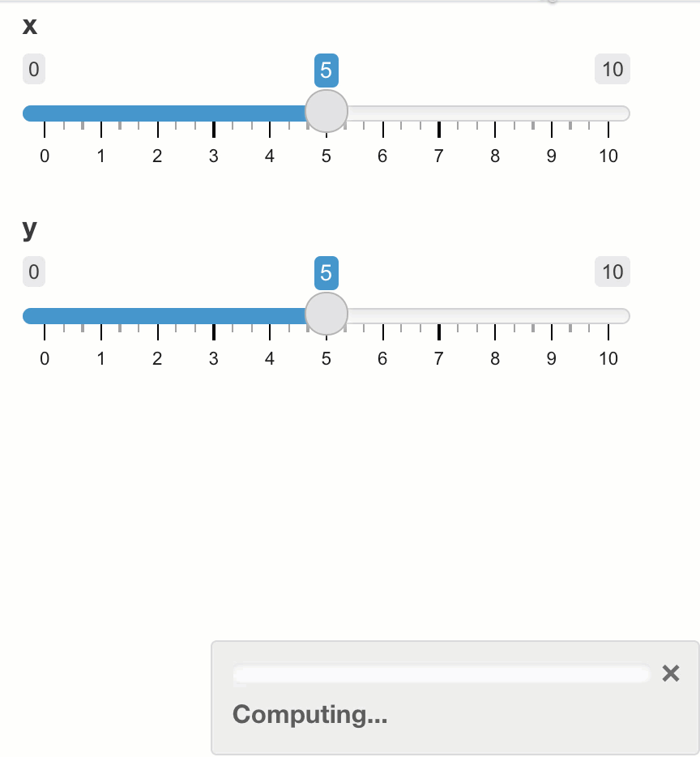
]

* Everytime `x` or `y` changes, `r()` re-executes.

---
class: large

### A minimal example

.pull-left[
```r
library(shiny)
ui <- fluidPage(
  sliderInput("x", "x", 0, 10, 5),
  sliderInput("y", "y", 0, 10, 5),
  verbatimTextOutput("val")
)
server <- function(input, output) {
  r <- reactive({
    Sys.sleep(2)
    input$x + input$y
  })
  output$val <- renderPrint(r())
}

shinyApp(ui, server)
```
]

.pull-right[

]

* Everytime `x` or `y` changes, `r()` re-executes.
* `r()` can recall its _most recent_ value (transient), but not its entire _history_ (persistent)

---
class: large

### bindCache(): persistent caching!

.pull-left[
```r
library(shiny)
ui <- fluidPage(
  sliderInput("x", "x", 0, 10, 5),
  sliderInput("y", "y", 0, 10, 5),
  verbatimTextOutput("val")
)
server <- function(input, output) {
  r <- reactive({
    Sys.sleep(2) 
    input$x + input$y
  }) %>%
*   bindCache(input$x, input$y)
  output$val <- renderPrint(r())
}

shinyApp(ui, server)
```
]

.pull-right[
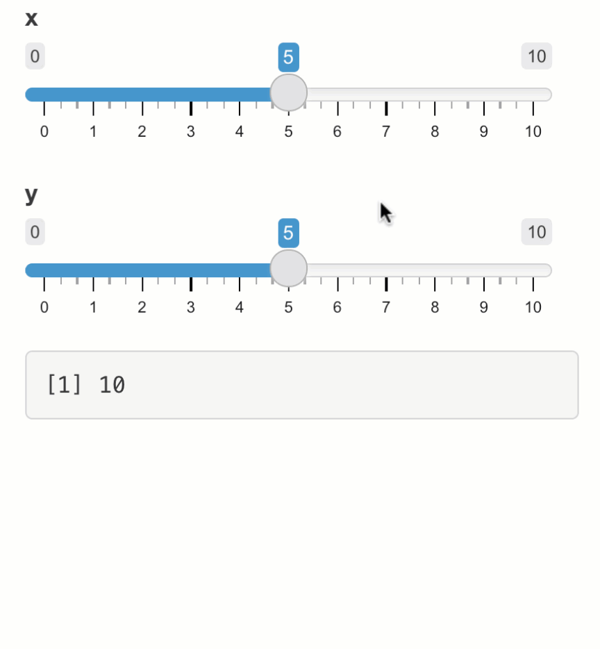
]

* Provide `bindCache()` a reactive and its input value(s).

---
class: large

### bindCache(): persistent caching!

.pull-left[
```r
library(shiny)
ui <- fluidPage(
  sliderInput("x", "x", 0, 10, 5),
  sliderInput("y", "y", 0, 10, 5),
  verbatimTextOutput("val")
)
server <- function(input, output) {
  r <- reactive({
    Sys.sleep(2) 
    input$x + input$y
  }) %>%
*   bindCache(input$x, input$y)
  output$val <- renderPrint(r())
}

shinyApp(ui, server)
```
]

.pull-right[

]

* Provide `bindCache()` a reactive and its input value(s).
* `r()` can now retrieve `x+y` from cache! 🎉


---
class: large

### bindCache(): persistent caching!

.pull-left[
```r
library(shiny)
ui <- fluidPage(
  sliderInput("x", "x", 0, 10, 5),
  sliderInput("y", "y", 0, 10, 5),
  verbatimTextOutput("val")
)
server <- function(input, output) {
  r <- reactive({
    Sys.sleep(2) 
    input$x + input$y
  }) %>%
*   bindCache(input$x, input$y)
  output$val <- renderPrint(r())
}

shinyApp(ui, server)
```
]

.pull-right[

]

* Provide `bindCache()` a reactive and its input value(s).
* `r()` can now retrieve `x+y` from cache! 🎉
* Cache is configurable & can be shared across sessions (see `?bindCache`)
  * Can vastly improve performance, especially in multi-user settings!

---
class: large

### bindCache() also works with render functions

.pull-left[
```r
# requires dev version of plotly
# remotes::install_github("ropensci/plotly")
library(plotly)
ui <- fluidPage(
  selectizeInput(
    "cities", "Select a city", 
    choices = unique(txhousing$city)
  ),
  plotlyOutput("p")
)
server <- function(input, output, ...) {
  output$p <- renderPlotly({
    Sys.sleep(2)
    plot_ly(txhousing, x = ~date, y = ~median) %>%
      filter(city %in% input$cities) %>%
      group_by(city) %>%
      add_lines()
  }) %>% 
*   bindCache(input$cities)
}
shinyApp(ui, server)
```
]

.pull-right[
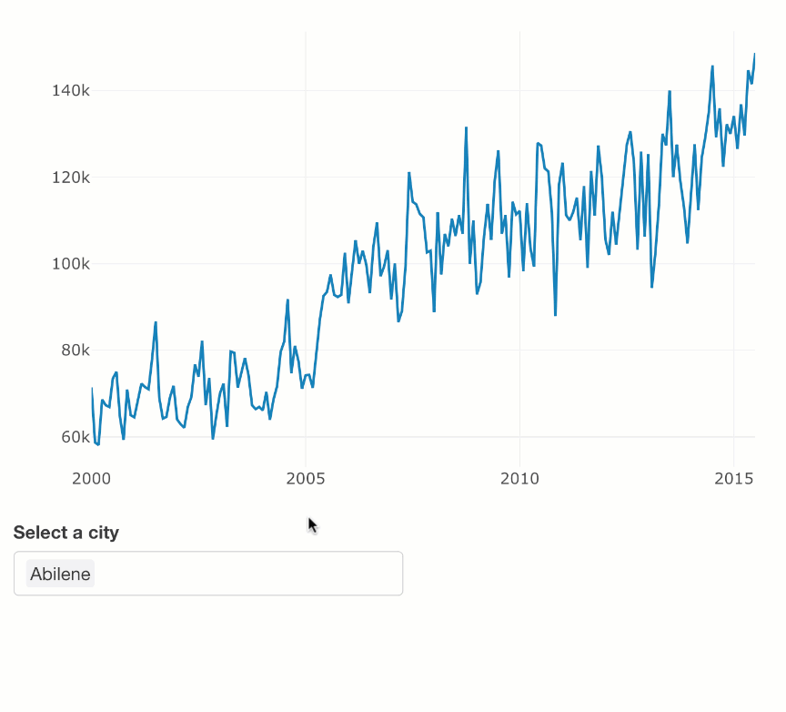
]

Some custom output bindings may need updating to cache correctly (see `?bindCache`). Let us know if you run into issues!

---
class: large

### Shiny v1.6 major features

* New `shiny::bindCache()` function
   * Persistent caching for any `reactive()` or `render*()` function

* <span style="font-size:2rem; font-weight:700">Improved theming support</span>
   * __All of Shiny may now be (properly) themed via new `{bslib}` & `{thematic}` packages__
    
* Accessibility improvements and many bug fixes
   * See the NEWS [here](https://github.com/rstudio/shiny/blob/master/NEWS.md)

.footnote[
Try v1.6 out today with:

```r
remotes::install_github("rstudio/shiny")
```
]

---
class: large, middle, inverse

### New R 📦s for theming Shiny & R Markdown

__`{bslib}`__: tools for customizing Bootstrap CSS from R
  * [rstudio.github.io/bslib](https://rstudio.github.io/bslib)

__`{thematic}`__: simplified theming of R plots (`{ggplot2}`, `{lattice}`, & `{base}`)
  * [rstudio.github.io/thematic](https://rstudio.github.io/thematic)

Also not yet on CRAN

```r
remotes::install_github(c("rstudio/bslib", "rstudio/thematic"))
```


---
class: large

### Start using `{bslib}` with Shiny

```r
library(shiny)
library(bslib)

ui <- fluidPage(
* theme = bs_theme(),
  ...
)
```

* `fluidPage()`, `navbarPage()`, `bootstrapPage()`, etc. all have this `theme` argument.

* You may already be using `theme` with `{shinythemes}` or your own custom Bootstrap CSS.
  * `bs_theme()` is way more powerful!
  
---
class: large

### By default, upgrades app from Bootstrap 3 to 4

```r
library(shiny)
library(bslib)

ui <- fluidPage(
* theme = bs_theme(version = 4),
  ...
)
```

* Special compatibility layer helps most Shiny apps & R Markdown docs upgrade to Bootstrap 4.

* Upgrading may break some apps (try `version = 3` in that case).

---
class: large

### Continue using Bootswatch themes

```r
library(shiny)
library(bslib)

# In the past, this was shinythemes::shinythemes("darkly")
ui <- fluidPage(
* theme = bs_theme(bootswatch = "darkly"),
  ...
)
```


* Now you can use [Bootswatch](https://bootswatch.com/3/darkly) with BS4 or BS3 (just change `version`).
  * Bootswatch 4 has some new themes (e.g., [solar](https://bootswatch.com/solar) and [minty](https://bootswatch.com/minty))

---

#### Preview a theme

```r
bs_theme_preview(
  bs_theme(bootswatch = "darkly")
)
```

```{r, echo = FALSE}
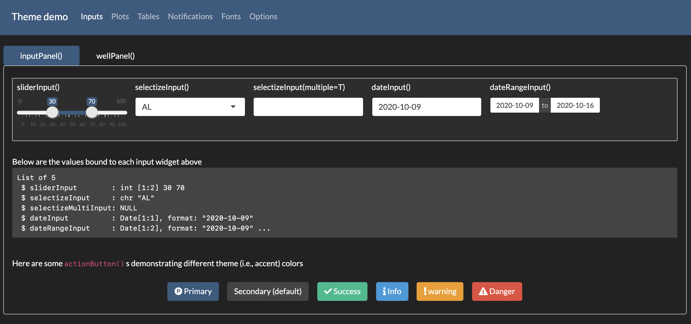
```

---
#### Create your own theme!

```r
bs_theme(
  bg = "black", fg = "white", primary = "red",
  base_font = font_google("Grandstander")
)
```

```{r, echo = FALSE}
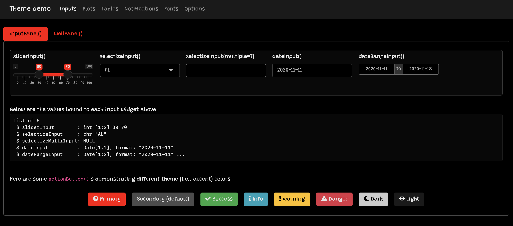
```

---
#### `font_google()` makes it easy to import Google Font files

```r
bs_theme(
  bg = "black", fg = "white", primary = "red",
* base_font = font_google("Grandstander")
)
```

```{r, echo = FALSE}

```

---
#### All Shiny UI is now (properly) themable!

```r
bs_theme(
  bg = "black", fg = "white", primary = "red",
  base_font = font_google("Grandstander")
)
```

```{r, echo = FALSE}
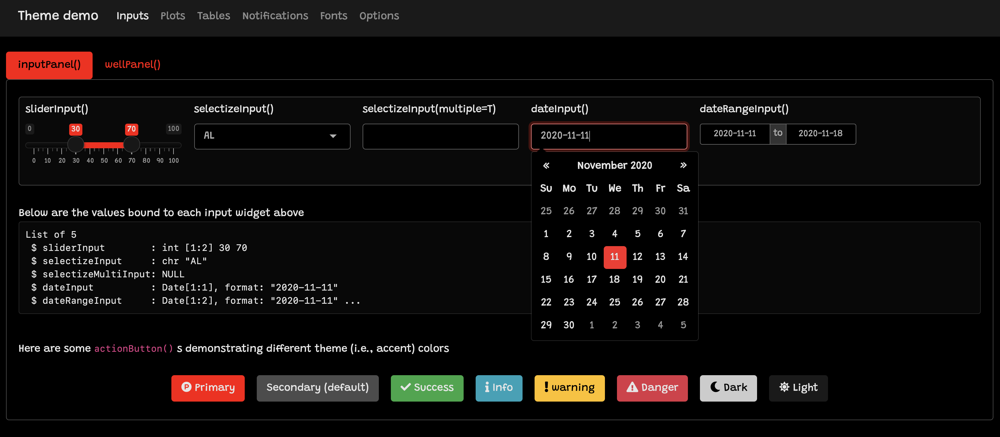
```

---
#### Use a better palette (e.g., [material dark](https://material.io/design/color/dark-theme.html))

```r
bs_theme(
  bg = "#202123", fg = "#B8BCC2", primary = "#EA80FC",
  base_font = font_google("Grandstander")
)
```

```{r, echo = FALSE}
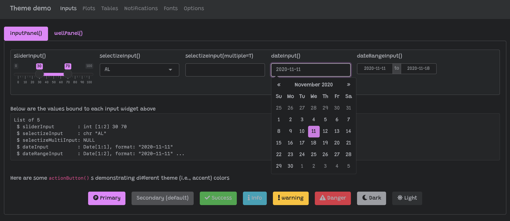
```


---
### Use with `rmarkdown::html_document`

```yaml
--- 
output:
  html_document:
    theme:
      bg: "#202123"
      fg: "#B8BCC2"
      primary: "#EA80FC"
      base_font: !expr bslib::font_google("Grandstander")
--- 
```

Currently requires an experimental version of R Markdown `remotes::install_github("rstudio/rmarkdown#1706")`


---
class: inverse, large

### Not everything is themable, but it's getting better!

* Currently themable (in next CRAN release):
    * The `{shiny}` package
    
    * `rmarkdown::html_document()` and `DT::datatable()`
    
    * Any "Bootstrap compatible" HTML/CSS

---
class: inverse, large

### Not everything is themable, but it's getting better!

* Currently themable (in next CRAN release):
    * The `{shiny}` package
    
    * `rmarkdown::html_document()` and `DT::datatable()`
    
    * Any "Bootstrap compatible" HTML/CSS

* Soon to be themable ([we'd love your help](https://rstudio.github.io/bslib/articles/theming.html#themable-components-1)!):
    * Other HTML-based R Markdown output formats
    
    * Other `{htmlwidgets}` packages (e.g., `{plotly}`, `{reactable}`, etc)
    
    * Other extension packages (e.g., `{shinyWidgets}`, etc)


---
class: inverse, large

### Not everything is themable, but it's getting better!

* Currently themable (in next CRAN release):
    * The `{shiny}` package
    
    * `rmarkdown::html_document()` and `DT::datatable()`
    
    * Any "Bootstrap compatible" HTML/CSS

* Soon to be themable ([we'd love your help](https://rstudio.github.io/bslib/articles/theming.html#themable-components-1)!):
    * Other HTML-based R Markdown output formats
    
    * Other `{htmlwidgets}` packages (e.g., `{plotly}`, `{reactable}`, etc)
    
    * Other extension packages (e.g., `{shinyWidgets}`, etc)
  
* Fundamentally un-themable via CSS:
    * `plotOutput()`: use `{thematic}` to "translate" CSS to R plots!

---

#### Plots don't reflect `bs_theme()` 😭

```r
fluidPage(
  theme = bs_theme(bg = "#002B36", fg = "#EEE8D5", primary = "#2AA198", base_fonts = font_google(("Pacifico")),
  tabsetPanel(type = "pills", tabPanel("ggplot", plotOutput("ggplot")), tabPanel("lattice", plotOutput("lattice")), tabPanel("base", plotOutput("base")))
)
```

```{r, echo = FALSE, out.width="70%"}
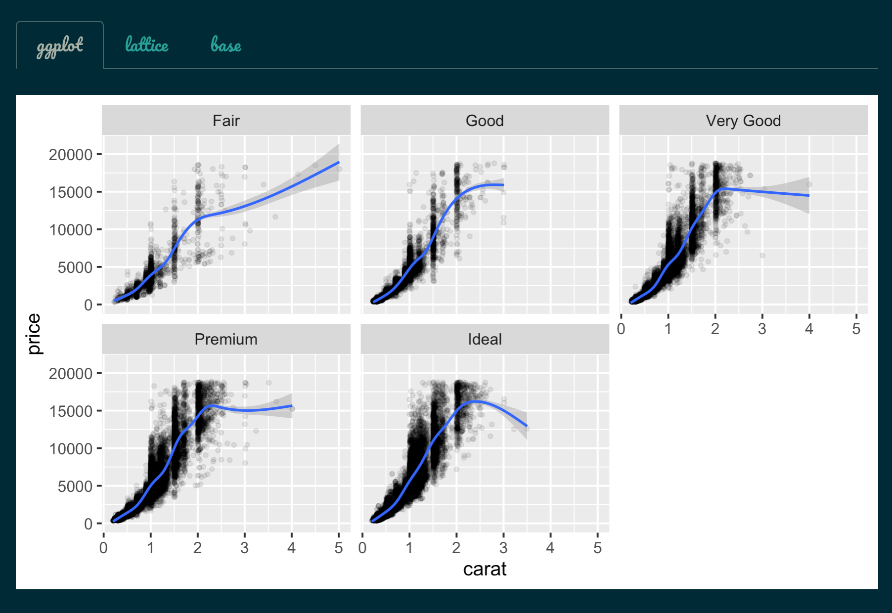
```

---

#### `{thematic}` to the rescue! 🎉 

```r
*thematic::thematic_shiny()
fluidPage(
  theme = bs_theme(bg = "#002B36", fg = "#EEE8D5", primary = "#2AA198", base_fonts = font_google("Pacifico")),
  tabsetPanel(type = "pills", tabPanel("ggplot", plotOutput("ggplot")), tabPanel("lattice", plotOutput("lattice")), tabPanel("base", plotOutput("base")))
)
```

```{r, echo = FALSE, out.width="70%"}
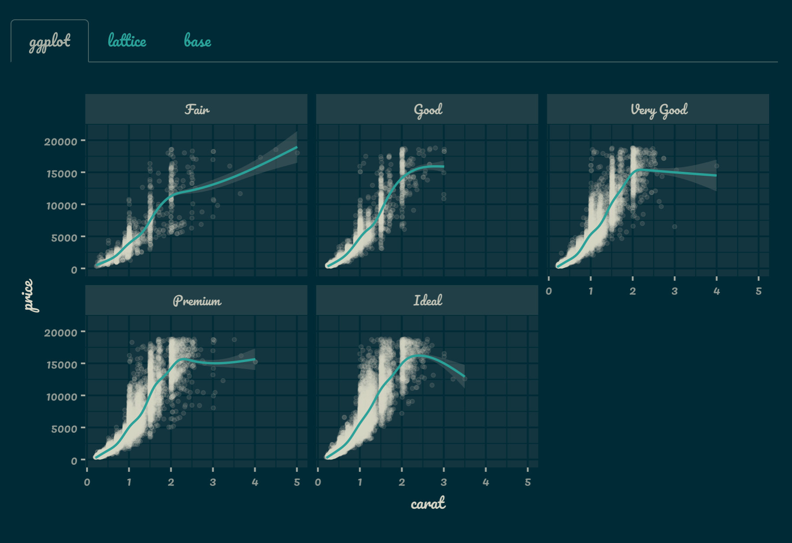
```

---
### The `{thematic}` package, in general

* `{thematic}` alters R plotting defaults using a few simple settings. Use `thematic_on()` to enable globally (until `thematic_off()` is called).

.pull-left[
```r
library(thematic)
library(ggplot2)
thematic_on(
  bg = "black", 
  fg = "white", 
  accent = "red", 
  font = "Indie Flower"
)
ggplot(mtcars, aes(wt, mpg)) + 
  geom_point() + 
  geom_smooth() 
```
]

.pull-right[
```{r, echo=FALSE}
library(thematic)
library(ggplot2)
thematic_on(
  bg = "black", fg = "white", accent = "red", 
  font = font_spec("Indie Flower", 2)
)
ggplot(mtcars, aes(wt, mpg)) + 
  geom_point() + 
  geom_smooth() 
```
]


---
### The `{thematic}` package, in general

* `{thematic}` alters R plotting defaults using a few simple settings. Use `thematic_on()` to enable globally (until `thematic_off()` is called).

.pull-left[
```r
library(thematic)
library(ggplot2)
thematic_on(
  bg = "black", 
  fg = "white", 
  accent = "red", 
* font = "Indie Flower"
)
ggplot(mtcars, aes(wt, mpg)) + 
  geom_point() + 
  geom_smooth() 
```

.bg-light-red.b--red.ba.bw2.br3.shadow-5.ph4.mt5[
 Since Indie Flower is a Google Font, `{thematic}` installs it if needed!
]

]

.pull-right[
```{r, echo=FALSE}
ggplot(mtcars, aes(wt, mpg)) + 
  geom_point() + 
  geom_smooth() 
```
]

---
class: dark-mode

### [Auto-theming](https://rstudio.github.io/thematic/articles/auto.html) with `{thematic}`

* Main colors and fonts can be `"auto"`-detected!

.pull-left[
```r
library(thematic)
library(ggplot2)
thematic_on(
  bg = "auto", 
  fg = "auto", 
  accent = "auto", 
  font = "auto"
)
ggplot(mtcars, aes(wt, mpg)) + 
  geom_point() + 
  geom_smooth() 
```
]

.pull-right[
```{r, echo=FALSE}
library(thematic)
library(ggplot2)
thematic_on(
  bg = "#444444", fg = "#e4e4e4", 
  accent = "#e39777", font = font_spec("Roboto Slab", 2)
)
ggplot(mtcars, aes(wt, mpg)) + 
  geom_point() + 
  geom_smooth() 
```
]

---
class: dark-mode

### [Auto-theming](https://rstudio.github.io/thematic/articles/auto.html) with `{thematic}`

* Main colors and fonts can be `"auto"`-detected!

.pull-left[
```r
library(thematic)
library(ggplot2)
thematic_on(
  bg = "auto", 
  fg = "auto", 
  accent = "auto", 
  font = "auto"
)
ggplot(mtcars, aes(wt, mpg)) + 
  geom_point() + 
  geom_smooth() 
```

.bg-light-yellow.black-70.b--yellow.ba.bw2.br3.shadow-5.ph4.mt5[
`"auto"` works best via `shiny::renderPlot()` (works with any CSS, not just `bs_theme()`)!
]
]

.pull-right[
```{r, echo=FALSE}
ggplot(mtcars, aes(wt, mpg)) + 
  geom_point() + 
  geom_smooth() 
```
]


---
class: dark-mode

### [Auto-theming](https://rstudio.github.io/thematic/articles/auto.html) with `{thematic}`

* Main colors and fonts can be `"auto"`-detected!

.pull-left[
```r
library(thematic)
library(ggplot2)
thematic_on(
  bg = "auto", 
  fg = "auto", 
  accent = "auto", 
  font = "auto"
)
ggplot(mtcars, aes(wt, mpg)) + 
  geom_point() + 
  geom_smooth() 
```

.bg-light-yellow.black-70.b--yellow.ba.bw2.br3.shadow-5.ph4.mt5[
`"auto"` can work with `{bslib}` in `rmarkdown::html_document()`
]
]

.pull-right[
```{r, echo=FALSE}
ggplot(mtcars, aes(wt, mpg)) + 
  geom_point() + 
  geom_smooth() 
```
]

---
class: dark-mode

### [Auto-theming](https://rstudio.github.io/thematic/articles/auto.html) with `{thematic}`

* Main colors and fonts can be `"auto"`-detected!

.pull-left[
```r
library(thematic)
library(ggplot2)
thematic_on(
  bg = "auto", 
  fg = "auto", 
  accent = "auto", 
  font = "auto"
)
ggplot(mtcars, aes(wt, mpg)) + 
  geom_point() + 
  geom_smooth() 
```

.bg-light-yellow.black-70.b--yellow.ba.bw2.br3.shadow-5.ph4.mt5[
`"auto"` detects your RStudio Theme inside RStudio 
]

]

.pull-right[
```{r, echo=FALSE}
ggplot(mtcars, aes(wt, mpg)) + 
  geom_point() + 
  geom_smooth() 
```
]

---
class: inverse, middle, center

## Demo

`bs_theme_preview()` overlays a real-time theming widget, let's see it action!

---
### Use real-time theming w/ any Shiny app

Call `bs_themer()` in the server code (also works with a `runtime: shiny` R Markdown doc)

```{r, echo = FALSE}
include_vimeo("465527125")
```


---
### Implement your own theming widgets w/ `setCurrentTheme()`

```r
ui <- fluidPage(
  theme = bs_theme(), 
  checkboxInput("dark_mode", "Dark mode", FALSE)
)
server <- function(input, output, session) {
  observe(session$setCurrentTheme({
    if (input$dark_mode) {
      bs_theme(bg = "black", fg = "white", primary = "purple")
    } else {
      bs_theme()
    }
  }))
}
shinyApp(ui, server)
```

```{r, echo = FALSE, out.width="50%"}
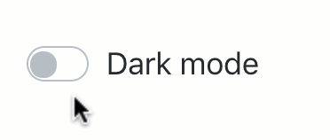
```

---
### More targetted theming

Main colors (e.g., `bg`, `fg`, etc) "cascade" to 100s of other settings, all of which can be set via [Bootstrap Sass variables](https://getbootstrap.com/docs/4.4/getting-started/theming/#variable-defaults) (e.g., [`$progress-bar-bg`]((https://github.com/rstudio/bslib/blob/0e936d/inst/lib/bootstrap/scss/_variables.scss#L1003))

```r
bs_theme(
  bg = "#002B36", fg = "#EEE8D5", 
  "progress-bar-bg" = "orange"
)
```

```{r, echo=FALSE, out.width="50%"}
knitr::include_graphics("progress-orange.png")
```

---
### What's a Sass variable?

* Sass is a more powerful way to write CSS (i.e., style HTML)
* Sass variables provide "high-level controls" over CSS

<div align="center">
  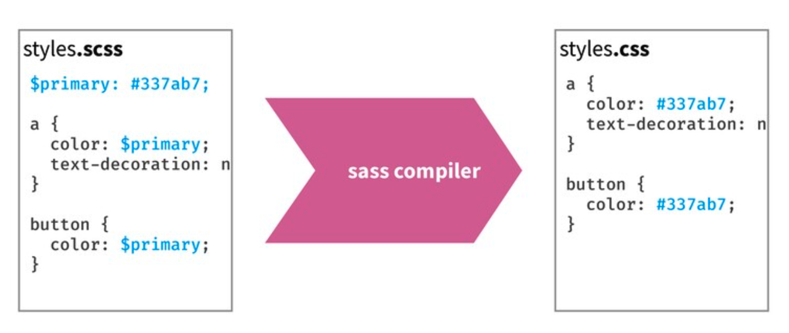
</div>

* `bs_theme()` works by overriding Bootstrap Sass variable defaults. 

Learn more about [Sass](https://sass-lang.com) and the `{sass}` 📦 at <https://rstudio.github.io/sass>

---
### Leverage the power of Bootstrap 4

Customize [spacing](https://getbootstrap.com/docs/4.4/utilities/spacing/), [borders](https://getbootstrap.com/docs/4.4/utilities/borders/), modify [colors](https://getbootstrap.com/docs/4.4/utilities/colors/), and more!

.pull-left[
```r
tabsetPanel(
  tabPanel("One", "No padding"),
  tabPanel("Two", "No padding")
)
```
```{r, echo = FALSE}
knitr::include_graphics("tab-before.png")
```
]

.pull-right[
```r
tabsetPanel(
  tabPanel(
    "One", "With padding",
*    class = "p-3 border border-top-0 rounded-bottom"
  ),
  tabPanel("Two", "No padding")
)
```
```{r, echo = FALSE}
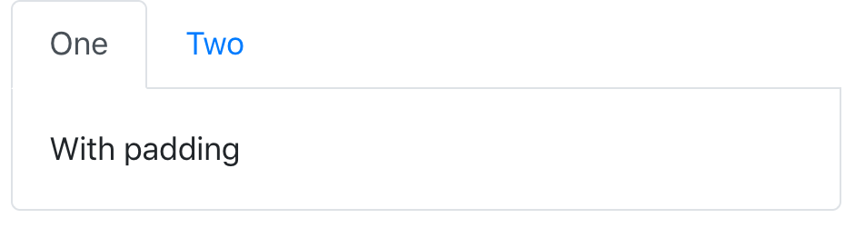
```
]

.footnote[
See more examples at <https://rstudio.github.io/bslib/articles/recipes.html>
]

---
### Leverage the power of Sass

Add [Sass rules](https://sass-lang.com/documentation/style-rules) to do things like `@extend` all [navs to be centered](https://getbootstrap.com/docs/4.4/components/navs/#horizontal-alignment)

```r
fluidPage(
  theme = bs_theme() %>%
*   bs_add_rules(".nav { @extend .justify-content-center; }"),
  tabsetPanel(
    tabPanel("One", "Centered w/ padding", class = "p-3 border border-top-0 rounded-bottom"),
    tabPanel("Two", "No padding")
  )
)
```
```{r, echo = FALSE}
knitr::include_graphics("tab-centered.png")
```

.footnote[
See more examples at <https://rstudio.github.io/bslib/articles/recipes.html>
]

---
### Create custom, themable, components

.panelset[
.panel[.panel-name[R Code]

```r
person <- function(name, title, company) {
  div(
    class = "person",
    h3(class = "name", name),
    div(class = "title", title),
    div(class = "company", company)
  )
}

fluidPage(
  person("Andrew Carnegie", "Owner", "Carnegie Steel Company"),
  person("John D. Rockefeller", "Chairman", "Standard Oil"),
  theme = bs_theme(bg = "#002B36", fg = "#EEE8D5") %>%
*    bs_add_rules(sass::sass_file("person.scss"))
)
```
]
.panel[.panel-name[Sass Code]
```scss
.person {
  display: inline-block;
  padding: $spacer;
  border: $border-width solid $border-color;
  @include border-radius;
  @include box-shadow;
  outline: 0;
  width: 300px;
  @include media-breakpoint-down(sm) {
    display: block;
    width: auto;
    margin-right: $grid-gutter-width;
  }
  margin: $grid-gutter-width;
  margin-right: 0;
  .title { font-weight: bold; }
  .title, .company { color: $gray-600; }
}
.person:last-of-type {
  margin-right: $grid-gutter-width;
}

```
]

.panel[.panel-name[Result]
`r ''`
<div align="center">
  
</div>
]
]


---
class: large

### In summary

* Use `shiny::bindCache()` to persistently cache reactive expressions
    * See `?bindCache` for more details

* Use `bslib::bs_theme()` to theme Shiny & R Markdown.
    * Upgrades to Bootstrap 4 by default (can also `version = 3`).
    
    * Use Bootswatch and/or design your own custom themes.
    
    * Use `bs_theme_preview()`/`bs_themer()` to quickly preview and update themes.

* Use `{thematic}` for easier theming of R plots
    * Works with `{ggplot2}`, `plotly::ggplotly()`, `{lattice}`, and `{base}` R graphics.
    
    * Auto-theming (i.e., translating CSS to R defaults) works great on Shiny, but can also specify colors and fonts directly in `{thematic}`.


---
class: center, middle

## Thank you! Any questions?

### Slides: [bit.ly/jj-shiny-2020](https://bit.ly/jj-shiny-2020)

### [rstudio.github.io/bslib](https://rstudio.github.io/bslib)
### [rstudio.github.io/thematic](https://rstudio.github.io/thematic)

`r icon::fa_twitter()` <a href='https://twitter.com/cpsievert'>@cpsievert</a> <br />
`r icon::fa_github()` <a href='https://github.com/cpsievert'>@cpsievert</a> <br />
`r icon::fa_envelope()` <cpsievert1@gmail.com> <br />
`r icon::fa_globe()` <https://cpsievert.me/>


.footnote[
<br>
Slides made possible thanks to [`{xaringan}`](https://github.com/yihui/xaringan) and [`{xaringanExtra}`](https://github.com/gadenbuie/xaringanExtra)
]

