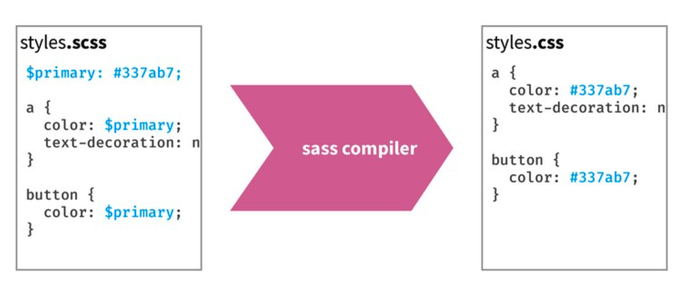

class: middle, center, inverse

# Shiny v1.6 overview: improvements to caching and theming

### Carson Sievert, Software Engineer @ RStudio

<carson@rstudio.com> 


```{r setup, echo = FALSE, message = FALSE}
library(thematic)
library(ggplot2)
library(lattice)
library(flair)
knitr::opts_chunk$set(
  message = FALSE,
  warning = FALSE,
  comment = "#>",
  collapse = TRUE,
  fig.align = "center",
  out.width = "100%",
  fig.asp = 1,
  #cache = TRUE,
  fig.retina = 2,
  dev = "ragg_png"
)
auto_config_set(auto_config(
  bg = "#002B36", fg = "#FDF6E3", 
  accent = "#2AA198", 
  # 2 is better for non-ragg
  font = font_spec("Roboto Condensed", 2)
))
include_vimeo <- function(id, width = "100%", height = "450") {
  url <- sprintf("https://player.vimeo.com/video/%s?title=0&byline=0&portrait=0", id)
  htmltools::tags$iframe(
    src = url,
    width = width,
    height = height,
    frameborder = "0",
    seamless = "seamless",
    webkitAllowFullScreen = NA,
    mozallowfullscreen = NA,
    allowFullScreen = NA
  )
}
#xaringanExtra::use_panelset()
xaringanExtra::use_tachyons()
#xaringanExtra::style_panelset_tabs(
#  font_family = "Fira Code, Menlo, Consolas, Monaco, Liberation Mono, Lucida #Console, monospace"
#)
```

```{scss, echo = FALSE}
@import url(https://fonts.googleapis.com/css?family=IBM+Plex+Sans);
@import url(https://fonts.googleapis.com/css?family=Roboto+Slab);
@import url(https://fonts.googleapis.com/css?family=Open+Sans);
body {
  font-family: Open Sans, sans-serif;
}
h1, h2, h3 {
  font-family: Roboto Slab, serif;
}
.remark-slide-content {
  &.large {
    font-size: 1.5rem
  }
  &.dark-mode {
    font-family: Roboto Slab;
    background-color: #444;
    color: #e4e4e4;
    a {
      color: #e39777;
    }
  }
}
```


---
class: large

### Shiny v1.6 major features


* New `shiny::bindCache()` function
   * Persistent caching for any `reactive()` or `render*()` function

* Improved theming support
   * All of Shiny may now be (properly) themed via new `{bslib}` package
    
* Accessibility improvements and many bug fixes
   * See the NEWS [here](https://github.com/rstudio/shiny/blob/master/NEWS.md)


.footnote[
v1.6 is out now, blog post coming this week:

```r
install.packages("shiny")
```
]

---
## bindCache() in a nutshell

* Similar to `renderCachedPlot()`, `bindCache()` needs the input(s) to a "pure" calculation:

```r
r <- reactive({
  input$x + input$y
}) %>%
*  bindCache(input$x, input$y)
```

---
## bindCache() in a nutshell

* Similar to `renderCachedPlot()`, `bindCache()` needs the input(s) to a "pure" calculation:

```r
r <- reactive({
  input$x + input$y
}) %>%
*  bindCache(input$x, input$y)
```

* Should work with most existing `render*()` functions (some might need updates):

```r
output$p <- renderPlotly({
  plot_ly(dat) %>% 
    filter(city %in% input$cities) %>% 
    add_lines(time, population)
}) %>%
*  bindCache(input$cities)
```

---
## bindCache() in a nutshell

* Similar to `renderCachedPlot()`, `bindCache()` needs the input(s) to a "pure" calculation:

```r
r <- reactive({
  input$x + input$y
}) %>%
*  bindCache(input$x, input$y)
```

* Should work with most existing `render*()` functions (some might need updates):

```r
output$p <- renderPlotly({
  plot_ly(dat) %>% 
    filter(city %in% input$cities) %>% 
    add_lines(time, population)
}) %>%
*  bindCache(input$cities)
```

* Same entry-point for cache configuring (now also supports [`{cachem}` objects](http://cachem.r-lib.org/))

```r
shinyOptions(cache = cachem::cache_disk("./cache"))
```

---
class: large

### Start using `{bslib}` with Shiny

```r
library(shiny)
library(bslib)

ui <- fluidPage(
* theme = bs_theme(),
  ...
)
```

* `fluidPage()`, `navbarPage()`, `bootstrapPage()`, etc. all have this `theme` argument, which now accepts `bslib::bs_theme()` objects.
  
---
class: large

### By default, upgrades app from Bootstrap 3 to 4

```r
library(shiny)
library(bslib)

ui <- fluidPage(
* theme = bs_theme(version = 4),
  ...
)
```

* Special compatibility layer helps most Shiny apps & R Markdown docs upgrade to Bootstrap 4.

* Upgrading may break some apps (try `version = 3` in that case).

---
class: large

### Continue using Bootswatch themes

```r
library(shiny)
library(bslib)

# In the past, this was shinythemes::shinythemes("darkly")
ui <- fluidPage(
* theme = bs_theme(bootswatch = "darkly"),
  ...
)
```


* Now you can use [Bootswatch](https://bootswatch.com/3/darkly) with BS4 or BS3 (just change `version`).
  * Bootswatch 4 has some new themes (e.g., [solar](https://bootswatch.com/solar) and [minty](https://bootswatch.com/minty))

---
#### Custom theming!

```r
bs_theme(
  bg = "#202123", fg = "#B8BCC2", primary = "#EA80FC",
  base_font = font_google("Grandstander")
)
```

```{r, echo = FALSE}

```

---

`font_google()`, by default, tries to download, cache, and bundle the font files in one shot.

```r
bs_theme(
  bg = "#202123", fg = "#B8BCC2", primary = "#EA80FC",
 *base_font = font_google("Grandstander")
)
```

```{r, echo = FALSE}

```

---
## How does custom theming actually work?

* `bs_theme()` works by overriding [Bootstrap Sass variable defaults](https://getbootstrap.com/docs/4.0/getting-started/theming/#variable-defaults). 

<div align="center">
  
</div>


* Shiny will compile Sass -> CSS at run-time when necessary.
  * Can be costly, but `options(sass.cache)` is `TRUE` by default, and we default to app sub-directory on hosted platforms (see `sass::sass_cache_context_dir()` for details).
  
---
### Bootstrap Sass provides 100s of variables!

Main colors (e.g., `bg`, `fg`, etc) "cascade" to 100s of other settings, all of which can be set via [Bootstrap Sass variables](https://getbootstrap.com/docs/4.4/getting-started/theming/#variable-defaults) (e.g., [`$progress-bar-bg`]((https://github.com/rstudio/bslib/blob/0e936d/inst/lib/bootstrap/scss/_variables.scss#L1003))

```r
bs_theme(
  bg = "#002B36", fg = "#EEE8D5", 
  "progress-bar-bg" = "orange"
)
```

```{r, echo=FALSE, out.width="50%"}

```

.footnote[
We're currently working on searchable table(s) of variables https://github.com/rstudio/bslib/pull/238
]

---
### Use with `rmarkdown::html_document`

```yaml
--- 
output:
  html_document:
    theme:
      bg: "#202123"
      fg: "#B8BCC2"
      primary: "#EA80FC"
      base_font: !expr bslib::font_google("Grandstander")
--- 
```

* Currently requires dev version of R Markdown `remotes::install_github("rstudio/rmarkdown")`

* In theory, any output format building on `html_document` (or `html_document_base`) should automatically gain `{bslib}` support.

* Some output formats (e.g. `{flexdashboard}`) need updates to restructure their harded-coded CSS to Sass.

---
### Use real-time theming w/ any Shiny app

Call `bs_themer()` in the server code (also works with a `runtime: shiny` R Markdown doc)

<iframe src="https://player.vimeo.com/video/465527125?title=0&amp;byline=0&amp;portrait=0" width="100%" height="450" frameborder="0" seamless="seamless" webkitAllowFullScreen mozallowfullscreen allowFullScreen></iframe>


---
### Implement your own theming widgets w/ `setCurrentTheme()`

```r
ui <- fluidPage(
  theme = bs_theme(), 
  checkboxInput("dark_mode", "Dark mode", FALSE)
)
server <- function(input, output, session) {
  observe(session$setCurrentTheme({
    if (input$dark_mode) {
      bs_theme(bg = "black", fg = "white", primary = "purple")
    } else {
      bs_theme()
    }
  }))
}
shinyApp(ui, server)
```

```{r, echo = FALSE, out.width="50%"}
knitr::include_graphics("dark-mode.gif")
```

---
class: middle, center

### Thanks! Any questions?
