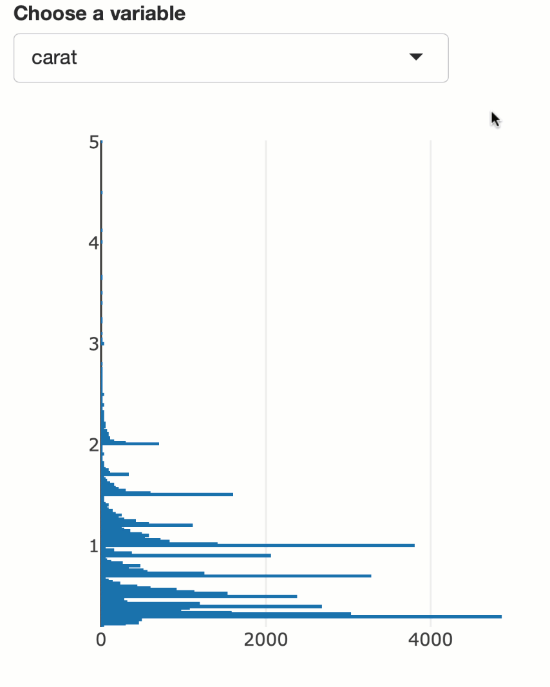
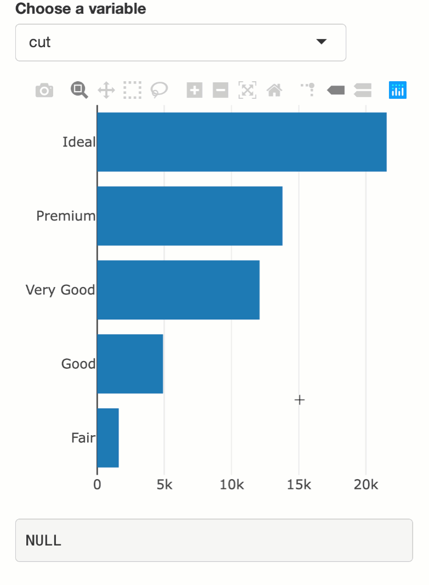

background-image: url(../20171207/workflow.svg)
background-size: contain
class: inverse

# Data science workflow

```{r, include = FALSE}
library(plotly)
knitr::opts_chunk$set(
  message = FALSE,
  out.width = "70%",
  comment = "#>",
  collapse = TRUE,
  fig.align = "center"
)

include_vimeo <- function(id, width = "100%", height = "450") {
  url <- sprintf("https://player.vimeo.com/video/%s?title=0&byline=0&portrait=0", id)
  htmltools::tags$iframe(
    src = url,
    width = width,
    height = height,
    frameborder = "0",
    seamless = "seamless",
    webkitAllowFullScreen = NA,
    mozallowfullscreen = NA,
    allowFullScreen = NA
  )
}
```

---
background-image: url(../20171207/workflow1.svg)
background-size: contain
class: inverse

## Interactive web graphics are great for sharing insight

---
background-image: url(../20171207/workflow2.svg)
background-size: contain
class: inverse

## Interactivity also enhances the sense-making process

---
background-image: url(../20171207/workflow2.svg)
background-size: contain
class: inverse

## Problem: Web technologies aren't designed for this phase

<br/>
<br/>
<br/>
<br/>
<br/>
<br/>
<br/>
<br/>
<br/>
<br/>
<br/>
<br/>
<br/>
<br/>
<br/>
<br/>
<br/>
<br/>

## Solution: bring them to R


---
background-image: url(htmlwidgets.png)
background-size: contain

## htmlwidgets: a standard for implementing R interfaces to JS

<br/>
<br/>
<br/>
<br/>
<br/>
<br/>
<br/>
<br/>
<br/>
<br/>
<br/>
<br/>
<br/>
<br/>
<br/>
<br/>
<br/>
<br/>

<h3><a href="https://htmlwidgets.org">htmlwidgets.org</a></h3>

---
background-image: url(htmlwidgets-gallery.png)
background-size: contain

<!--
class: principles

## The problem with a 'naive' R->JS binding

* Most JS libraries don't natively support multiple linked views.

* Instead, it's common for interactions to fire events, which _can be_ used to implement linked views. 

* Many `{htmlwidgets}` make it possible to listen to such events in `{shiny}`. 

* Some `{htmlwidgets}` 
-->

---
### plotly: an advanced htmlwidget

Make static `{ggplot2}` plots interactive with `plotly::ggplotly()`!

```r
library(plotly)
p <- ggplot(diamonds, aes(x = log(price), color = clarity)) + 
    geom_freqpoly(stat = "density") + 
    facet_wrap(~cut)
ggplotly(p)
```

```{r, echo = FALSE}
include_vimeo("322318131", height = 360)
```

---
### plotly: an advanced htmlwidget

Or, use the underlying [plotly.js graphing library](https://github.com/plotly/plotly.js) more directly:

```r
library(plotly)
plot_ly(diamonds, x = ~cut, color = ~clarity)
```

```{r, echo = FALSE}
include_vimeo("315707813", height = 420)
```

---
### plotly: an advanced htmlwidget

All plots come pre-packaged with simple interaction (e.g., tooltip, zoom, and legend filter).

```r
library(plotly)
plot_ly(diamonds, x = ~cut, color = ~clarity)
```

```{r, echo = FALSE}
include_vimeo("315707813", height = 420)
```

---
### shiny: create a web UI to re-execute R code

.pull-left[
```r
library(shiny)
library(plotly)

ui <- fluidPage(
* selectInput(
*   "y", "Choose a variable", 
*   choices = names(diamonds)
* ),
  plotlyOutput("p")
)

server <- function(input, output) {

  output$p <- renderPlotly({
    plot_ly(
*     y = diamonds[[input$y]]
    )
  })
  
}

shinyApp(ui, server)
```
]

.pull-right[

]

---
### Use {plotly} like an input control 

.pull-left[
```r
library(shiny)
library(plotly)

ui <- fluidPage(
  selectInput(
    "y", "Choose a variable", 
    choices = names(diamonds)
  ),
  plotlyOutput("p"),
  verbatimTextOutput("hover")
)

server <- function(input, output) {
  output$p <- renderPlotly({
    plot_ly(y = diamonds[[input$y]])
  })
* output$hover <- renderPrint({
*   #Think of this like an input value
*   event_data("plotly_hover")
* })
}

shinyApp(ui, server)
```
]

.pull-right[

]

---
### Linking htmlwidgets with shiny

Many `{htmlwidgets}` provide `{shiny}` 'hooks' into user events.

```{r, echo = FALSE}
include_vimeo("372903411", height = 500)
```

---
### Linking htmlwidgets with shiny

Lots of different user events available (e.g., `{leaflet}` zoom)!

```{r, echo = FALSE}
include_vimeo("307598756", height = 500)
```

---
### Linking htmlwidgets with shiny

`{shiny}` provides tools for [managing state](https://plotly-r.com/linking-views-with-shiny.html#reactive-vals), -- useful for making multiple comparisons:

```{r, echo = FALSE}
include_vimeo("353646796", height = 500)
```


---
### Linking htmlwidgets with shiny

Managing state is also useful for 'drill-down' apps:

```{r, echo = FALSE}
include_vimeo("328770954", height = 500)
```


---
class: inverse

### Linking with shiny, in general

Super powerful and flexible, but requires advanced `{shiny}` programming as well as an R process running _somewhere_. 

<div align="center">
  
</div>


---
class: inverse

### Linking without shiny

* [`{crosstalk}`](https://rstudio.github.io/crosstalk/) provides a standard for linking `{htmlwidgets}` entirely client-side (i.e., in JavaScript).

<div align="center">
  
</div>

---

### Link plotly with DT via crosstalk

```r
library(plotly)
library(crosstalk)
*sd <- SharedData$new(mpg)
p <- plot_ly(sd, x = ~displ, y = ~hwy) %>%
  add_markers() %>%
  highlight("plotly_selected")
bscols(p, DT::datatable(sd))
```

```{r, echo = FALSE}
include_vimeo("324366759", height = 350)
```

---

### Link plotly with DT via crosstalk

```r
library(plotly)
library(crosstalk)
*sd <- SharedData$new(mpg)
p <- plot_ly(sd, x = ~displ, y = ~hwy) %>%
  add_markers() %>%
  highlight("plotly_selected")
bscols(p, DT::datatable(sd))
```

* Most [`{crosstalk}`-compatible widgets](https://rstudio.github.io/crosstalk/widgets.html) only support this sort of "simple transient selection". 
* However, when linking multiple `{plotly}` widgets via `{crosstalk}`, you can do a lot more!


---
### Texas housing prices

```r
library(dplyr)
library(plotly)
tx <- txhousing %>%
  select(city, year, month, median) %>%
  filter(city %in% c("Galveston", "Midland", "Odessa", "South Padre Island"))
tx
```

```r
#> # A tibble: 748 x 4
#>         city  year month median
#>        <chr> <int> <int>  <dbl>
#>  1 Galveston  2000     1  95000
#>  2 Galveston  2000     2 100000
#>  3 Galveston  2000     3  98300
#>  4 Galveston  2000     4 111100
#>  5 Galveston  2000     5  89200
#>  6 Galveston  2000     6 108600
#>  7 Galveston  2000     7  99000
#>  8 Galveston  2000     8  96200
#>  9 Galveston  2000     9 104000
#> 10 Galveston  2000    10 118800
#> # ... with 738 more rows
```

---
### Generalized selection

```r
*TX <- SharedData$new(tx, ~year)
p <- ggplot(TX, aes(month, median, group = year)) + geom_line() +
  facet_wrap(~city, ncol = 2)
ggplotly(p)
```

<iframe src="txhousing-2.html" width="100%" height="450" scrolling="no" seamless="seamless" frameBorder="0"> </iframe>

---
### Persist, color, and search indirectly

```r
TX <- SharedData$new(tx, ~year)
p <- ggplot(TX, aes(month, median, group = year)) + geom_line() +
  facet_wrap(~city, ncol = 2)
*highlight(ggplotly(p), persistent = TRUE, dynamic = TRUE, selectize = TRUE)
```

<iframe src="txhousing-1.html" width="100%" height="450" scrolling="no" seamless="seamless" frameBorder="0"> </iframe>

---
background-image: url(https://i.imgur.com/Id2nVFG.gif)
background-size: contain

<div align="right">
  <a href="epl.html" target="_blank">Live demo </a>
  (<a href="https://github.com/ropensci/plotly/blob/master/demo/crosstalk-highlight-epl2.R">code</a>)
</div>

---
class: middle, inverse
background-image: url(https://i.imgur.com/Id2nVFG.gif)
background-size: contain

# Generally useful for comparing within/across panels!

---
class: inverse, center, middle

# Have _lots_ of panels?

### Check out [TrelliscopeJS with Plotly](http://ryanhafen.com/blog/trelliscopejs-plotly)

---
class: middle, center

# Beyond trellis (i.e. facet) displays

---
### Query missing values by city

```r
demo("crosstalk-highlight-pipeline", package = "plotly")
```

<iframe src="txmissing.html" width="100%" height="485" scrolling="no" seamless="seamless" frameBorder="0"> </iframe>

---
class: bottom, left 
background-image: url(../20171207/pipeline.svg)
background-size: contain

## The 'data pipeline'

---
### Works with 'aggregated' traces

<iframe src="mpg.html" width="100%" height="600" scrolling="no" seamless="seamless" frameBorder="0"> </iframe>

---
class: middle, principles

## The implementation

```r
d <- SharedData$new(mpg)
dots <- plot_ly(d, color = ~class, x = ~displ, y = ~cyl)
*boxs <- plot_ly(d, color = ~class, x = ~class, y = ~cty) %>% add_boxplot()
*bars <- plot_ly(d, x = ~class, color = ~class)

subplot(dots, boxs) %>%
  subplot(bars, nrows = 2) %>%
  layout(barmode = "overlay") %>%
  highlight("plotly_selected")
```

plotly.js dynamically recomputes summary stats as a function of selection 

---
### See relationships evolve over time ([made via ggplot2](https://plotly-book.cpsievert.me/linking-animated-views.html))

<a href="../20180118/gapminder.html" target="_blank">
  
</a>

---
background-image: url(../20170803/tour.gif)
background-size: contain
class: middle

### Interactively [plot models in data space](../20180118/tour.html) ([code](https://github.com/ropensci/plotly/blob/master/demo/animation-tour-USArrests.R))

---
## Summary

* Interactive (web) graphics can enhance the sense-making process for data analysts (as well as for their audience).

* In particular, multiple linked views is a powerful paradigm for exploring data.

* `{htmlwidgets}` such as `{plotly}` make it easy to leverage web graphics from R.

* `{shiny}` provides a reactive programming framework, which we can leverage to link multiple `{htmlwidgets}`.

* `{crosstalk}` and `{plotly}` make it possible to link views without `{shiny}`.

---
class: middle, center, principles

## Thanks! Questions?

Slides: <https://talks.cpsievert.me>

Learn more: <https://plotly-book.cpsievert.me>

#### Contact

`r fontawesome::fa("twitter")` <a href='https://twitter.com/cpsievert'>@cpsievert</a> <br />
`r fontawesome::fa("twitter")` <a href='https://github.com/cpsievert'>@cpsievert</a> <br />
`r fontawesome::fa("envelope")` <cpsievert1@gmail.com> <br />
`r fontawesome::fa("globe")` <https://cpsievert.me/>

